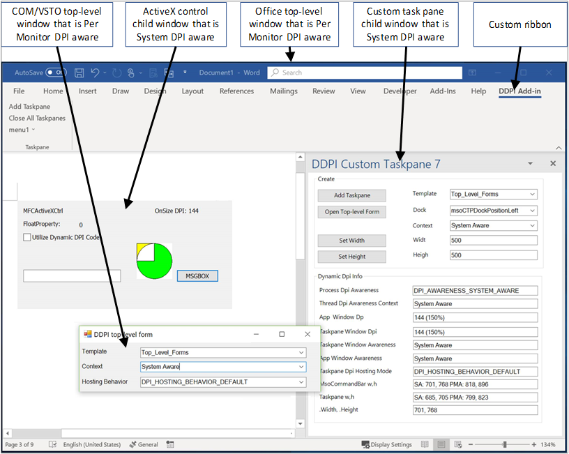
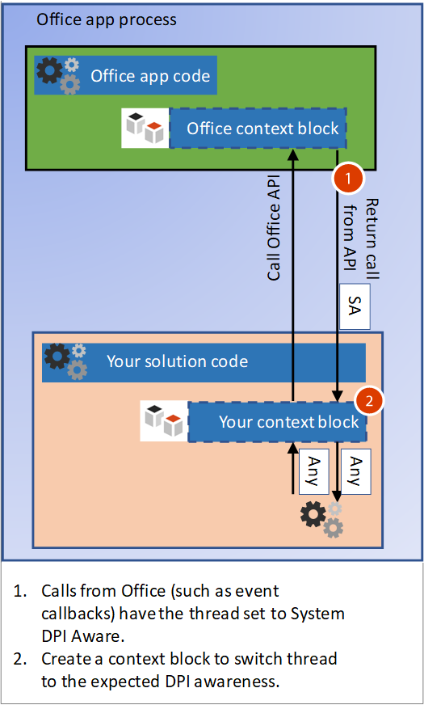

# Handle high DPI and DPI scaling in your Office solution

Many computer and display configurations now support high DPI (dots-per-inch) resolutions, and can connect multiple monitors with different sizes and pixel densities. This requires applications to adjust when the user moves the app to a monitor with a different DPI, or changes the zoom level. Applications that don’t support DPI scaling might look fine on low DPI monitors, but will look stretched and blurry when shown on a high DPI monitor. 

Office 2016 applications, such as Word and Excel, have been updated to respond to changes in scale factor. However, your Office solution must also respond to changes to draw correctly when the DPI changes. This article describes how Office supports dynamic DPI, and what steps you can take to ensure the best viewing experience for your Office extensibility solution to handle DPI scaling. 

## DPI scaling symptoms in your solution

Windows applies DPI scaling when an application is moved from one display to another display with a different DPI. This happens in scenarios such as dragging an application to a different monitor or docking your laptop. If your Office solution is adversely affected by DPI scaling, you will see one or more of the following symptoms:

- The windows draw in the wrong location or have incorrect sizing.
- Elements such as buttons and labels appear in the wrong location in your solution’s window.
- Fonts and images appear too small, too large or in the wrong location.

The following types of Office solutions can be affected by DPI scaling:

- VSTO Add-ins
- Custom task panes
- COM Add-ins
- ActiveX controls
- Ribbon extensions
- Ole servers
- Office web add-ins

## Windows DPI awareness modes

Throughout this article we’ll refer to the DPI awareness modes that Windows supports. Each DPI awareness mode supports different capabilities, as described in the following table. This is a simplified description of the modes to explain how Office solutions support them. For more information about the DPI awareness modes, see [High DPI Desktop Application Development on Windows](https://docs.microsoft.com/windows/desktop/hidpi/high-dpi-desktop-application-development-on-windows).

|Mode  |Description  |When DPI changes  |
|---------|---------|---------|
|DPI unaware |  Application always renders as if it is on a display with a DPI value of 96. |  Application is bitmap stretched to expected size on primary and secondary displays.    |
|System DPI aware |  Application detects the DPI of the primary connected monitor at Windows login but cannot respond to DPI changes. For more information, see the [Configure Windows to fix blurry apps](#configure-windows-to-fix-blurry-apps) section in this article.  | Application is bitmap stretched when moved to a new display with a different DPI.    |
|Per Monitor DPI aware |  Application is capable of redrawing itself correctly when the DPI changes.  |   Windows will send DPI notifications to top-level windows in the application so that it can redraw when the DPI changes.     |
|Per Monitor v2 |  Application is capable of redrawing itself correctly when the DPI changes.  |   Windows will send DPI notifications to both top-level and child windows so that the application can redraw when the DPI changes. |

## How Office supports DPI scaling

The most significant factor in determining how your Office solution can handle DPI scaling is whether your solution is a top-level window, or a child window. The following picture shows a few examples of Office solutions running as top-level or child windows, and which DPI awareness mode they will use on Windows April 2018 Update (1803) and later.



In this image:
- The COM/VSTO top-level window is Per Monitor DPI aware.
- The ActiveX control child window is System DPI aware.
- The Office top-level window is Per Monitor DPI aware.
- The custom task pane child window is System DPI aware.

## Managing thread DPI context

When the host Office app starts, its main thread runs in Per Monitor DPI aware context. When your solution code creates threads, or receives calls from Office, you need to manage the thread DPI context.

### Creating new threads with the correct DPI context

If your solution creates additional threads, Office will force the threads into Per Monitor DPI aware context. If your code expects a different context, you need to use the [SetThreadDpiAwarenessContext](https://docs.microsoft.com/windows/desktop/api/winuser/nf-winuser-setthreaddpiawarenesscontext) function to set the expected thread DPI awareness. 

### Build a context block for incoming thread calls



Your solution will interact with its host Office app, so you will have incoming calls to your solution from Office such as event callbacks. When Office calls your solution, it has a context block that forces the thread context to be in System DPI Aware context. You must change the thread context to match the DPI awareness of your window. You can implement a similar context block to switch the thread context on incoming calls. Use the [SetThreadDpiAwarenessContext](https://docs.microsoft.com/windows/desktop/api/winuser/nf-winuser-setthreaddpiawarenesscontext) function to change the context to match your window context. 

> [!NOTE]
> Your context block should restore the original DPI thread context before calling other components outside of your solution code.

#### Managed code context block

The following example code shows how to construct your own context block.

```csharp
public struct DPI_AWARENESS_CONTEXT
        {
            private IntPtr value;

            private DPI_AWARENESS_CONTEXT(IntPtr value)
            {
                this.value = value;
            }

            public static implicit operator DPI_AWARENESS_CONTEXT(IntPtr value)
            {
                return new DPI_AWARENESS_CONTEXT(value);
            }

            public static implicit operator IntPtr(DPI_AWARENESS_CONTEXT context)
            {
                return context.value;
            }

            public static bool operator ==(IntPtr context1, DPI_AWARENESS_CONTEXT context2)
            {
                return AreDpiAwarenessContextsEqual(context1, context2);
            }

            public static bool operator !=(IntPtr context1, DPI_AWARENESS_CONTEXT context2)
            {
                return !AreDpiAwarenessContextsEqual(context1, context2);
            }

            public override bool Equals(object obj)
            {
                return base.Equals(obj);
            }

            public override int GetHashCode()
            {
                return base.GetHashCode();
            }
        }

        private static DPI_AWARENESS_CONTEXT DPI_AWARENESS_CONTEXT_HANDLE = IntPtr.Zero;

        public static readonly DPI_AWARENESS_CONTEXT DPI_AWARENESS_CONTEXT_INVALID = IntPtr.Zero;
        public static readonly DPI_AWARENESS_CONTEXT DPI_AWARENESS_CONTEXT_UNAWARE = new IntPtr(-1);
        public static readonly DPI_AWARENESS_CONTEXT DPI_AWARENESS_CONTEXT_SYSTEM_AWARE = new IntPtr(-2);
        public static readonly DPI_AWARENESS_CONTEXT DPI_AWARENESS_CONTEXT_PER_MONITOR_AWARE = new IntPtr(-3);
        public static readonly DPI_AWARENESS_CONTEXT DPI_AWARENESS_CONTEXT_PER_MONITOR_AWARE_V2 = new IntPtr(-4);

        public static DPI_AWARENESS_CONTEXT[] DpiAwarenessContexts =
        {
            DPI_AWARENESS_CONTEXT_UNAWARE,
            DPI_AWARENESS_CONTEXT_SYSTEM_AWARE,
            DPI_AWARENESS_CONTEXT_PER_MONITOR_AWARE,
            DPI_AWARENESS_CONTEXT_PER_MONITOR_AWARE_V2
        };

class DPIContextBlock : IDisposable
    {
        private DPI_AWARENESS_CONTEXT resetContext;
        private bool disposed = false;

        public DPIContextBlock(DPI_AWARENESS_CONTEXT contextSwitchTo)
        {
            resetContext = SetThreadDpiAwarenessContext(contextSwitchTo);
         }

        public void Dispose()
        {
            Dispose(true);
            GC.SuppressFinalize(this);
        }

        protected virtual void Dispose(bool disposing)
        {
            if (!disposed)
            {
                if (disposing)
                {
                    SetThreadDpiAwarenessContext(resetContext);
                }
            }
            disposed = true;
        }
    }
```

#### Native code context block

```cpp
#include <winuser.h>
/* DpiAwarenessContextBlock can be used to simplify setting and resetting the DPI_AWARENESS_CONTEXT of
the current thread.  When the object is constructed, the DPI_AWARENESS_CONTEXT is set, and when the object is
destructed, the DPI awareness context is reverted to the previous awareness context at construct time.

This object allows us to write code such as:

// Thread state is currently DPI_AWARENESS_SYSTEM_AWARE
if (condition)
{
DpiAwarenessContextBlock perMonitorAware(DPI_AWARENESS_PER_MONITOR_AWARE);
... // Create a top-level hwnd with the current thread state, DPI_AWARENESS_PER_MONITOR_AWARE
}
// Thread state automatically returns to DPI_AWARENESS_SYSTEM_AWARE

*/
class DpiAwarenessContextBlock
{
public:
      DpiAwarenessContextBlock(DPI_AWARENESS_CONTEXT dpiContext) noexcept;
      ~DpiAwarenessContextBlock();

      // Copy and move are not to be used with these context objects
      DpiAwarenessContextBlock(const DpiAwarenessContextBlock&) = delete;
      DpiAwarenessContextBlock(DpiAwarenessContextBlock&&) = delete;

private:
      DPI_AWARENESS_CONTEXT m_contextReversalType;
      bool m_doContextSwitch;
};

inline DpiAwarenessContextBlock::DpiAwarenessContextBlock(DPI_AWARENESS_CONTEXT dpiContext) noexcept
{
      m_contextReversalType = SetThreadDpiAwarenessContext(dpiContext);
}

inline DpiAwarenessContextBlock::~DpiAwarenessContextBlock()
{
      SetThreadDpiAwarenessContext(m_contextReversalType);
}
```

<h2 id="top-level-window-management">Top-level window management</h2>

When Office applications start, a call is made to [SetThreadDpiAwarenessContext](https://docs.microsoft.com/windows/desktop/api/winuser/nf-winuser-setthreaddpiawarenesscontext) as DPI_AWARENESS_CONTEXT_PER_MONITOR_AWARE. In this context, DPI changes are sent to the HWND of any top-level windows in the process that are running as Per Monitor DPI aware. Top-level windows are the Office application window, and any additional top-level windows created by your solution. When an Office application is moved to a new display, it gets notified so that it can dynamically scale and draw correctly in the DPI of the new display. Your Office solution can create top-level windows that are in any DPI awareness mode. Your top-level windows can also respond to DPI changes by listening to Windows messages for the changes.

If you create child windows that are parented to your top-level window, you can also set them to any DPI awareness mode. However, if you use Per Monitor DPI aware mode, your child windows will not receive DPI change notifications.  For more information about Windows DPI awareness modes, see [High DPI Desktop Application Development on Windows](https://docs.microsoft.com/windows/desktop/hidpi/high-dpi-desktop-application-development-on-windows).

## Child window management

When working with ActiveX controls and custom task panes, Office creates the child window for your solution. You can create additional child windows, but you have to be aware of the parent window DPI awareness. Office runs in Per Monitor DPI awareness mode, which means any child windows in your solution will not get DPI change notifications. Only Per Monitor v2 mode supports sending DPI changes to child windows (Office does not support Per Monitor v2). However, for ActiveX controls, there is a workaround. For more information, see the [ActiveX controls](#activex-controls) section later in this article.

> [!NOTE]
> If your child window creates a top-level window, you can use any DPI awareness mode for the new top-level window. For more information about managing top-level windows, see the [Top-level window management](#top-level-window-management) section in this article.

You will see two different DPI modes applied to your child window, depending on which version of Windows 10 Office is running on.

### Office DPI behavior on Windows Fall Creators Update (1709)

Because Office apps use Per Monitor awareness mode, your solution’s child windows will also be created in Per Monitor DPI awareness mode. This means Windows expects your solution to update when drawing in a new DPI.  Because your window cannot get DPI change notifications, your solution’s UI might be incorrect. 


### Office DPI behavior on Windows April 2018 Update (1803)

With Windows April 2018 (1803) update and later, The Office DPI hosting behavior uses mixed-mode DPI scaling for some scenarios. This allows System DPI Aware windows to be parented to Office windows set to Per Monitor DPI aware. This helps to ensure improved compatibility when the DPI changes when the windows are bitmap stretched. The windows might still be blurry from the bitmap stretching.


When you create new child windows, be sure they match the DPI awareness of their parent window. You can use the [GetWindowDpiAwarenessContext](https://docs.microsoft.com/windows/desktop/api/winuser/nf-winuser-getwindowdpiawarenesscontext) function to get the DPI awareness of the parent window. For more information about DPI awareness consistency, see the “Forced reset of process-wide DPI awareness” section in [High DPI Desktop Application Development on Windows](https://docs.microsoft.com/windows/desktop/hidpi/high-dpi-desktop-application-development-on-windows#related-topics).

> [!NOTE]
> You can’t rely on the Process DPI Awareness as it might return [PROCESS_SYSTEM_DPI_AWARE](https://docs.microsoft.com/windows/desktop/api/shellscalingapi/ne-shellscalingapi-process_dpi_awareness) even when the application main thread DPI awareness context is [DPI_AWARENESS_CONTEXT_PER_MONITOR_AWARE](https://docs.microsoft.com/windows/desktop/hidpi/dpi-awareness-context). Use the [GetThreadDpiAwarenessContext](https://docs.microsoft.com/windows/desktop/api/winuser/nf-winuser-getthreaddpiawarenesscontext) function to get the thread DPI awareness context.

## Office and Windows DPI compatibility settings

When users encounter add-ins or solutions that are not rendering correctly, some compatibility settings can help correct the problem.

<h3 id="office-compatibility">Configure Office to optimize for compatibility</h3>

Office has a setting to optimize for compatibility when moving to different DPI scales on different screens. The compatibility mode disables DPI scaling so that everything in Office is bitmap stretched when moved to a display using different DPI scaling. 

The compatibility mode forces Office to run in System DPI aware mode. This causes application windows to bitmap stretch and can have a side effect of a blurry appearance. Your Office solution cannot control this setting because the user chooses it. Using the display compatibility mode solves most drawing problems. For more information, see [Office support for high definition displays](https://support.office.com/en-us/article/office-support-for-high-definition-displays-6720ca0e-be59-41f6-b629-1369f549279d). 

### Configure Windows to fix blurry apps

Windows 10 (Version 1803) and later has a setting to fix apps so they’re not blurry. This is another setting to try if your solution is not rendering correctly. Your Office solution cannot control this setting because the user chooses it. For more information, see [Fix apps that appear blurry in Windows 10](https://support.microsoft.com/en-us/help/4091364/windows-10-fix-blurry-apps).

## How to support DPI scaling in your solution

Some solutions can receive and respond to DPI changes. Some have a workaround if they cannot receive notifications. The following table lists the details for each solution type.

<table>
	<thead>
        <tr>
		    <th>Solution Type</th>
		    <th>Window type</th>
		    <th>Can respond to DPI scaling</th>
		    <th>More details</th>
        </tr>
	</thead>
<tbody>
	<tr>
		<td rowspan="2"><a href="#vsto-add-ins">VSTO Add-in</a></td>
		<td>Top and its descendants</td>
		<td>Yes</td>
		<td>See <a href="#vsto-add-ins">VSTO add-in guidance</a>.</td>
	</tr>
<tr>
		<td>Child parented to Office window</td>
		<td>No</td>
		<td>See <a href="#office-compatibility">Configure Office to optimize for compatibility</a>.</td>
</tr>
	<tr>
		<td rowspan="2"><a href="#custom-task-panes">Custom task pane</a></td>
		<td>Top and its descendants</td>
		<td>Yes</td>
		<td>See <a href="#top-level-window-management">top-level window guidance</a>.</td>
	</tr>
<tr>
		<td>Child parented to Office window</td>
		<td>No</td>
		<td>See <a href="#office-compatibility">Configure Office to optimize for compatibility</a>.</td>
</tr>
	<tr>
		<td rowspan="2"><a href="#com-add-ins">COM Add-in</a></td>
		<td>Top and its descendants</td>
		<td>Yes</td>
		<td>See <a href="#com-add-ins">COM Add-in guidance</a>.</td>
	</tr>
<tr>
		<td>Child parented to Office window</td>
		<td>No</td>
		<td>See <a href="#office-compatibility">Configure Office to optimize for compatibility</a>.</td>
</tr>
	<tr>
		<td rowspan="2"><a href="#activex-controls">ActiveX control</a></td>
		<td>Top and its descendants</td>
		<td>Yes</td>
		<td>See <a href="#activex-controls">ActiveX control guidance</a>.</td>
	</tr>
	<tr>
		<td>Child parented to Office window</td>
		<td>Yes</td>
	</tr>
	<tr>
		<td><a href="#web-add-ins">Web Add-in</a></td>
		<td>NA</td>
		<td>Yes</td>
		<td>See <a href="#web-add-ins">Office web add-in guidance</a>.</td>
	</tr>
	<tr>
		<td><a href="#ribbon-extensibility">Ribbon extension</a></td>
		<td>NA</td>
		<td>NA</td>
		<td>See <a href="#ribbon-extensibility">Ribbon extension guidance</a>.</td>
	</tr>
	<tr>
		<td><a href="#ole">OLE server or client</a></td>
		<td>NA</td>
		<td>NA</td>
		<td>See <a href="#ole">OLE server/client guidance</a>.</td>
	</tr>
</tbody>
</table>

<h3 id="vsto-add-ins">VSTO add-in</h3>

If your VSTO add-in creates child windows that are parented to any Office windows, be sure they match the DPI awareness of their parent window. You can use the [GetWindowdpiAwarenessContext](https://docs.microsoft.com/windows/desktop/api/winuser/nf-winuser-getwindowdpiawarenesscontext) function to get the DPI awareness of the parent window. Your child windows will not get any DPI change notifications. If your solution is not rendering correctly, users will need to put Office into compatibility mode.

For any top-level windows your VSTO add-in creates, you can set them to any DPI awareness mode. The following sample code shows how to set up the desired DPI awareness, and how to respond to DPI changes. You will also need to adjust your app.config, as described in the [High DPI support in Windows Forms](https://docs.microsoft.com/dotnet/framework/winforms/high-dpi-support-in-windows-forms) article. 

```csharp
using System;
using System.Diagnostics;
using System.Drawing;
using System.Runtime.InteropServices;
using System.Windows.Forms;

namespace SharedModule
{
    // DpiAwareWindowsForm
    // For any top level winform you create, derive from the DpiWindowsForm class
    // if you are creating Windows Forms with the Dpi Awareness Context set to 
    // DPI_AWARENESS_CONTEXT_PER_MONITOR_AWARE or DPI_AWARENESS_CONTEXT_PER_MONITOR_AWARE_V2
    //
    // For example, if you Window form class is defined as:
    //    public partial class TopLevelWinForm : Form
    //
    // update to:
    //    public partial class TopLevelWinForm : DpiAwareWindowsForm
    //
    // When showing the form, call SetThreadDpiAwarenessContext() or use a context block to
    // to set the desired Dpi Awareness Context.
    //
    // For example, here is code to show a Windows Form using a context block as Per Monitor Aware v2.
    //
    //    DPIContextBlock context = new DPIContextBlock(DPI_AWARENESS_CONTEXT_PER_MONITOR_AWARE_V2);
    //    TopLevelWinForm frm = new TopLevelWinForm();
    //    frm.Show();
    //
    public partial class DpiAwareWindowsForm : Form
    {
        private SizeF m_newDpi = SizeF.Empty;
        private SizeF m_oldDpi = SizeF.Empty;

        public DpiAwareWindowsForm()
        {
            this.HandleCreated += new EventHandler((sender, args) =>
            {
                m_oldDpi = m_newDpi = DPIHelper.GetDpiForWindowSizeF(this.Handle);
            });
        }

        public void OnDpiChangedEvent(RECT newRect)
        {
            this.SuspendLayout();

            // Resize form
            this.Width = newRect.Width;
            this.Height = newRect.Height;

            // Resize controls and set font sizes
            ScaleAllChildControls(this.Controls, m_oldDpi.Width, m_newDpi.Width);
            this.ResumeLayout(true);
        }

        // Additional changes may be needed for controls that set Anchor or Dock properties 
        private void ScaleAllChildControls(Control.ControlCollection controls, float oldDpi, float newDpi)
        {
            float scaleFactorChange = newDpi / oldDpi;

            foreach (Control control in controls)
            {
                control.Top = (int)(control.Top * scaleFactorChange);
                control.Left = (int)(control.Left * scaleFactorChange);
                control.Width = (int)(control.Width * scaleFactorChange);
                control.Height = (int)(control.Height * scaleFactorChange);
                control.Font = ScaleFont(control.Font, oldDpi, newDpi);
            }
        }

        private Font ScaleFont(Font font, float oldDpi, float newDpi)
        {
            float fontSizePx = 0.0f;
            float fontSizePt = 0.0f;

            fontSizePx = font.SizeInPoints / 72 * oldDpi;
            fontSizePt = fontSizePx * (newDpi / oldDpi) * 72 / oldDpi;

            return new Font(font.Name, fontSizePt, font.Style, GraphicsUnit.Point);
        }

        protected override void WndProc(ref Message m)
        {
            switch ((DPIHelper.WinMessages)m.Msg)
            {
                case DPIHelper.WinMessages.WM_DPICHANGED:
                    // Marshal the value in the lParam into a Rect.
                    RECT newDisplayRect = (RECT)Marshal.PtrToStructure(m.LParam, typeof(RECT));

                    // Remember current DPI and calculate current from WParam.
                    // Both X and Y are the same on Windows for Dpi.
                    m_oldDpi = m_newDpi;

                    m_newDpi.Width = (float)(m.WParam.ToInt32() >> 16);
                    m_newDpi.Height = (float)(m.WParam.ToInt32() & 0x0000FFFF);

                    // DPI should be the same for both width and height on Windows devices.
                    Debug.Assert(m_newDpi.Height == m_newDpi.Width);

                    if (m_oldDpi.Width != m_newDpi.Width)
                    {
                        OnDpiChangedEvent(newDisplayRect);
                    }
                    base.DefWndProc(ref m);
                    break;
                default:
                    base.WndProc(ref m);
                    break;
            }
        }
    }
}
```

<h3 id="custom-task-panes">Custom task panes</h3>

A custom task pane is created as a child window by Office. When running on Windows Fall Creators Update (1709), your custom task pane will run using the same DPI awareness mode as Office. When running on Windows April 2018 Update (1803) and later, your custom task pane will run using System DPI awareness mode. 

Because custom task panes are child windows, they cannot receive DPI notifications. If they are drawing incorrectly, the user will need to use [Office DPI compatibility mode](https://support.office.com/en-us/article/office-support-for-high-definition-displays-6720ca0e-be59-41f6-b629-1369f549279d).
If your custom task pane creates top-level windows, those windows can run in any DPI awareness mode and receive DPI change notifications. For more information, see the [Top-level window management](#top-level-window-management) section in this article.

<h3 id="com-add-ins">COM add-ins</h3>

COM add-ins that create top-level windows can receive DPI notifications. You should create a [context block](#build-a-context-block-for-incoming-thread-calls) to set the thread to the DPI awareness that you want for your window, then create your window. There’s a lot to handling the DPI notifications correctly, so be sure to read [High DPI Desktop Application Development on Windows](https://docs.microsoft.com/windows/desktop/hidpi/high-dpi-desktop-application-development-on-windows#related-topics) for more details.

The [WM_DPICHANGED](https://docs.microsoft.com/windows/desktop/hidpi/wm-dpichanged) message is sent when the DPI for a window has changed.  In unmanaged code, this message is handled by the [Window Procedure](https://docs.microsoft.com/windows/desktop/winmsg/using-window-procedures) for the HWND.  Sample DPI change handler code can be found in the WM_DPICHANGED article. 

COM add-ins that show child windows that are parented to a window in Office cannot receive DPI notifications. If they are drawing incorrectly, the user will need to use [Office DPI compatibility mode](https://support.office.com/article/office-support-for-high-definition-displays-6720ca0e-be59-41f6-b629-1369f549279d).

<h3 id="activex-controls">ActiveX controls</h3>

How to support DPI scaling in ActiveX controls depends on whether the control is windowed or windowless.

#### Windowed ActiveX controls

Windowed ActiveX controls receive a WM_SIZE message each time the control is resized.  When this event is triggered, the event handler code can call the [GetDpiForWindow](https://docs.microsoft.com/windows/desktop/api/winuser/nf-winuser-getdpiforwindow) function using the HWND of the control to get the DPI, calculate the scale factor differences, and adjust as needed. 

The following example enables an MFC-based ActiveX control to respond to the **OnSize** event. 

```cpp
void ChangeWindowFontDPI(HWND hWnd, UINT dpi) 
{ 
LOGFONT fontInfo1 = { 0 }; 
// Calculate the font height based on the DPI. 
fontInfo1.lfHeight = -MulDiv(DESIRED_HEIGHT, dpi, 72); 
fontInfo1.lfQuality = CLEARTYPE_QUALITY; 
wcscpy_s(fontInfo1.lfFaceName, DESIRED_FONT_NAME); 
 
::SendMessage(hWnd, WM_SETFONT, (WPARAM)::CreateFontIndirectW(&fontInfo1), TRUE); 
} 
 
BOOL CALLBACK CMainDialog::EnumChildProc(HWND hWnd, LPARAM lParam) 
{ 
CMainDialog* _this = (CMainDialog*) lParam; 
if (_this != nullptr) 
{ 
// Calculate the scale factor difference between the old and new DPI changes. 
double scale = (((double) _this->m_newDPI) /  
   (((double) _this->m_currentDPI) / 100.0)) / 100; 
 
RECT rect = {}; 
::GetWindowRect(hWnd, &rect); 
 
POINT pt = { rect.left, rect.top }; 
::ScreenToClient(::GetParent(hWnd), &pt); 
 
// Adjust the window based on the scale changes. 
::MoveWindow(hWnd, 
pt.x * scale, 
pt.y * scale, 
(rect.right - rect.left) * scale, 
(rect.bottom - rect.top) * scale, 
TRUE); 
 
ChangeWindowFontDPI(hWnd, _this->m_newDPI); 
return TRUE; 
} 
return FALSE; 
} 
 
void CMainDialog::OnSize(UINT nType, int cx, int cy) 
{ 
CDialog::OnSize(nType, cx, cy); 
 
// Get the new DPI and enumerate the child windows that will use that value. 
m_currentDPI = ::GetDpiForWindow(this->GetSafeHwnd()); 
::EnumChildWindows(this->GetSafeHwnd(), EnumChildProc, (LPARAM)this); 
} 
```

#### Windowless ActiveX controls

Windowless ActiveX controls are not guaranteed have an HWND.  When an ActiveX control is inserted onto a document canvas, it is put into design mode.  In Office applications, the hosting container will return 0 for the call to hDC->GetWindow() in the ::OnDraw event when the control is in design mode.  A reliable DPI cannot be retrieved in this case. 

However, when the control is in runtime mode, Office will return the HWND where the control is to be drawn.  In this case, the control developer can call [GetDpiForWindow](https://docs.microsoft.com/windows/desktop/api/winuser/nf-winuser-getdpiforwindow) and get the current DPI and scale fonts, controls, and so on. 

<h3 id="ribbon-extensibility">Custom ribbon extensibility</h3>

Any callbacks from Office for custom ribbon controls will be in a DPI thread awareness of System DPI aware.  If your solution is expecting a different DPI thread awareness, you should implement a context block to set the thread awareness as expected. For more information, see [Build a context block](#build-a-context-block-for-incoming-thread-calls).

<h3 id="ole">OLE clients and servers</h3>

When an OLE server is hosted within an OLE client container, you currently can’t provide current or supported DPI information. This can cause problems because some combinations of parent to child window mixed modes are not supported by the current Windows architecture. If Word or Excel detect that there are multiple monitors with different DPI scales, they will not support in-place activation. Your OLE server will activate out-of-place. If you are experiencing issues with OLE server interactions, the user will need to use [Office DPI compatibility mode](https://support.office.com/article/office-support-for-high-definition-displays-6720ca0e-be59-41f6-b629-1369f549279d).

<h3 id="web-add-ins">Office Web Add-ins</h3>

Office Add-ins built using the Office JavaScript API run inside a browser control. You can handle DPI scaling using the same techniques used in any web app design. Many online resources are available to help design a web page for high resolution screens.

## Verify that your solution supports DPI scaling

After you have updated your application to support DPI scaling, you should validate your changes in a mixed-DPI environment. Validate that your UI code responds properly to DPI changes when your solution’s windows are moved from one display to another that has different DPI values. For more information about DPI scaling testing techniques, see [High DPI Desktop Application Development on Windows](https://docs.microsoft.com/windows/desktop/hidpi/high-dpi-desktop-application-development-on-windows#related-topics).

You might also find these additional techniques helpful:

- With a laptop, you can set the primary monitor to an external monitor, then undock the laptop. This will force the primary monitor to change to the laptop display.
- Use the open source [WinSpy++ tool](https://github.com/BissetJ/winspy/releases) to help debug. You can use it to see the DPI awareness setting of any window.
- You can use remote desktop to test multiple monitors on a remote computer by selecting Use all my monitors for the remote session on the Display tab, as shown in the following screenshot.


## See also

### Articles

- [Developing a Per-Monitor DPI-Aware WPF Application](https://docs.microsoft.com/windows/desktop/hidpi/declaring-managed-apps-dpi-aware) provides a general overview and guide for writing Win32 desktop applications. Many of the same techniques described in this article will apply to Office extensibility solutions.
- [Mixed-Mode DPI Scaling and DPI-aware APIs](https://docs.microsoft.com/windows/desktop/hidpi/high-dpi-improvements-for-desktop-applications) has a list of APIs related to DPI.
- [Developer Guide - Per Monitor DPI - WPF Preview](https://github.com/Microsoft/WPF-Samples/blob/master/PerMonitorDPI/Developer%20Guide%20-%20Per%20Monitor%20DPI%20-%20WPF%20Preview.docx) covers the WPF app development guide for building DPI-aware WPF apps.
- [Office support for high definition displays](https://support.office.com/article/Office-support-for-high-definition-displays-6720ca0e-be59-41f6-b629-1369f549279d) provides information about how a user can set Office to optimize for compatibility if your Office solution is not supported properly when the DPI changes.
- [Display Scaling changes for the Windows 10 Anniversary Update](https://blogs.technet.microsoft.com/askcore/2016/08/16/display-scaling-changes-for-the-windows-10-anniversary-update/) is a blog post that covers changes introduce with the Windows 10 Anniversary update. 
- [DPI_AWARENESS_CONTEXT handle](https://docs.microsoft.com/windows/desktop/hidpi/dpi-awareness-context) has programming details on the DPI_AWARENESS_CONTEXT values and definitions.
- [High DPI Desktop Application Development on Windows](https://docs.microsoft.com/windows/desktop/hidpi/high-dpi-desktop-application-development-on-windows#testing-your-changes) includes information about testing in the Testing Your Changes section.

### Code samples

- [Per-window DPI Awareness sample](https://github.com/Microsoft/Windows-classic-samples/tree/master/Samples/DPIAwarenessPerWindow)
- [Dynamic DPI sample](https://github.com/Microsoft/Windows-classic-samples/tree/master/Samples/DynamicDPI)
- [Per-Monitor Aware WPF sample](https://github.com/Microsoft/Windows-classic-samples/tree/master/Samples/PerMonitorDPIAware)
