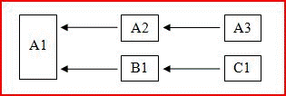

# Multithreaded recalculation in Excel

**Applies to**: Excel 2013 | Office 2013 | Visual Studio 
  
Microsoft Office Excel 2007 was the first version of Excel to use multithreaded recalculation (MTR) of worksheets. You can configure Excel to use up to 1024 concurrent threads when recalculating, regardless of the number of processors or processor cores on the computer. 
  
> [!NOTE]
> There is an operating system overhead associated with each thread, so you should not configure Excel to use more threads than you need. 
  
If the computer has multiple processors or processor cores, the operating system takes responsibility for allocating the threads to the processors in the most efficient way.
  
## Excel MTR overview

Excel tries to identify parts of the calculation chain that can be recalculated concurrently on different threads. The following very simple tree (where x ← y means y only depends on x) shows an example of this.
  
**Figure 1. Calculating concurrently on different threads**

  
After A1 is calculated, A2 and then A3 can be calculated on one thread, while B1 and then C1 can be calculated on another, assuming all the cells are thread safe. 
  
> [!NOTE]
> The term thread-safe cell means a cell that only contains thread-safe functions. What is and is not thread-safe is detailed [What Is and Is Not Considered Thread Safe by Excel](#xl2007xllsdk_threadsafe). 
  
Most practical workbooks contain far more complex dependency trees than this example. Moreover, the recalculation time of a cell cannot be known until a calculation is done and can vary greatly depending on the functions' arguments. To obtain the best results, Excel tries to improve the calculation order on every calculation until no further optimization is possible.
  
Excel uses a single main thread to run or execute the following:
  
- Built-in commands
    
- XLL commands
    
- XLL Add-in Manager interface functions (**xlAutoOpen** function, and so on) 
    
- Microsoft Visual Basic for Applications (VBA) user-defined commands (often referred to as macros)
    
- VBA user-defined functions
    
- Built-in thread-unsafe worksheet functions (see the next section for a list)
    
- XLM macro sheet user-defined commands and functions
    
- COM add-in commands and functions
    
- Functions and operators within conditional formatting expressions
    
- Functions and operators within defined name definitions used in worksheet formulas
    
- The forced evaluation of an expression in the formula-edit box using the **F9** key 
    
All worksheet formulas, regardless of whether the functions are thread safe or not, are evaluated on the main thread unless Excel is configured to use more than one thread. When the user specifies that more than one thread should be used, the additional threads are used for thread-safe cells. Note that the main thread may still be used for thread-safe cells when it makes sense from a load-balancing point of view.
  
It is worth restating that Excel does not run more than one command at once, so you do not need to employ the same precautions as when you are writing thread-safe functions, such as the use of thread-local memory and critical sections.
  
## What is and is not considered thread safe by Excel

Excel only considers the following as thread safe:
  
- All unary and binary operators in Excel.
    
- Almost all built-in worksheet functions starting in Excel 2007 (see exceptions list)
    
- XLL add-in functions that have been explicitly registered as thread-safe.
    
The built-in worksheet functions that are not thread safe are:
  
- **PHONETIC**
    
- **CELL** when either the "format" or "address" argument is used 
    
- **INDIRECT**
    
- **GETPIVOTDATA**
    
- **CUBEMEMBER**
    
- **CUBEVALUE**
    
- **CUBEMEMBERPROPERTY**
    
- **CUBESET**
    
- **CUBERANKEDMEMBER**
    
- **CUBEKPIMEMBER**
    
- **CUBESETCOUNT**
    
- **ADDRESS** where the fifth parameter (the sheet_name) is given 
    
- Any database function (**DSUM**, **DAVERAGE**, and so on) that refers to a pivot table
    
- **ERROR.TYPE**
    
- **HYPERLINK**
    
To be explicit, the following are considered to be unsafe:
  
- VBA user-defined functions
    
- COM add-in user-defined functions
    
- XLM macro-sheet user-defined functions
    
- XLL add-in functions not explicitly registered as thread safe
    
The implications are that the following operations and functions are not thread-safe, and fail if they are called from an XLL function registered as thread safe:
  
- Calls to XLM information functions, for example, **xlfGetCell** (**GET.CELL**).
    
- Calls to **xlfSetName** (**SET.NAME**) to define or delete XLL-internal names.
    
- Calls to thread-unsafe user-defined functions using **xlUDF**.
    
- Calls to the [xlfEvaluate](xlfevaluate.md) function for expressions that contain thread-unsafe functions or that contain defined names whose definitions contain thread-unsafe functions. 
    
- Calls to the [xlAbort](xlabort.md) function to clear a break condition. 
    
- Calls to the [xlCoerce](xlcoerce.md) function to get the value of an uncalculated cell reference. 
    
> [!NOTE]
> XLL worksheet functions are not permitted to call C API commands, for example, **xlcSave**, regardless of whether they have been registered as thread safe or not. 
  
Given that XLL functions declared as thread safe cannot call XLM information functions or reference uncalculated cells, Excel does not permit XLL functions that are registered as macro sheet equivalents to also be registered as thread safe. Therefore attempting to get the value of an uncalculated cell reference using **xlCoerce** fails with an **xlretUncalced** error. Calling an XLM information function fails with an **xlretFailed** error. The other points listed previously fail with an error code introduced in the Excel C API: **xlretNotThreadSafe**. 
  
The C API-only call-back functions are all thread safe:
  
- **xlCoerce** (except although coercion of uncalculated cell references fails) 
    
- **xlFree**
    
- **xlStack**
    
- **xlSheetId**
    
- **xlSheetNm**
    
- **xlAbort** (except when used to clear a break condition) 
    
- **xlGetInst**
    
- **xlGetHwnd**
    
- **xlGetBinaryName**
    
- **xlDefineBinaryName**
    
The one exception is the **xlSet** function, which is, in any case, a command-equivalent and so cannot be called from any worksheet function. 
  
An XLL worksheet function can be registered with Excel as thread safe. This tells Excel that the function can be called safely and simultaneously on multiple threads, although you must make sure this is really the case. You can possibly destabilize Excel if a function registered as thread safe then behaves unsafely.
  
## Registering XLL functions as thread safe

The rules that a developer must obey when writing thread-safe functions are as follows:
  
- Do not call resources in other DLLs that may not be thread safe.
    
- Do not make any thread-unsafe calls via the C API or COM.
    
- Protect resources that could be used simultaneously by more than one thread using critical sections.
    
- Use thread-local memory for thread-specific storage, and replace static variables within functions with thread-local variables.
    
Excel imposes an additional restriction: thread-safe functions cannot be registered as macro-sheet equivalents, and therefore cannot call XLM information functions or get the values of un-recalculated cells.
  
## Memory contention

Multithreaded systems must address two fundamental issues:
  
- How to protect memory that must be read from, or written to, by more than one thread.
    
- How to create and access memory that is associated with, and so private to, the executing thread.
    
The Windows operating system and Windows Software Development Kit (SDK) provide tools for both of these: critical sections and the thread-local storage (TLS) API respectively. For more information, see [Memory Management in Excel](memory-management-in-excel.md).
  
The first issue can arise, for example, when two worksheet functions (or two simultaneously running instances of the same function) need to access or modify a global variable in a DLL project. Remember that such a global variable might be hidden in a globally accessible instance of a class object.
  
The second issue can arise, for example, when a worksheet function declares a static variable or object within the function body code. The C/C++ compiler only creates a single copy that all threads use. This means one instance of the function could change the value, while another on a different thread might be assuming the value is what it previously set.
  
## Example applications of MTR

Any XLL that exports worksheet functions can take advantage of multithreaded recalculation (MTR) in Excel provided that those functions do not need to perform thread-unsafe actions. This enables Excel to recalculate workbooks that depend on them as quickly as possible and is therefore desirable whatever the application.
  
Specifically, MTR has an enormous impact on the recalculation time of workbooks that call user-defined functions (UDFs) that themselves call external processes to obtain the desired result. In particular, consider a UDF that calls a remote server that can process many requests simultaneously and a workbook containing many calls to that function. If recalculation of the workbook is single-threaded, each call to the UDF, and so to the remote server, must complete before the next one can be made. This wastes the server's ability to process many calls at once. If recalculation of the workbook is multithreaded, Excel can make multiple calls at the same time or in rapid succession.
  
If Excel is configured to use the same number of threads as the server—call it N—and the topology of the dependency tree of the workbook permits it, the total recalculation time could be reduced to something approaching 1/N of the single-threaded calculation time. This may be true even where the client computer (on which the workbook is running) only has one processor, especially where the time taken to make the call to the server is small relative to the time it takes the server to process the call. 
  
There is operating system overhead for each additional thread. Therefore some experimentation might be required for a given workbook and a given server and client computer to find the optimum number of threads Excel should be told to use. 
  
For example, consider a single-processor computer that is running Excel and a workbook that contains 1,000 cells. It calls a UDF, which in turn calls one or more remote servers. Assume that the 1,000 cells do not depend upon each other, so that Excel does not have to wait for one call to complete before calling the next. (Some relaxation of this constraint is possible without affecting this example.) If the servers can process 100 requests simultaneously, and Excel is configured to use 100 threads, the execution time can be reduced to as little as 1/100th of that where only one thread is used. The overhead that is associated with Excel allocating calls to each thread and the operating system managing 100 threads means that, in practice, the reduction will not be quite this great. There is also an implicit assumption here that the server scales well, and asking it to process 100 tasks concurrently will not affect individual task completion times significantly.
  
One practical application in which this technique can have an important benefit is that of Monte-Carlo methods, as well as other numerically intensive tasks that can be split into smaller sub-tasks that can be farmed out to servers.
  
## Excel Services considerations

Excel Services supports the loading, calculating, and rendering of Excel spreadsheets on a server. Users can then access and interact with the spreadsheets by using standard browser tools.
  
Excel Services UDFs are created using Microsoft .NET Framework managed code and made available though a .NET assembly. XLLs are not supported by Excel Services. A managed code server UDF resource can call into an XLL to access its functionality, so that the user can have the same functionality with a server-loaded workbook as with a client-loaded workbook.
  
To make an XLL's functions available in this way, they must therefore be wrapped in a .NET assembly that converts arguments and return values from the native data types to the .NET Framework managed data types, and that calls the XLL functions. The .NET wrapper would export one server UDF for each XLL function being accessed. An additional requirement is that any XLL functions called in this way must be thread safe. Because the XLL functions are not registered in the way that they are with client Excel, the server and the .NET wrapper have no way of enforcing that they are thread safe. It is the responsibility of the XLL developer to ensure this.
  
## See also

- [Excel Recalculation](excel-recalculation.md)  
- [Memory Management in Excel](memory-management-in-excel.md) 
- [Accessing XLL Code in Excel](accessing-xll-code-in-excel.md)  
- [Excel Programming Concepts](excel-programming-concepts.md)  
- [Excel XLL SDK API Function Reference](excel-xll-sdk-api-function-reference.md)

