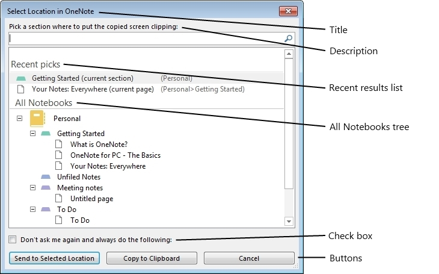

# Quick Filing dialog box interfaces (OneNote)

This topic describes the interfaces that you can use to programmatically customize the Quick Filing dialog box in OneNote 2013.
  
## Quick Filing Dialog Box

The Quick Filing dialog box in OneNote 2013 is a customizable dialog box that allows users to select a location within the OneNote hierarchy structure. Selectable locations include notebooks, section groups, sections, pages, and subpages. The dialog box is used both within the OneNote application and by external applications through the OneNote 2013 API. Figure 1 shows the Quick Filing dialog box in its default state.
  
**Figure 1. Quick Filing dialog box without customizations**


  
Within the dialog box, users can navigate the All Notebooks hierarchy to look for specific locations or search the OneNote tree structure by typing into the text box. Aspects of the dialog box that can be customized include the title, description, recent results list, check box text and state, tree depth, buttons, and selectable location types.
  
## Interfaces

You can access the Quick Filing dialog box functionality through two OneNote 2013 interfaces. The **IQuickFilingDialog** interface allows users to instantiate, set up, and run the dialog box. The **IQuickFilingDialogCallback** interface is called after the dialog box is closed. The dialog box is run in the OneNote process, so a mechanism is needed to keep the dialog box's thread running and then to capture the user's selection and the state of the dialog box when it is closed. 
  
## IQuickFilingDialog Interface
<a name="odc_IQuickFilingDialog"> </a>

This interface allows the user to customize and run the dialog box. The user can instantiate a dialog box through the **Application** class by using the **Application.QuickFilingDialog** method. The method returns an instance of the dialog box. Once the properties of the dialog box are set, the **IQuickFilingDialog.Run** method is used to run the dialog box. This method runs the dialog box on a new thread. 
  
**Properties**

|**Name**|**Type**|**Description**|
|:-----|:-----|:-----|
|**Title** <br/> |string  <br/> |Gets or sets the title text that appears in the title bar of the dialog box window.  <br/> |
|**Description** <br/> |string  <br/> |Gets or sets the text description to instruct the user about what to select. This value can be multiple-line text.  <br/> |
|**CheckboxText** <br/> |string  <br/> |Gets or sets the text that follows the check box. If this value is set to a non-empty string, a check box appears in the dialog box. If the value is an empty string, no check box appears.  <br/> |
|**CheckboxState** <br/> |bool  <br/> |Gets or sets the state of the check box. If value is set to **false**, the check box is cleared when the dialog box is started. If the value is set to **true**, the check box is selected when the dialog box is started as long as **CheckboxText** is a non-empty string.  <br/> |
|**WindowHandle** <br/> |ulong  <br/> |Gets the handle ID of the Quick Filing dialog box window.  <br/> |
|**TreeDepth** <br/> |**HierarchyElement** <br/> |Gets or sets how deep the OneNote tree should be displayed in the All Notebooks section. By default, the tree is displayed up to the sections. This property does not affect what type of elements can be selected.  <br/> If **TreeDepth** is set to an element lower in the OneNote hierarchy than can be selected by any of the buttons, the displayed tree depth will be the lowest possible selectable element. That is, if tree depth is set to display down to pages, but the lowest selectable element is a section, the tree is displayed down to sections.  <br/> |
|**ParentWindowHandle** <br/> |ulong  <br/> |Gets or sets the handle ID of the parent window of the dialog box. If this property is set, the Quick Filing dialog box will be modal to the assigned parent window when the dialog box opens. That is, a user will not be able to access the parent window until the Quick Filing dialog box is closed.  <br/> |
|**Position** <br/> |tagPOINT  <br/> |Gets or sets the position of the window in relation to the screen. By default, the dialog box appears in the middle of the parent window or the desktop.  <br/> |
|**SelectedItem** <br/> |string  <br/> |Gets the object ID of the OneNote location selected by the user when the dialog box is closed. If the user clicks the **Cancel** button, the object is set to null.  <br/> |
|**PressedButton** <br/> |ulong  <br/> |Gets which button was clicked when the dialog box was closed. If the **Cancel** button was clicked, this property returns a value of -1. All other buttons are assigned integer values from 0, incremented by 1 for each button added to the dialog box. The integer value of the default **OK** button is 0.  <br/> |
   
### Methods

**SetRecentResults**

|||
|:-----|:-----|
|**Description** <br/> |Sets what recent result list will be displayed in the Quick Filing dialog box, and indicates whether to include some special filing locations in the list. Users can select a recent result list from the [RecentResultType](enumerations-onenote-developer-reference.md#odc_RecentResultType) enumeration. Users can also choose to add the following options to the list: Current Section, Current Page, or Unfiled Notes. If **RecentResultType.rrtNone** is selected, no recent result list is shown.  <br/> |
|**Syntax** <br/> | `HRESULT SetRecentResults (`           ` [in]RecentResultType recentResults, `           ` [in]VARIANT_BOOL fShowCurrentSection, `           ` [in]VARIANT_BOOL fShowCurrentPage, `           ` [in]VARIANT_BOOL fShowUnfiledNotes); ` <br/> |
|**Parameters** <br/> | _recentResults_—An object of type **RecentResultType** that indicates which recent result list, if any, should appear. If **rrtNone** is selected, no recent result list appears in the dialog box.  <br/>  _fShowCurrentSection_—A Boolean value that indicates whether the current section should be included in the recent result list.  <br/>  _fShowCurrentPage_—A Boolean value that indicates whether the current page should be included in the recent result list.  <br/>  _fShowUnfiledNotes_—A Boolean value that indicates whether the Unfiled Notes section should be included in the recent result list.  <br/> |
   
> [!NOTE]
> If a special filing location cannot be selected by using any of the buttons in the dialog box, it is not shown in the list. If no selectable item in the recent results list is found, no recent result list is displayed. 
  
The following example uses the **SetRecentResults** method to display the current section, current page, and the Unfiled Notes section in the recent result list. 
  
```cs
        static void Main(string[] args)
        {
            Microsoft.Office.Interop.OneNote.Application app = 
                new Microsoft.Office.Interop.OneNote.Application();
            ... 
            // RECENT RESULTS
            qfDialog.SetRecentResults(RecentResultType.rrtFiling,
                /*Current Section*/ true,
                /*Current Page*/ true,
                /*Unfiled Notes*/ true);
            ...
        }

```

**AddButton**

|||
|:-----|:-----|
|**Description** <br/> |Allows users to add and customize buttons in the dialog box. Users can specify the text on the buttons and what elements of the OneNote hierarchy can be selected by each button.  <br/> |
|**Syntax** <br/> | `HRESULT AddButton (`           ` [in]BSTR bstrText, `           ` [in]HierarchyElement allowedElements, `           ` [in]HierarchyElement allowedReadOnlyElements, `           ` [in]VARIANT_BOOL fDefault); ` <br/> |
|**Parameters** <br/> | _bstrText_—A string that specifies the text to appear on the button. To customize the default **OK** button, pass in a null value as **bstrText**.  <br/>  _allowedElements_—A **HierarchyElement** that indicates what non-read-only OneNote hierarchy elements a user is allowed to select by using the button. For selecting multiple items, the user should pass in the **OR** operator for all the uint equivalent values of the **HierarchyElement** types allowed as a **HierarchyElement**.  <br/>  _allowedReadOnlyElements_—A **HierarchyElement** that indicates what OneNote read-only hierarchy elements a user is allowed to select by using the button. For selecting multiple items, the user should pass in the **OR** operator for all the **uint** equivalents values of the **HierarchyElement** types allowed as a **HierarchyElement**.  <br/>  _fDefault_—A Boolean value that specifies whether this button should be the default button. If multiple buttons are set as default, the last specified button becomes the default button.  <br/> |
   
The following example adds three buttons to the Quick Filing dialog box. The first one, **All**, can be selected by all elements in the OneNote hierarchy tree. The others, **Notebooks** and **Pages**, can be selected only if their corresponding elements, Notebooks and Pages, are selected.
  
```cs
        static void Main(string[] args)
        {
            Microsoft.Office.Interop.OneNote.Application app = 
                new Microsoft.Office.Interop.OneNote.Application();
            ... 
            
            // BUTTONS
            HierarchyElement heAll = (HierarchyElement) 
                ((uint)HierarchyElement.heNotebooks | 
                (uint)HierarchyElement.heSectionGroups | 
                (uint)HierarchyElement.heSections |  
                (uint)HierarchyElement.hePages);
            
            qfDialog.AddButton("All", heAll, heAll, true);
            qfDialog.AddButton("Notebooks", HierarchyElement.heNotebooks, 
                HierarchyElement.heNotebooks, false);
            qfDialog.AddButton("Pages", HierarchyElement.hePages, 
                HierarchyElement.hePages, false);
            ... 
        }

```

**Run**

|||
|:-----|:-----|
|**Description** <br/> |Displays the Quick Filing dialog box from a new thread. It takes a reference to the **IQuickFilingDialogCallback** interface, whose **OnDialogClosed** method will be called once the dialog box closes.  <br/> |
|**Syntax** <br/> | `HRESULT Run (`           ` [in]IQuickFilingDialogCallback piCallback); ` <br/> |
|**Parameters** <br/> | _piCallback_—A reference to the **IQuickFilingDialogCallback** interface that will be instantiated once the dialog box closes.  <br/> |
   
The following example uses the **Run** method to display the Quick Filing dialog box from a new thread. 
  
```cs
    class OpenQuickFilingDialog
    {
            ... 
        static void Main(string[] args)
        {
            Microsoft.Office.Interop.OneNote.Application app = 
                new Microsoft.Office.Interop.OneNote.Application();
            ... 
            // Display Quick Filing UI
            qfDialog.Run(new Callback());
            ... 
        }
    }

```

**TreeCollapsedState**

|||
|:-----|:-----|
|**Description** <br/> |Indicates whether the hierarchy tree should be expanded or collapsed.  <br/> |
|**Syntax** <br/> | `HRESULT TreeCollapsedState(`           `[in] TreeCollapsedStateType tcs);` <br/> |
|**Parameters** <br/> | _tcs_ - Specifies whether the tree is expanded or collapsed.  <br/> |
   
**NotebookFilterOut**

|||
|:-----|:-----|
|**Description** <br/> |Filters the list of notebooks shown by type.  <br/> |
|**Syntax** <br/> | `HRESULT NotebookFilterOut(`           `[in] NotebookFilterOutType nfo);` <br/> |
|**Parameters** <br/> | _nfo_ - Specifies the set of notebooks that are to be filtered out of the list  <br/> |
   
**ShowCreateNewNotebook**

|||
|:-----|:-----|
|**Description** <br/> |Displays the create new notebook option in the dialog.  <br/> |
|**Syntax** <br/> | `HRESULT ShowCreateNewNotebook ();` <br/> |
|**Parameters** <br/> |None  <br/> |
   
**AddInitialEditor**

|||
|:-----|:-----|
|**Description** <br/> |Adds a user as an initial editor to a notebook in the Quick Filing dialog box.  <br/> |
|**Syntax** <br/> | `HRESULT AddInitialEditor (BSTR initialEditor);` <br/> |
|**Parameters** <br/> | _initialEditor_ - The email address of the user you wish to add as an editor to the notebook. When the notebook is created via the Quick Filing dialog box, it is automatically shared with all Initial Editors.  <br/> |
   
**ClearInitialEditors**

|||
|:-----|:-----|
|**Description** <br/> |Removes all initial editors from the Quick Filing dialog box.  <br/> |
|**Syntax** <br/> | `HRESULT ClearInitialEditors ();` <br/> |
|**Parameters** <br/> |None  <br/> |
   
**ShowSharingHyperlink**

|||
|:-----|:-----|
|**Description** <br/> |Displays the Sharing Help Topic Hyperlink in the Quick Filing dialog box.  <br/> |
|**Syntax** <br/> | `HRESULT ShowSharingHyperlink();` <br/> |
|**Parameters** <br/> |None  <br/> |
   
## IQuickFilingDialogCallback Interface
<a name="odc_IQuickFilingDialog"> </a>

This interface allows the user to access the dialog box properties after the dialog box closes. Once the dialog box closes, OneNote 2013 calls the **IQuickFilingDialogCallback.OnDialogClose** method in this interface. 
  
A class that inherits this interface has to be defined.
  
### Methods

The following section describes the methods associated with the interfaces detailed previously.
  
**OnDialogClosed**

|||
|:-----|:-----|
|**Description** <br/> |Enables users to add functionality to capture and use the user selection from the dialog box. This method is called after the Quick Filing dialog box is closed. This method is a function that **IQuickFilingDialogCallback** interfaces have to define.  <br/> |
|**Syntax** <br/> | `HRESULT OnDialogClosed (`           ` [in]IQuickFilingDialog dialog); ` <br/> |
|**Parameters** <br/> | _dialog_—The **IQuickFilingDialog** object that called the **OnDialogClose** method.  <br/> |
   
The following example is a sample **IQuickFilingDialogCallback** interface. The **OnDialogClose** method prints the user's selection from the Quick Filing dialog box to the console. 
  
```cs
    class Callback : IQuickFilingDialogCallback
    {
        public Callback(){}
        public void OnDialogClosed(IQuickFilingDialog qfDialog)
        {
            Console.WriteLine(qfDialog.SelectedItem);
            Console.WriteLine(qfDialog.PressedButton);
            Console.WriteLine(qfDialog.CheckboxState);
        }
    }

```

## Example
<a name="odc_IQuickFilingDialog"> </a>

The following code example opens a Quick Filing dialog box that has a customized title, description, recent result list, tree depth, check box, and buttons. The user's selected item, pressed button, and check-box state will be displayed in a console window when the dialog box is closed. To see the page button enabled, the user will have to search for a page and select it, because the tree depth is set down to sections. The dialog box is not a child of any window.
  
```cs
using System;
using System.Collections.Generic;
using System.Linq;
using System.Text;
using System.Threading;
using Microsoft.Office.Interop.OneNote;
namespace SampleQFD
{
    class OpenQuickFilingDialog
    {
        private static EventWaitHandle wh = new AutoResetEvent(false);
        private static IQuickFilingDialog qfDialog;
        private static String strTitle = "Sample Title";
        private static String strDescription = "Sample Description";
        private static String strCheckboxText = "Sample Checkbox";
        static void Main(string[] args)
        {
            Microsoft.Office.Interop.OneNote.Application app = 
                new Microsoft.Office.Interop.OneNote.Application();
            // Instantiate Quick Filing UI
            qfDialog = app.QuickFiling();
            #region//SET API PARAMETERS
            // TITLE
            qfDialog.Title = strTitle;
            // DESCRIPTION
            qfDialog.Description = strDescription;
            // RECENT RESULTS
            qfDialog.SetRecentResults(RecentResultType.rrtFiling,
                /*Current Section*/ true,
                /*Current Page*/ true,
                /*Unfiled Notes*/ true);
            // TREE DEPTH
            qfDialog.TreeDepth = HierarchyElement.heSections;
            // CHECKBOX
            qfDialog.CheckboxText = strCheckboxText;
            qfDialog.CheckboxState = false;
            // BUTTONS
            HierarchyElement heAll = (HierarchyElement) 
                ((uint)HierarchyElement.heNotebooks | 
                (uint)HierarchyElement.heSectionGroups | 
                (uint)HierarchyElement.heSections |  
                (uint)HierarchyElement.hePages);
            
            qfDialog.AddButton("All", heAll, heAll, true);
            qfDialog.AddButton("Notebooks", HierarchyElement.heNotebooks, 
                HierarchyElement.heNotebooks, false);
            qfDialog.AddButton("Pages", HierarchyElement.hePages, 
                HierarchyElement.hePages, false);
            // PARENTWINDOW
            #endregion
            // Display Quick Filing UI
            qfDialog.Run(new Callback());
            // Clean up and Wait so console window does not close
            qfDialog = null;
            wh.WaitOne();
        }
    }
    class Callback : IQuickFilingDialogCallback
    {
        public Callback(){}
        public void OnDialogClosed(IQuickFilingDialog qfDialog)
        {
            Console.WriteLine(qfDialog.SelectedItem);
            Console.WriteLine(qfDialog.PressedButton);
            Console.WriteLine(qfDialog.CheckboxState);
        }
    }
}

```

## See also
<a name="odc_IQuickFilingDialog"> </a>

#### Concepts

[OneNote developer reference](onenote-developer-reference.md)

