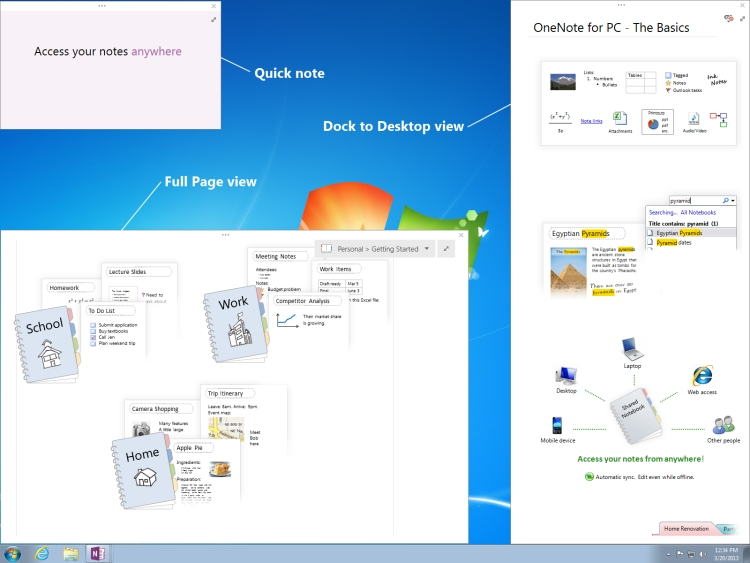

# Window interfaces (OneNote)

The **Window** and **Windows** interfaces are OneNote 2013 API objects that enables users to work with OneNote windows. These objects allow users to enumerate through the set of OneNote windows and modify certain window properties.
  
## OneNote window views

The following list shows the four view modes that you can use for OneNote windows:
  
- Normal view—Displays the default OneNote window in which the Notebook and Page navigation panes are visible.

- Full Page view—Displays a minimal user-interface (UI) view in which the Notebook and Page panes are not displayed.

- Quick note—Displays a small window that allows users to take short notes. You would usually access quick notes through the OneNote icon in the Windows notification area, but you can also access them through the **View** tab in OneNote.

- Dock to Desktop—Displays a OneNote window that you can dock to any side of the desktop (similar to the taskbar). This view reduces the size of the desktop to fit the window. You can dock only one window at any time, and the window is always visible without blocking the desktop.

The following figure shows what the Full Page view, Dock to Desktop view, and quick notes look like on your desktop.
  
**OneNote views**


  
## Interfaces

This section lists the interfaces and members that you can use to modify OneNote windows programmatically.
  
### Windows interface

The **Windows** interface allows the user to access the set of opened OneNote windows. It is a property of the OneNote **Application** class, accessed through **Application.Windows**. This returns the enumerated set of OneNote windows.
  
**Properties**

|**Name**|**Type**|**Description**|
|:-----|:-----|:-----|
|**Count** <br/> |ulong  <br/> |Gets the number of **Window** objects in the **Windows** set. |
|**CurrentWindow** <br/> |**Window** <br/> |Gets the **Window** object of the active OneNote window. |
|**Items** <br/> |**Window** <br/> |Returns the **Window** object that corresponds to the index value passed. This property cannot be accessed directly. To return a **Window** object, use **Windows [(uint) index]**. |

### Window interface

The **Window** interface allows the user to access certain properties of each window. Each OneNote window can be accessed by enumerating through the **Windows** property of the **Application** class.
  
**Properties**

|**Name**|**Type**|**Description**|
|:-----|:-----|:-----|
|**Active** <br/> |bool  <br/> |Gets or sets a value that indicates whether the window is the active OneNote window. |
|**Application** <br/> |**Application** <br/> |Gets the OneNote **Application** object that is associated with the window. |
|**CurrentPageId** <br/> |string  <br/> |Gets the object ID of the active OneNote page of the window. |
|**CurrentSectionId** <br/> |string  <br/> |Gets the object ID of the active OneNote section of the window. |
|**CurrentSectionGroupId** <br/> |string  <br/> |Gets the object ID of the active OneNote section group of the window. |
|**CurrentNotebookId** <br/> |string  <br/> |Gets the object ID of the active OneNote notebook of the window. |
|**DockedLocation** <br/> |**DockedLocation** <br/> |Gets or sets the docked location of the OneNote window. |
|**FullPageView** <br/> |bool  <br/> |Gets or sets a value that indicates whether the window is in Full Page view (minimal UI view). |
|**SideNote** <br/> |bool  <br/> |Gets or sets a value that indicates whether the window is a quick note window. |
|**WindowHandle** <br/> |ulong  <br/> |Gets the handle ID of the OneNote window. |

**Methods**
  
You can use the following methods of the **Window** interface to navigate to specified objects in the OneNote window or to specified URLs.
  
**NavigateTo**

|||
|:-----|:-----|
|**Description** <br/> |Navigates to the specified object in the OneNote window. For example, you can navigate to sections, pages, and outline elements within pages. |
|**Syntax** <br/> | `HRESULT NavigateTo(`           ` [in]BSTR bstrHierarchyObjectID, `           ` [in]BSTR bstrObjectID); ` <br/> |
|**Parameters** <br/> | _bstrHierarchyObjectID_—The hierarchy OneNote ID of the object you want to navigate to. The object ID can reference a OneNote notebook, section, section group, or page.  _bstrObjectID_—The OneNote ID of the specific object to navigate to within a OneNote page. If the user does not want to navigate to a specific object on a page, this parameter is set to null. |

**NavigateToUrl**

|||
|:-----|:-----|
|**Description** <br/> |If passed a OneNote link (onenote://), opens the OneNote window to the corresponding location in OneNote. However, if the link is an external link, such as https:// or file://, a security dialog box will appear. Upon dismissal, OneNote attempts to open up the link and an HResult.hrObjectDoesNotExist error is returned. |
|**Syntax** <br/> | `HRESULT NavigateToUrl (`           ` [in]BSTR bstrUrl); ` <br/> |
|**Parameters** <br/> | _bstrUrl_—The URL to navigate to. |

**SetDockedLocation**

|||
|:-----|:-----|
|**Description** <br/> |Docks the window to the location specified by **dockLocation** and the monitor at **ptMonitor**. |
|**Syntax** <br/> | `HRESULT SetDockedLocation`(           `[in] DockLocation dockLocation,`           `[in] POINT ptMonitor);` <br/> |
|**Parameters** <br/> | _dockLocation_ - Indicates the docked location of a OneNote 2013 window.  _ptMonitor_ - (Optional) Indicates in x,y co-ordinates which monitor the window should be docked to. |

## Example

The following code iterates through the OneNote windows to find a docked window. If no docked window exists, the example docks the active window. If no active window exists, the code creates a new docked window.
  
```cs
using System;
using System.Diagnostics;
using Microsoft.Office.Interop.OneNote;
namespace SampleWND
{
    class DockOneNoteWindow
    {
        static void Main(string[] args)
        {
            Microsoft.Office.Interop.OneNote.Application app = new Microsoft.Office.Interop.OneNote.Application();
            // Search through all OneNote windows for a docked window and activate it.
            bool foundDockedWND = false;
            for (int i = 0; i < app.Windows.Count; i++)
            {
                if (app.Windows[(uint) i].DockedLocation != DockLocation.dlNone)
                {
                    foundDockedWND = true;
                    app.Windows[(uint) i].Active = true;
                }
            }
            
            // If no docked window exists, dock the active window.
            if (!foundDockedWND && (app.Windows.Count > 0))
                app.Windows.CurrentWindow.DockedLocation = DockLocation.dlDefault;
            // If no active window exists, create a new docked window.
            if (app.Windows.Count < 1)
            {
                Process oneProc = new Process();
                oneProc.StartInfo.FileName = "onenote.exe";
                oneProc.StartInfo.Arguments = "/docked";
                oneProc.Start();
            }
        }
    }
}

```

## See also

- [OneNote developer reference](onenote-developer-reference.md)
