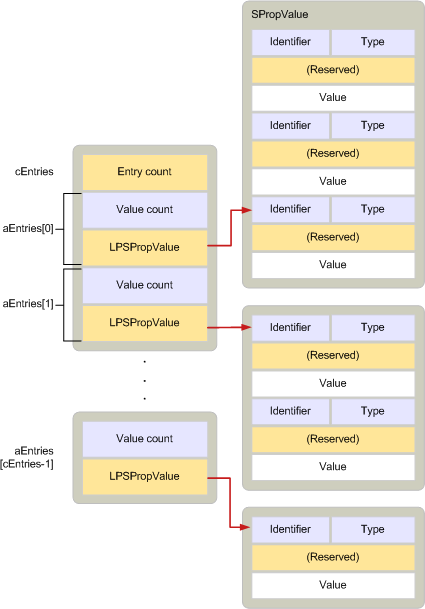

# ADRLIST

**Applies to**: Outlook 2013 | Outlook 2016
  
Describes zero or more properties that belong to one or more recipients.
  
|**Value**|**Description**|
|:-----|:-----|
|Header file:  <br/> |Mapidefs.h  <br/> |
|Related macros:  <br/> |[CbADRLIST](cbadrlist.md), [CbNewADRLIST](cbnewadrlist.md), [CbNewADRLIST](cbnewadrlist.md) <br/> |

```cpp
typedef struct _ADRLIST
{
  ULONG cEntries;
  ADRENTRY aEntries[MAPI_DIM];
} ADRLIST, FAR *LPADRLIST;

```

## Members

**cEntries**
  
> Count of entries in the array specified by the **aEntries** member.

**aEntries**
  
> Array of [ADRENTRY](adrentry.md) structures, one structure for each recipient.

## Remarks

An **ADRLIST** structure contains one or more **ADRENTRY** structures, each describing the properties of a recipient. A recipient can be unresolved. This means that it is lacking an entry identifier in its array of property values. A resolved recipient means that the **PR\_ENTRYID** ([PidTagEntryId](pidtagentryid-canonical-property.md)) property is included. Typically, resolved recipients also have an email address the **PR_EMAIL_ADDRESS** ([PidTagEmailAddress](pidtagemailaddress-canonical-property.md)) property. However, the email address is not required. **ADRLIST** structures are used, for example, to describe the recipient list for an outgoing message and by MAPI to display the entries in the address book.
  
**ADRLIST** structures resemble [SRowSet](srowset.md) structures the structures used for representing rows in tables. In fact, these two structures are designed so that they can be used interchangeably. Both contain an array of structures describing a group of properties and a count of the values in the array. Whereas in the **ADRLIST** structure, the array contains [ADRENTRY](adrentry.md) structures, in the **SRowSet** structure the array contains [SRow](srow.md) structures. **ADRENTRY** structures and **SRow** structures are identical in layout. Because **ADRLIST** and **SRowSet** structures follow the same allocation rules, an **SRowSet** structure that is retrieved from the contents table of an address book container can be cast to an **ADRLIST** structure and used as is.
  
The following illustration shows the layout of an **ADRLIST** structure.  


  
The **ADRENTRY** and [SPropValue](spropvalue.md) portions in an **ADRLIST** structure must be allocated and freed independently of the other parts. That is, each **SPropValue** structure must be allocated individually after memory for the **ADRENTRY** structure has been allocated and freed before the **ADRENTRY** structure is freed. This independence in handling memory allows recipients and individual recipient properties to be freely added or deleted from the address list.
  
The [MAPIAllocateBuffer](mapiallocatebuffer.md) and [MAPIFreeBuffer](mapifreebuffer.md) functions must be used to allocate and free the **ADRLIST** structure and all its parts.
  
If a recipient list is too large to fit in memory, clients can call the [IMessage::ModifyRecipients](imessage-modifyrecipients.md) method to work with a subset of the list. Clients should not use the address book common dialog boxes in this situation.
  
For more information about how to allocate memory for **ADRENTRY** structures, see [Managing Memory for ADRLIST and SRowSet Structures](managing-memory-for-adrlist-and-srowset-structures.md).
  
## See also

- [ADRENTRY](adrentry.md)  
- [CbNewADRLIST](cbnewadrlist.md)
- [IMessage::ModifyRecipients](imessage-modifyrecipients.md)
- [SRowSet](srowset.md)
- [MAPI Structures](mapi-structures.md)
