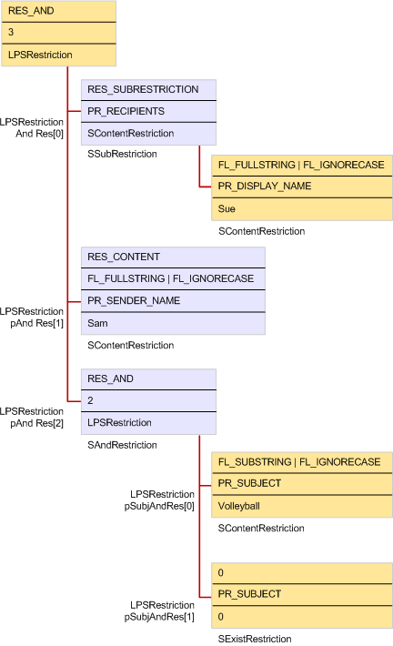

# Building a restriction

**Applies to**: Outlook 2013 | Outlook 2016 
  
To build a restriction, a client application creates a hierarchy of one or more restriction structures of various types and passes a pointer to the hierarchy to the [IMAPITable::Restrict](imapitable-restrict.md) or [IMAPITable::FindRow](imapitable-findrow.md) method. The illustration that follows and the code sample in [Sample Restriction Code](sample-restriction-code.md) demonstrate how a typical restriction is implemented with linked restriction structures of different types. 

In this example, a user of a client application is trying to find all messages that contain the word "volleyball" in the subject line and were sent to Sue from Sam. First, a generic [SRestriction](srestriction.md) structure is allocated. This structure becomes the basis for other calls to the [MAPIAllocateMore](mapiallocatemore.md) function to create linked [SRestriction](srestriction.md) and [SPropValue](spropvalue.md) structures that can be freed with a single call to [MAPIFreeBuffer](mapifreebuffer.md). Because the criteria to apply to the set of messages is in three parts, the top level restriction structure is an **AND** restriction. The [SAndRestriction](sandrestriction.md) structure's **cRes** member is set to 3 to indicate the three restrictions to evaluate and its **lpRes** member is set to a three member array of **SRestriction** structures. 
  
To search for messages that are sent to a particular recipient, it is necessary to search the recipient table for each message rather than the message itself. A subobject restriction is used to perform the recipient table search. Therefore, the first member of the array points to an [SSubRestriction](ssubrestriction.md) structure with its **ulSubObject** member set to **PR_MESSAGE_RECIPIENTS** ([PidTagMessageRecipients](pidtagmessagerecipients-canonical-property.md)). Then, to specify what to look for in the recipient table, a content restriction is used. 
  
The second and third members of the array are more straightforward. They both point to content restriction structures, one to search for messages that have a **PR_SENDER_NAME** ([PidTagSenderName](pidtagsendername-canonical-property.md)) property set to "Sam" and another that has a **PR_SUBJECT** ([PidTagSubject](pidtagsubject-canonical-property.md)) property set to "volleyball."
  
**Restriction implementation**
  

  
## See also

- [MAPI Tables](mapi-tables.md)

