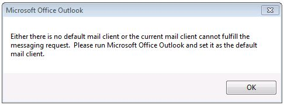
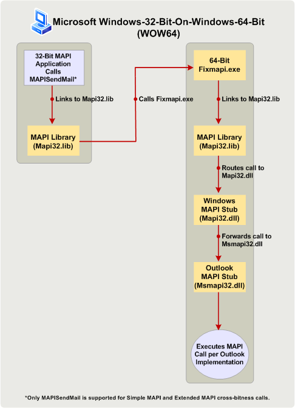

# Building MAPI Applications on 32-Bit and 64-Bit Platforms

  
  
**Applies to**: Outlook 
  
This topic describes the actions that MAPI developers should take to change and rebuild 32-bit MAPI applications to run on a 64-bit platform, and 64-bit applications to run on a 32-bit platform. In this topic, a 64-bit platform is a computer installed with 64-bit Microsoft Outlook and 64-bit Windows, and a 32-bit platform is a computer installed with a 32-bit Outlook and 32-bit or 64-bit Windows. 
  
## Operating System and Office Support for 64-Bit Outlook

> [!NOTE]
> The term bitness refers to the distinction between 32-bit and 64-bit processor architectures and the associated compatibility of applications. In this topic, bitness is used to qualify the version of Windows, Microsoft Office, Outlook, or a MAPI application built to suit a 32-bit or 64-bit processor architecture of a computer, and possibly other applications that run on that computer. 
  
Starting in Microsoft Office 2010, Outlook is available as a 32-bit and a 64-bit application. On the same computer, the bitness of Outlook depends on the bitness of the Windows operating system (x86 or x64), and of Microsoft Office, if Office is already installed on that computer. The following are some of the factors that determine the feasibility of installing a 32-bit or a 64-bit version of Outlook:
  
- 32-bit Office (and 32-bit Outlook) can be installed on a 32-bit or 64-bit version of the Windows operating system. 64-bit Office (and 64-bit Outlook) can be installed only on a 64-bit operating system.
    
- The default installation of Office on a 64-bit version of the Windows operating system is 32-bit Office.
    
- The bitness of an installed version of Outlook is always the same as the bitness of Office, if Office is installed on the same computer. In other words, a 32-bit version of Outlook cannot be installed on the same computer that already has 64-bit versions of other Office applications installed, such as 64-bit Microsoft Word or 64-bit Microsoft Excel. Similarly, a 64-bit version of Outlook cannot be installed on the same computer that already has 32-bit versions of other Office applications installed.
    
## Preparing MAPI Applications for 32-Bit and 64-Bit Platforms

MAPI applications include standalone applications such as Microsoft Communicator and MFCMAPI, and service providers such as address book, store, and transport providers. For MAPI method and function calls to work in a MAPI application (with the exception of one Simple MAPI function, MAPISendMail), the bitness of the MAPI application must be the same as the bitness of the MAPI subsystem on the computer that the application is targeted to run on. The bitness of the MAPI subsystem, in turn, is determined by and always the same as the bitness of the installed version of Outlook. The following table summarizes the necessary actions to prepare MAPI applications to run on targeted computers configured with Office and Windows of various bitness.
  
|**Bitness of MAPI application**|**Bitness of Outlook on targeted computer**|**Bitness of Windows on targeted computer**|**Necessary action to enable application to run on targeted computer**|
|:-----|:-----|:-----|:-----|
|32-bit    |32-bit    |32-bit or 64-bit    |No specific action is necessary.    |
|32-bit    |64-bit    |64-bit    |Rebuild the application as a 64-bit application. Otherwise, all MAPI method and function calls (except for **MAPISendMail**) will fail.    |
|64-bit    |64-bit    |64-bit    |No specific action is necessary.    |
|64-bit    |32-bit    |32-bit or 64-bit    |Rebuild the application as a 32-bit application. Otherwise, all MAPI method and function calls (except for **MAPISendMail**) will fail.    |
   
The following sections further explain each scenario. For scenarios that require rebuilding the MAPI application, see [Link to MAPI Functions](how-to-link-to-mapi-functions.md) for additional information regarding linking to and calling MAPI functions. 
  
### 32-Bit MAPI Application and 32-Bit Outlook

MAPI applications compiled for a 32-bit MAPI subsystem that is available in 32-bit versions of Outlook, including those versions prior to Microsoft Outlook 2013, continue to be supported on computers installed with 32-bit Outlook and a 32-bit or 64-bit Windows operating system. There is no specific action necessary for the application developers.
  
### 32-bit MAPI Application and 64-Bit Outlook

32-bit MAPI applications are not supported to run on a computer installed with 64-bit Outlook and 64-bit Windows. The application developer must update and rebuild the application as a 64-bit application for the 64-bit platform. This is because a 32-bit application cannot load a 64-bit Msmapi32.dll file. There are a small number of API changes that application developers must incorporate to build their code successfully for a 64-bit environment. MAPI header files have been updated with these changes to support the 64-bit platform. You can download these header files at [Outlook 2010: MAPI Header Files](http://www.microsoft.com/downloads/details.aspx?FamilyID=f8d01fc8-f7b5-4228-baa3-817488a66db1). Developers can use this same set of MAPI header files to build both 32-bit and 64-bit MAPI applications.
  
### 64-bit MAPI Application and 64-Bit Outlook

64-bit MAPI applications are supported on computers installed with 64-bit Outlook and 64-bit Windows. There is no specific action necessary for the application developers.
  
### 64-Bit MAPI Application and 32-Bit Outlook

64-bit MAPI applications are not supported to run on a computer installed with 32-bit Outlook and 32-bit or 64-bit Windows. The application developer must update and rebuild the application as a 32-bit application to work with 32-bit Outlook. Use the updated MAPI header files, which you can download at [Outlook 2010: MAPI Header Files](http://www.microsoft.com/downloads/details.aspx?FamilyID=f8d01fc8-f7b5-4228-baa3-817488a66db1). Developers can use this same set of MAPI header files to build both 32-bit and 64-bit MAPI applications.
  
### Exception: MAPISendMail

In general, a 32-bit MAPI application must not run on a 64-bit platform (64-bit Outlook on 64-bit Windows) without first being rebuilt as a 64-bit application, and a 64-bit MAPI application must not run on a computer installed with 32-bit Outlook and 32-bit or 64-bit Windows without first being rebuilt as a 32-bit application. Figure 1 shows an alert dialog box that would be displayed if either of these scenarios occurs.
  
**Figure 1. Error message for most cross-bitness MAPI calls.**

  
However, one function call among all Simple MAPI and MAPI elements, **MAPISendMail**, would succeed in a Windows-32-bit-on-Windows-64-bit (WOW64) or Windows-64-bit-on-Windows-32-bit (WOW32) scenario and would not result in the above alert. This WOW64 scenario only applies to Windows 7. Figure 2 shows a WOW64 scenario in which a 32-bit MAPI application calls **MAPISendMail** on a computer installed with 64-bit Windows 7. In this scenario, the MAPI library makes a COM call to launch a 64-bit Fixmapi application. The Fixmapi application implicitly links to the MAPI library, which routes the function call to the Windows MAPI stub, which in turn forwards the call to the Outlook MAPI stub, enabling the **MAPISendMail** function call to succeed. 
  
**Figure 2. Processing MAPISendMail in a WOW64 scenario.**

  
## See also

#### Concepts

[Link to MAPI Functions](how-to-link-to-mapi-functions.md)

