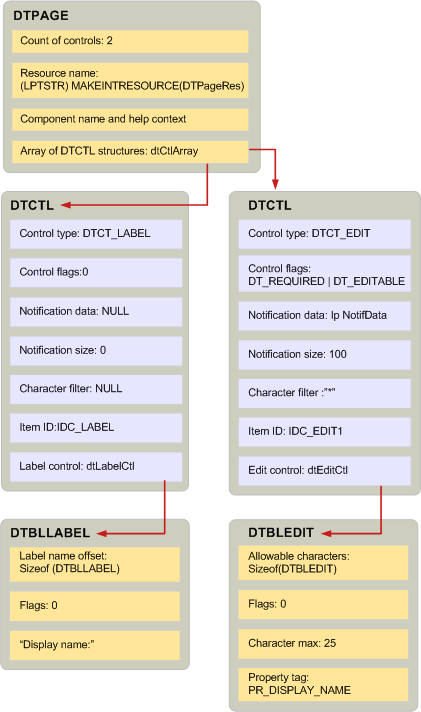

# Creating Display Tables and Related Structures

  
  
**Applies to**: Outlook 
  
Creating a display table is similar to writing a program with a scripting language. You can create a display table either by calling [BuildDisplayTable](builddisplaytable.md) or writing custom code to populate the rows and columns of the table. In general, you should use the **BuildDisplayTable** technique because it is simpler. 
  
Before you can call **BuildDisplayTable** to prompt MAPI to create a display table, there is a hierarchy of structures that you must build. The top-level structure, [DTPAGE](dtpage.md), describes a single tabbed property page. In every **DTPAGE** structure is a [DTCTL](dtctl.md) structure that describes a single control, such as an edit box or an option button. Each **DTCTL** structure contains a structure that is specific to the type of control. For example, if the **DTCTL** structure describes an edit box control, it will contain a **DTBLEDIT** structure. The **DTCTL** structure for an option button contains a **DTBLRADIOBUTTON** structure. 
  
These structures relate directly to **BuildDisplayTable**; they have no meaning outside the context of this function. When you call **BuildDisplayTable**, you pass one or more **DTPAGE** structures as input parameters. The **DTPAGE** structures contain an array of **DTCTL** structures and a count of the number of **DTCTL** structures in the array. There is one structure for every control to display in the dialog box. **DTPAGE** structures also have a character string that represents the name of a corresponding Help file and dialog box resource. 
  
Each **DTCTL** structure in a **DTPAGE** structure contains the following data that is used to set properties for the control: 
  
- The control type for setting **PR_CONTROL_TYPE** ( [PidTagControlType](pidtagcontroltype-canonical-property.md)).
    
- Control flags for setting **PR_CONTROL_FLAGS** ( [PidTagControlFlags](pidtagcontrolflags-canonical-property.md)).
    
- Notification data for setting **PR_CONTROL_ID** ( [PidTagControlId](pidtagcontrolid-canonical-property.md)).
    
- The control structure for setting **PR_CONTROL_STRUCTURE** ( [PidTagControlStructure](pidtagcontrolstructure-canonical-property.md)).
    
 **DTCTL** structures also contain a resource identifier and, for edit and combo box controls, a character filter. 
  
The control structure member of a **DTCTL** structure describes the data that is unique for the type of control. MAPI defines a different structure for each control type. For example, the data of an edit control is represented by a **DTBLEDIT** structure; the data of a list box is represented by a **DTBLLBX** structure. 
  
The relationship between the three types of display table structures is shown in the following illustration. The dialog box described by this display table has two controls: a label and an edit control. The **DTBLLBX** structure has a label offset member, as do several of the control structures, that describes where the character string for the label begins. Label character strings are typically placed in memory immediately following the structure. 
  
 **Display table structures**
  

  
## See also

#### Concepts

[Display Table Implementation](display-table-implementation.md)

