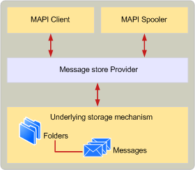

# Developing a MAPI message store provider
  
**Applies to**: Outlook 2013 | Outlook 2016 
  
Like other MAPI service providers, message stores are dynamic-link libraries (DLLs) that present the services of an underlying storage mechanism to MAPI client applications and the MAPI spooler. The message store provider presents the underlying storage mechanism as a hierarchical set of folders and messages that MAPI clients and the MAPI spooler can use.
  
The following illustration shows the basic MAPI message store architecture.
  
**Message store architecture**
  

  
You can implement a message store provider by using any sort of underlying storage mechanism you like. However, you need to be aware of performance concerns. In addition, the underlying storage mechanism must be presented as a hierarchical collection of MAPI objects. These requirements mean that message stores are typically implemented by using an existing database product that supports hierarchical storage of objects in the database and that has a programming interface or well-defined file structure. For example, Microsoft Office Access, SQL, and Oracle databases can be used as the underlying storage mechanism. Some database products have feature sets that make it easier to implement MAPI features, so your choice of database product may be affected by the features that your message store provider needs to support.
  
Using an existing database as the underlying storage mechanism saves you work because it is usually easier to present database objects to MAPI clients as MAPI objects than to implement your own hierarchical storage mechanism. Doing this enables you to treat MAPI operations at a higher level than if you implement your own hierarchical storage mechanism. For example, searching for a message with a particular subject line becomes a fairly simple matter of constructing and submitting an appropriate database query, rather than implementing complex routines to search your hierarchical storage mechanism.
  
Message store providers communicate with MAPI clients and the MAPI spooler to perform operations on folders and objects. The message store provider translates those operations into lower level operations on the underlying storage mechanism. The MAPI spooler typically communicates with the message store provider while sending and receiving messages. MAPI clients typically communicate with message store providers to manipulate the folder hierarchy and to read, edit, delete, and send messages.
  
Both the MAPI spooler and MAPI clients communicate with the message store provider to create new messages. Client applications do this when users compose a message. The MAPI spooler does this when it receives an incoming message. In either case, the new message is usually created in the Inbox folder of the message store, if there is one.
  
Message store providers make heavy use of MAPI tables, folders, messages, and properties. The implementation details for those objects are documented in [MAPI Tables](mapi-tables.md), [MAPI Folders](mapi-folders.md), [MAPI Messages](mapi-messages.md), and [MAPI Property Overview](mapi-property-overview.md). You should familiarize yourself with that material before attempting to implement a message store provider.
  
There are two important types of message store providers: those that can act as a user's default message store and those that cannot. A default message store is one in which client applications and the MAPI spooler can perform any messaging task, such as receiving messages or creating folders. A default message store provider must support several more features than the minimum number required for all message store providers.
  
## See also

- [MAPI concepts](mapi-concepts.md)

