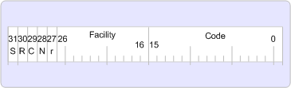

# Error Handling in MAPI

  
  
**Applies to**: Outlook 
  
Success, warning, and error values are returned using a 32-bit number known as a result handle, or HRESULT. An HRESULT is really not a handle to anything; it is merely a 32-bit value with several fields encoded in the value. A zero result indicates success and a nonzero result indicates failure.
  
MAPI on 32-bit platforms works solely with HRESULT values.
  
The following illustration shows the HRESULT format for 32-bit platforms.
  
 **HRESULT format**
  

  
The high order bit in the HRESULT indicates whether the return value represents success or failure. If set to zero, the value indicates success. If set to 1, it indicates failure.
  
The R, C, N, and r bits are reserved in the HRESULT.
  
The facility field in both versions indicates the area of responsibility for the error. There are several facilities, but the vast majority of MAPI errors use FACILITY_ITF to represent interface errors. The most common facilities that are currently used are: FACILITY_NULL, FACILITY_ITF, FACILITY_DISPATCH, FACILITY_RPC, and FACILITY_STORAGE. If new facilities are necessary, Microsoft allocates them because they need to be unique. The following table describes the various facility fields.
  
|**Facility**|**Description**|
|:-----|:-----|
|FACILITY_NULL    |For broadly applicable common status codes such as S_OK or E_OUTOF_MEMORY; the value is zero.    |
|FACILITY_ITF    |For most status codes returned from interface methods; the value is defined by the interface. That is, two HRESULT values with exactly the same 32-bit value returned from two different interfaces might have different meanings.    |
|FACILITY_DISPATCH    |For late binding [IDispatch](http://msdn.microsoft.com/en-us/library/ms221608.aspx) interface errors.    |
|FACILITY_RPC    |For status codes returned from remote procedure calls.    |
|FACILITY_STORAGE    |For status codes returned from [IStorage](http://msdn.microsoft.com/en-us/library/aa380015%28VS.85%29.aspx) or [IStream](http://msdn.microsoft.com/en-us/library/aa380034%28VS.85%29.aspx) method calls relating to structured storage. Status codes with code (lower 16 bits) values in the range of Windows error codes (that is, less than 256) have the same meaning as the corresponding Windows errors.    |
   
The code field is a unique number that is assigned to represent the error or warning.
  

