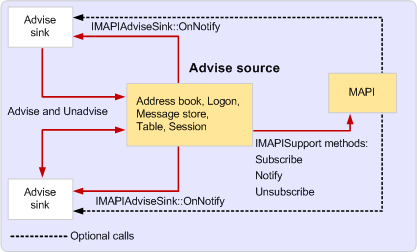

# Event Notification in MAPI

  
  
**Applies to**: Outlook 
  
Event notification is the communication of information between two MAPI objects. Through one of the objects, a client or service provider registers for notification of a change or error, called an event, which may take place in the other object. After the event occurs, the first object is notified of the change or error. The object receiving the notification is called the advise sink; the object responsible for the notification is called the advise source.
  
There are three types of advise sink objects (all types are standard MAPI objects):
  
- Advise sink objects.
    
- Form advise sink objects.
    
- View advise sink objects.
    
Advise sink objects are the most common type. Advise sinks are typically implemented by client applications to receive address book and message store notifications and support the [IMAPIAdviseSink : IUnknown](imapiadvisesinkiunknown.md) interface. **IMAPIAdviseSink** contains a single method, [IMAPIAdviseSink::OnNotify](imapiadvisesink-onnotify.md). Form and view advise sinks are less common; they are implemented to receive notifications about changes to custom forms. Form advise sinks support the [IMAPIFormAdviseSink : IUnknown](imapiformadvisesinkiunknown.md) interface and view advise sinks support the [IMAPIViewAdviseSink : IUnknown](imapiviewadvisesinkiunknown.md) interface. Because most clients implement standard advise sink objects, assume that discussions of notifications relate to address book and message store notifications rather than forms notifications. For more information about forms notifications, see [MAPI Forms Notifications](mapi-forms-notifications.md) and [Writing Form Server Code](writing-form-server-code.md).
  
Advise source objects are implemented by service providers and by MAPI. Not all service providers support event notification; it is optional, but strongly recommended. Message store and address book providers usually support object notifications on several of their objects and table notifications on their contents and hierarchy tables. Transport providers do not support notifications directly; they rely on alternative methods of communication with clients.
  
Unlike advise sinks, advise source objects are not a unique type of MAPI object. Many MAPI objects, such as message stores and tables, can take on the role of advise source. An advise source is any MAPI object that does the following:
  
- Implements an **Advise** method to receive notification registrations. 
    
- Implements an **Unadvise** method to receive notification cancellations. 
    
- Generates notifications of the appropriate type to the appropriate advise sink objects that have registered by calling their **IMAPIAdviseSink::OnNotify** methods. 
    
Clients that implement advise sink objects call **Advise** when they want to register for a notification, in most cases passing in the entry identifier of the object with which registration should occur, and **Unadvise** when they want to cancel the registration. Clients pass a parameter to **Advise** that indicates which of the several types of events they want to monitor. **Advise** returns a nonzero number that represents a successful connection between the advise sink and advise source. 
  
Before calling **Advise**, clients can determine whether a message store provider supports notification by checking that the STORE_NOTIFY_OK flag is set in the message store's **PR_STORE_SUPPORT_MASK** ([PidTagStoreSupportMask](pidtagstoresupportmask-canonical-property.md)) property. There is no way for clients to determine ahead of time whether or not an address book provider supports notifications. Clients must attempt to register and if the attempt fails, they can assume notifications are unsupported.
  
When an event for which a client has registered occurs, the advise source notifies the advise sink by calling its [IMAPIAdviseSink::OnNotify](imapiadvisesink-onnotify.md) method with a notification data structure that contains information about the event. An advise sink's implementation of **OnNotify** can perform tasks in response to the notification, such as updating data in memory or refreshing a screen display. 
  
Service providers can implement support for notifications manually or take advantage of the help provided in three **IMAPISupport** methods: [IMAPISupport::Subscribe](imapisupport-subscribe.md), [IMAPISupport::Unsubscribe](imapisupport-unsubscribe.md), and [IMAPISupport::Notify](imapisupport-notify.md). The **Subscribe** and **Unsubscribe** methods handle notification registration and deregistration for providers; the **Notify** method handles sending notifications when appropriate. 
  
To use the support object methods for notification registration, service providers call [IMAPISupport::Subscribe](imapisupport-subscribe.md) in their **Advise** methods and pass to **Subscribe** the advise sink pointer that clients pass to **Advise**. If an entry identifier is passed as an input parameter to specify an advise source, service providers convert it to a binary key. **Subscribe** creates a unique connection number and it is this number that service providers return to clients. Service providers can release the client's advise sink object pointer at any time after the **Advise** call has completed. 
  
When clients call **Unadvise** to cancel a registration, service providers either decrement the reference count on the client's advise sink pointer or call **Unsubscribe** to do the same. 
  
When it is time to generate a notification, service providers perform any internal processing that relates to the notification and initializes a [NOTIFICATION](notification.md) structure by setting all of its unused members to zero. This technique for initializing the **NOTIFICATION** structure can help clients create smaller, faster, and less error-prone **OnNotify** implementations. 
  
The following illustration shows the communication between advise sink objects, advise source objects, and MAPI. MAPI is involved only when the advise source calls the **IMAPISupport** methods for notification support. 
  
 **Event notification calls**
  

  
The MFCMAPI **CAdviseSink** class (using the AdviseSink.h and AdviseSink.cpp files) implements the advise sink object for all calls to **Advise**. For more information about MFCMAPI, see [MFCMAPI as a Code Sample](mfcmapi-as-a-code-sample.md) and [MFCMAPI](http://go.microsoft.com/fwlink/?LinkId=124154).
  

