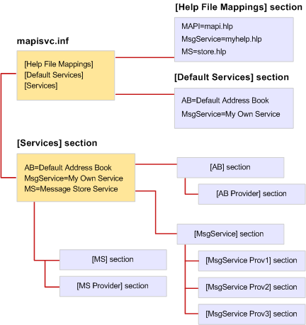

# File Format of MapiSvc.inf

 **Last modified:** July 23, 2011 
  
 * **Applies to:** Outlook * 
  
The MapiSvc.inf file acts as the central database for MAPI message service configuration information. MapiSvc.inf contains information about each of the message services installed on the workstation, information about the service providers that belong to each message service, and information about the MAPI subsystem. MapiSvc.inf is the primary source of information for profiles. That is, when a new profile is being built or an existing one modified, relevant information for each message service or service provider is copied from MapiSvc.inf. 
  
MapiSvc.inf is divided into linked hierarchical sections:
  
1. Section containing information that applies to all profiles. This section has three parts:
    
  - **[Services]** section, providing links to each of the subsequent message service sections. 
    
  - **[Help File Mappings]** section, containing information about .HLP files provided by message services. 
    
  - **[Default Services]** section, listing message services that make up a default installation. 
    
2. Section containing information that applies to individual message services. Entries in these sections provide links to subsequent service provider sections.
    
3. Section containing information that applies to individual service providers in a message service.
    
The following illustration shows the organization of a typical MapiSvc.inf file. There are three message services: AB, MsgService, and MS. The name on the right hand side of the equal sign for each message service is the service's display name. Each message service has its own section elsewhere in the file that is linked to one or more service provider sections. There is one service provider section for every service provider that belongs to the message service. The AB and MS message services are single provider services whereas three service providers belong to the MsgService service.
  
 **MapiSvc.inf file organization**
  

  
MAPI provides a skeletal version of the MapiSvc.inf file that contains the entries for the MAPI subsystem. Each message service implementer adds entries that are appropriate both for their service and the service providers that belong to their service. Some of the entries are required while others are optional. For example, MAPI requires that you specify the name and path of each of the service providers in your message service. Without this information, they cannot be loaded.
  
You can add required and optional information in either the section for your message service and/or to the service provider sections. Where you put the information describing your message service depends on the number of service providers in the service. Because this information applies to each service provider in the service, you must make it accessible to all providers. Store it either in the message service section, the preferred option, or in all of the service provider sections. Store information once to avoid unnecessary replication and the need to keep multiple copies synchronized.
  
If your message service is a single provider service, store all of the message service information in the section for the service provider rather than in the section for the service. Accessing the service provider section is faster and more direct than accessing the message service section. 
  
Store only public configuration data in the MapiSvc.inf file. Information that is private or requires extra protection, such as passwords or other credentials, should not be included in this file. Instead, opt either not to store information of this type at all or keep it in the profile as secure properties. Secure properties have built-in protection features such as encryption.
  

