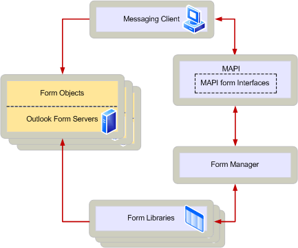

# Handling MAPI forms

**Applies to**: Outlook 2013 | Outlook 2016 
  
A MAPI form is a viewer for a message of a particular class. Clients that allow their users to work with messages belonging to a variety of message classes must be written to handle a variety of MAPI forms. To handle multiple forms, clients implement a component known as a form viewer which contains the following three objects:
  
- A message site object, which supports the [IMAPIMessageSite : IUnknown](imapimessagesiteiunknown.md) interface. 
    
- A view advise sink, which supports the [IMAPIViewAdviseSink : IUnknown](imapiviewadvisesinkiunknown.md) interface. 
    
- A view context object, which supports the [IMAPIViewContext : IUnknown](imapiviewcontextiunknown.md) interface. 
    
Each of these objects is used by a component called the form server which implements each form, handling its storage and the notifications generated by clients handling the view. One other component, the form library provider, implements a form manager. The form manager administers the form libraries, which store form server executable files. This administration includes loading the appropriate form server and handling the initial communication between the server and the client.
  
The following diagram shows the relationship between a client and the other parts of the MAPI form architecture.
  
## MAPI form architecture
  

  
If your client plans to handle MAPI forms, you will use the form manager's [IMAPIFormMgr : IUnknown](imapiformmgriunknown.md) interface to perform five basic tasks: 
  
- Launch the appropriate MAPI form server when a message is opened or composed.
    
- Display form servers' icons in the contents tables of folders.
    
- Send and receive form notifications. For more information, see [Sending and Receiving Form Notifications](sending-and-receiving-form-notifications.md).
    
- Allow users to install or remove form servers from form libraries. For more information, see [Maintaining a Form Library](maintaining-a-form-library.md).
    
- Allow users to associate form servers with particular folders.
    
To access the form manager, call the [MAPIOpenFormMgr](mapiopenformmgr.md) function once during initialization. 
  
## In this section

- [Implementing a Form Viewer](implementing-a-form-viewer.md): Describes how to implement a form viewer by using a view advise sink, a message site, and a view context.
    
- [Implementing Standard Form Verbs](implementing-standard-form-verbs.md): Describes how to implement the verbs for user menu or button clicks on MAPI forms.
    
- [Sending and Receiving Form Notifications](sending-and-receiving-form-notifications.md): Describes how to send and receive form notifications.
    
- [Maintaining a Form Library](maintaining-a-form-library.md): Describes how to maintain a library that holds all the important information about a form.
    
- [Loading a Message Into a Form](loading-a-message-into-a-form.md): Describes how to load a message into a form.
    
- [Composing a New Message by Using a Form](composing-a-new-message-by-using-a-form.md): Describes how to compose a message using a form.
    
- [Displaying Form Icons](displaying-form-icons.md): Describes the steps for displaying an icon with a form.
    
## See also

- [MAPI Forms](mapi-forms.md)
- [Developing MAPI Form Servers](developing-mapi-form-servers.md)

