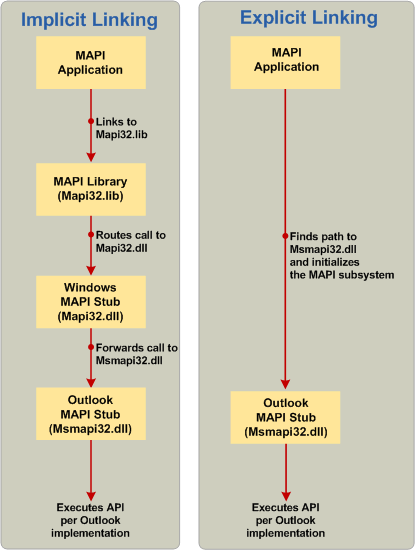

# Link to MAPI functions

**Applies to**: Outlook 2013 | Outlook 2016 
  
There are three methods of linking: implicit linking, explicit linking, and a new hybrid model using the MAPI Stub Library.
  
## Implicit linking

Historically, calling MAPI functions in a messaging application always involved linking to the Mapi32.lib library. This included routing MAPI calls to the Windows MAPI stub library, Mapi32.dll, which then forwarded the calls to the default MAPI client implementation at run time. This call process is known as implicit linking. The left side of the following figure shows an example of implicit linking used in a MAPI function call process. The process is initiated by a MAPI application and involves the MAPI library (Mapi32.lib) and the Windows MAPI stub (Mapi32.dll) and is completed by the Outlook MAPI client implementation of the MAPI stub (Msmapi32.dll).
  
**Comparison of implicit and explicit linking.**


  
## Explicit linking

Because the default MAPI client supports on-demand installation using the Windows Installer (MSI), you can develop messaging applications directly on the Outlook MAPI stub instead of using the MAPI library and Windows MAPI stub. The right side of the previous figure shows an example of a MAPI function call process, starting with a MAPI application looking for the path and DLL name for the Outlook MAPI stub (step 2 in the following section), and making function calls into the Outlook MAPI stub (step 3 in the following section). The following procedure shows how to call MAPI functions by using explicit linking. 
  
> [!NOTE]
> This information about explicit linking may be superfluous to your needs with the introduction of the MAPIStubLibrary.lib discussed in the following section. Like the implicit model, the new library manages everything and implements the explicit linking logic that loads Outlook's MAPI directly. 
  
For more information about explicit linking, see Linking Explicitly.
  
### To call MAPI API elements without the MAPI library and the Windows MAPI stub

1. In your program file, create a global list of function pointers for each MAPI API element that you are using. 
    
   The following example shows this step.
    
   ```cpp
    //Global MAPI function pointers
    LPMAPIINITIALIZE pfnMAPIInitialize = NULL;
    LPMAPIUNINITIALIZE pfnMAPIUninitialize = NULL;
   ```

2. Create a function that initializes MAPI functions to link to the MAPI DLL of the default MAPI client (for example, Msmapi32.dll of Microsoft Outlook). In this function, do the following: 
    
    1. Load mapi32.dll from the appropriate system directory. 
        
       |||
       |:-----|:-----|
       |x64 or x86 natively  <br/> |**%windir%\system32\mapi32.dll** <br/> |
       |x86 on WoW mode  <br/> |**%windir%\syswow64\mapi32.dll** <br/> |
    
    2. Call the [FGetComponentPath](fgetcomponentpath.md) function to get the path and DLL name that implements the MAPI subsystem. For more information, see [Choose a Specific Version of MAPI to Load](how-to-choose-a-specific-version-of-mapi-to-load.md).
        
    3. Load the DLL by calling the LoadLibrary function. 
        
    4. Initialize the MAPI function pointer array by calling the GetProcAddress function. 
        
    The following example shows the previous steps:
        
   ```cpp
    void InitializeMapiFunctions()
    {
    {
        // Get the DLL path and name of the actual MAPI implementation.
        FGetComponentPath(g_szMapiComponentGUID, NULL, szMAPIDLL, MAX_PATH);
        // Load the DLL.
        hMod = LoadLibrary(szMAPIDLL);
        // Initialize MAPI functions.
        pfnMAPIInitialize = GetProcAddress(hMod, "MAPIInitialize");
        pfnMAPIUninitialize = GetProcAddress(hMod, "MAPIUninitialize");
    }
   ```

3. Finally, call the function that you created in step 2 in your messaging application before you make calls to MAPI API elements. 
    
   > [!CAUTION]
   > You must uninitialize the MAPI subsystem before closing your application. 
  
   The following example shows this step: 
    
   ```cpp
    int main()
    {
        HRESULT hr;
        InitializeMapiFunctions();
        // Initialize the MAPI subsystem.
        hr = (*pfnMAPIInitialize)(NULL);
        if (hr!= S_OK)
        {
            // Handle the error case.
        }
        // Here is where you make calls to other MAPI interfaces.
        // Uninitialize the MAPI subsystem.
        (*pfnMAPIUninitialize)();
    return (0);
    }
   ```

## MAPIStubLibrary.lib

The advent of Microsoft Outlook 2010 and 64-bit MAPI, now extending to the Microsoft Outlook 2013, requires more than the traditional 32-bit API for full implementation. A new project, the MAPI Stub Library, posted on the CodePlex website provides a drop-in replacement for Mapi32.lib that supports building both 32-bit and 64-bit MAPI applications. MAPIStubLibrary.lib eliminates the need to explicitly link to MAPI, and having built it, you can remove Mapi32.lib from your linker settings, replacing it with MAPIStubLibrary.lib; no further modifications to your code should be needed. It also eliminates the need to write **LoadLibrary**, **GetProcAddress**, and **FreeLibrary** code to handle newer exports included in this library file but not in Mapi32.lib, which would be needed if you used explicit linking. 
  
Some of the new functions linked from this library that are not available in Mapi32.lib include the following:
  
- [GetDefCachedMode](getdefcachedmode.md)    
- [HrGetGALFromEmsmdbUID](hrgetgalfromemsmdbuid.md)   
- [HrOpenOfflineObj](hropenofflineobj.md)    
- [MAPICrashRecovery](mapicrashrecovery.md)   
- [OpenStreamOnFileW](openstreamonfilew.md)    
- [WrapCompressedRTFStreamEx](wrapcompressedrtfstreamex.md)
    
An alternate method of incorporating the MAPI Stub Library is to copy the source files, MapiStubLibrary.cpp and StubUtils.cpp, directly into your project and remove any linkage to Mapi32.lib and any code that explicitly links to MAPI.
  
To access the MAPI Stub Library files and for information about how to build and integrate it into your project, as well as questions about this library such as when and why to use it, see the [MAPI Stub Library](http://mapistublibrary.codeplex.com/documentation) on the CodePlex site. 
  
## See also

- [MAPI Programming Overview](mapi-programming-overview.md)
- [Installing the MAPI Subsystem](installing-the-mapi-subsystem.md)
- [Install MAPI Header Files](how-to-install-mapi-header-files.md)
- [Choose a Specific Version of MAPI to Load](how-to-choose-a-specific-version-of-mapi-to-load.md)
- [Determining Which Linking Method to Use](http://msdn.microsoft.com/en-us/library/253b8k2c.aspx)
- [Linking an Executable to a DLL](http://msdn.microsoft.com/en-us/library/9yd93633.aspx)
- [Setting Up the MSI Keys for Your MAPI DLL](http://msdn.microsoft.com/en-us/library/ee909494%28v=VS.85%29.aspx)

