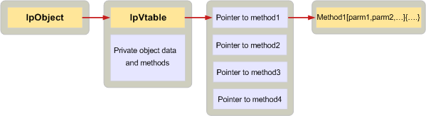

# Implementing objects in C

**Applies to**: Outlook 2013 | Outlook 2016 
  
Client applications and service providers written in C define MAPI objects by creating a data structure and an array of ordered function pointers known as a virtual function table, or vtable. A pointer to the vtable must be the first member of the data structure.
  
In the vtable itself, there is one pointer for every method in each interface supported by the object. The order of the pointers must follow the order of the methods in the interface specification published in the Mapidefs.h header file. Each function pointer in the vtable is set to the address of the actual implementation of the method. In C++, the compiler automatically sets up the vtable. In C, it does not. 
  
The following illustration shows how this works. The box on the far left represents a client that needs to use a service provider object. Through the session, the client obtains a pointer to the object, **lpObject**. The vtable appears first in the object followed by private data and methods. The vtable pointer points to the actual vtable, which contains pointers to each of the implementations of the methods in the interface. 
  
**Object implementation**
  

  
The following code example shows how a C service provider can define a simple status object. The first member is the vtable pointer; the rest of the object is made up of data members. 
  
```C
typedef struct _MYSTATUSOBJECT
{
    const STATUS_Vtbl FAR *lpVtbl;
    ULONG              cRef;
    ANOTHEROBJ        *pObj;
    LPMAPIPROP         lpProp;
    LPFREEBUFFER       lpFreeBuf;
} MYSTATUSOBJECT, *LPMYSTATUSOBJ;
 
```

Because this object is a status object, the vtable includes pointers to implementations of each of the methods in the [IMAPIStatus : IMAPIProp](imapistatusimapiprop.md) interface, as well as pointers to implementations of each of the methods in the base interfaces — **IUnknown** and **IMAPIProp**. The order of methods in the vtable matches the specified order as defined in the Mapidefs.h header file.
  
```js
static const MYOBJECT_Vtbl vtblSTATUS =
{
    STATUS_QueryInterface,
    STATUS_AddRef,
    STATUS_Release,
    STATUS_GetLastError,
    STATUS_SaveChanges,
    STATUS_GetProps,
    STATUS_GetPropList,
    STATUS_OpenProperty,
    STATUS_SetProps,
    STATUS_DeleteProps,
    STATUS_CopyTo,
    STATUS_CopyProps,
    STATUS_GetNamesFromIDs,
    STATUS_GetIDsFromNames,
    STATUS_ValidateState,
    STATUS_SettingsDialog,
    STATUS_ChangePassword,
    STATUS_FlushQueues
};
 
```

Clients and service providers written in C use objects indirectly through the vtable and add an object pointer as the first parameter in every call. Every call to a MAPI interface method requires a pointer to the object being called as its first parameter. C++ defines a special pointer known as the **this** pointer for this purpose. The C++ compiler implicitly adds the **this** pointer as the first parameter to every method call. In C there is no such pointer; it must be explicitly added. 
  
The following code demonstrates how a client can make a call to an instance of MYSTATUSOBJECT:
  
```C
lpMyObj->lpVtbl->ValidateState(lpMyObj, ulUIParam, ulFlags);
 
```

## See also

- [Implementing MAPI Objects](implementing-mapi-objects.md)

