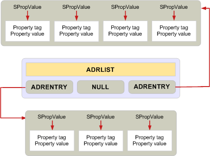

# Managing Memory for ADRLIST and SRowSet Structures

 **Last modified:** July 23, 2011 
  
 * **Applies to:** Outlook * 
  
The requirement to allocate all memory for a buffer whenever possible with a single **MAPIAllocateBuffer** call does not apply when using the address list, or **ADRLIST**, and row set, or **SRowSet**, structures. 
  
 These two structures are exceptions to the standard rules for allocating and releasing memory. They contain multiple levels of structures and are designed to enable individual members to be added or removed. Therefore, each property must be a separate allocation. Where most structures are freed with one call to **MAPIFreeBuffer**, each individual entry in an **ADRLIST** or **SRowSet** structure must be freed with its own call to **MAPIFreeBuffer** or a single call to either **FreeProws** or **FreePadrlist**. For more information, see [MAPIFreeBuffer](mapifreebuffer.md), [ADRLIST](adrlist.md), and [SRowSet](srowset.md). **FreeProws** and **FreePadrlist** are functions provided by MAPI for simplifying the freeing of these data structures. For more information, see [FreeProws](freeprows.md) and [FreePadrlist](freepadrlist.md). **FreePadrlist** frees the memory for the **ADRLIST** structure plus all associated memory for the structure members; **FreeProws** does the same for the **SRowSet** structure. 
  
The following diagram shows the layout of an **ADRLIST** data structure, indicating the separate memory allocations required. The gray boxes show memory that can be allocated and released with one call. 
  
 **ADRLIST memory allocation**
  

  
## See also

#### Concepts

[Managing Memory in MAPI](managing-memory-in-mapi.md)

