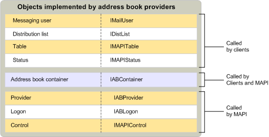

# MAPI Address Book Provider Objects

 **Last modified:** July 23, 2011 
  
 * **Applies to:** Outlook * 
  
In addition to the standard provider and logon objects, address book providers implement address book containers, distribution lists, messaging users, tables, status objects, and controls.
  
The following illustration shows these objects, their corresponding interfaces, and the MAPI components that use them.
  

  
## See also

#### Concepts

[MAPI Service Provider Objects](mapi-service-provider-objects.md)

