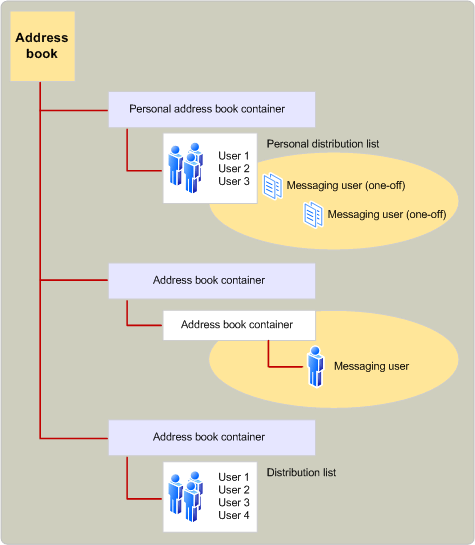

# MAPI address book provider overview
  
**Applies to**: Outlook 
  
Address book providers handle access to directory information. Directory information consists of data for two types of message recipients: individual messaging users and groups of messaging users who are commonly addressed together in distribution lists. Depending on the type of recipient and the address book provider, there is a wide range of information that can be made available. For example, all address book providers store a recipient's name, address, and address type.
  
Each address book provider organizes this data by using one or more containers. The number and structure of the containers depends on the address book provider's implementation. For example, one address book provider might use a single container to hold all of the information, another might use one top-level container that holds subcontainers, and a third might use several top-level containers, each holding subcontainers. An address book container hierarchy can be quite deep; there is no limit to the number of subcontainers that can be used.
  
The following illustration shows a typical MAPI address book organization.
  
**Address book organization**
  

  
MAPI integrates all the information supplied by the installed address book providers into a single address book, presenting a unified view to the client application. The integrated list shows the top-level containers displayed by each of the installed address book providers. Most address book providers expose only a few containers (typically one to three) at the top level for inclusion in the top level of the MAPI integrated address book. For example, an address book provider might make available "All Users" and "Local Users" as two containers at the top level.
  
The users of client applications can view the contents of address book containers and, in some cases, modify the contents. Address book containers can be created with different access levels, depending on the address book provider. 
  
## See also

- [MAPI Features and Architecture](mapi-features-and-architecture.md)

