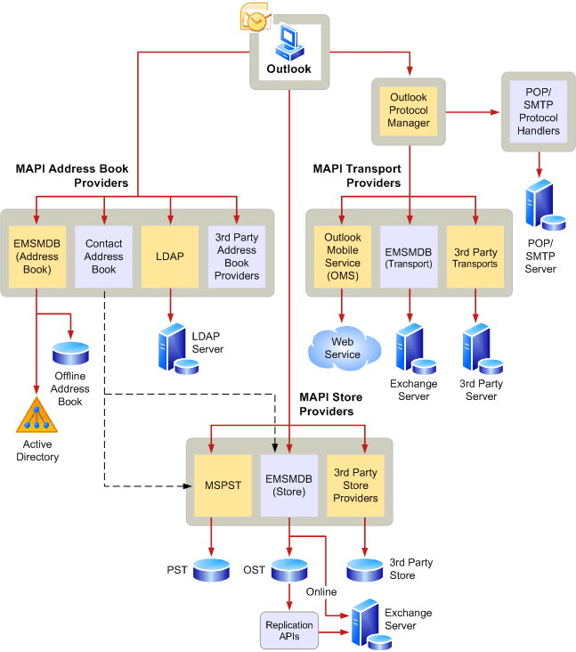

# MAPI architecture overview
 
**Applies to**: Outlook 2013 | Outlook 2016 
  
MAPI defines a modular architecture, as shown in the following illustration.  
  

  
The MAPI application is known as a client application because it is a client of the MAPI subsystem. Messaging-based applications employ messaging as a central part of their processing and offer extensive messaging features, such as the exchange of information of various types in various formats and the ability to save and organize the information locally. Email, scheduling, and work flow applications are examples of messaging-based applications.
  
The MAPI subsystem is made up of a common user interface and the programming interfaces. The common user interface is a set of dialog boxes that gives client applications a consistent look and users a consistent way to work.
  
MAPI has programming interfaces that are used by the MAPI subsystem, by client software developers, and by service provider developers. The MAPI programming interface is the main object-based programming interface. The MAPI programming interface is similar to the OLE Component Object Model and is used by the MAPI subsystem and messaging-based client applications written in C or C++. 
  
As a client software developer, you make MAPI calls directly through the MAPI programming interface. You can implement messaging with a single MAPI client interface or a combination of interfaces. A single application can make calls to methods or functions belonging to any of the interfaces.
  
## See also

-[MAPI features and architecture](mapi-features-and-architecture.md)

