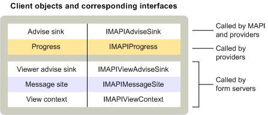

# MAPI client objects
  
**Applies to**: Outlook 2013 | Outlook 2016 
  
Standard messaging client applications implement only one object — an advise sink. Advise sinks inherit from the [IMAPIAdviseSink : IUnknown](imapiadvisesinkiunknown.md) interface and are used by MAPI and service providers for event notification. Some clients also implement progress objects to support the display of progress dialog boxes. 
  
More complex clients that support custom forms implement another advise sink object and a few other objects, such as the message site object that inherits from the [IMAPIMessageSite : IUnknown](imapimessagesiteiunknown.md) interface and the view context object that inherits from the [IMAPIViewContext : IUnknown](imapiviewcontextiunknown.md) interface. The additional advise sink object inherits from the [IMAPIViewAdviseSink : IUnknown](imapiviewadvisesinkiunknown.md) interface. 
  
The following table summarizes the MAPI objects implemented by standard messaging clients and by clients that support the viewing of custom forms.
  
|**Client object**|**Description**|
|:-----|:-----|
|Advise sink    |Provides a callback function for events that occur in the message store, address book, or the session. |
|Message site    |Handles the manipulation of form objects. |
|Progress    |Displays a dialog box to show the progress of an operation. |
|View advise sink    |Provides callback functions for events that occur in a form. |
|View context    |Supports commands for printing and saving forms and for navigating between forms. |
   
The following illustration shows the relationship between these different client objects, the interfaces from which they inherit, and the MAPI components that use them. 
  

  
Clients use many more objects than they implement. All clients use a session object to gain access to a wide variety of service provider objects and objects that MAPI implements. Clients interact with service providers either indirectly, through the session, the address book, or the status objects that MAPI supplies, or directly through a variety of objects that particular service providers implement. To make direct contact with address book providers, clients use address book containers, messaging users, and distribution lists. To access a message store provider directly, clients use the message store object, folders, messages, and attachments. When service providers support a status object, clients can use the status object to monitor the service provider's state.
  
Clients that support service provider and message service configuration use three objects that MAPI implements: the message service administration object, profile administration object, and provider administration object. Clients that display custom forms use several form objects that a form library provider or a form server implements.
  
## See also

- [IMAPIMessageSite : IUnknown](imapimessagesiteiunknown.md) 
- [IMAPIViewContext : IUnknown](imapiviewcontextiunknown.md)  
- [IMAPIViewAdviseSink : IUnknown](imapiviewadvisesinkiunknown.md)
- [MAPI Object and Interface Overview](mapi-object-and-interface-overview.md)

