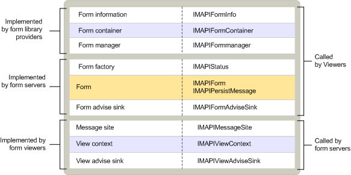

# MAPI custom form objects
  
**Applies to**: Outlook 2013 | Outlook 2016 
  
Objects for custom forms are implemented by three different components:
  
- A form server.
    
- A form library provider.
    
- A form viewer.
    
A form server is similar in functionality to an OLE compound document object application. It is an executable component that implements the form; it controls its display and the operations that a user can perform. MAPI starts a form server upon request when a user wants to view a message together with a message class that is displayed by using a form supported by the form server. Form servers implement three objects: a form factory object that resembles the standard OLE class factory, a form advise sink for handling form-specific events, and the form itself. 
  
A form library provider supplies access for clients to a form's property set, to its container, and to the object that links messages of a specific class to the server that can open the form for that class. Form library providers implement three objects: a form information object, a form container, and a form manager for binding a message to the appropriate form server based on the message's class.
  
A form viewer is a component that is included in clients that support the display of custom forms in their folder viewers. Form viewers are not independent MAPI components, as are form library providers and form servers. Form viewers start form servers and provide context for them. Form viewers implement three objects: a message site, a view context, and an advise sink for handling view-specific events.
  
The following table describes all of the custom form objects. 
  
|**Form object**|**Description**|
|:-----|:-----|
|Form    |Controls the display and operation of a custom form for viewing messages of a specific class.    |
|Form advise sink    |Handles notifications from the form viewer.    |
|Form factory    |Creates an instance of a form and allows its server to remain in memory.    |
|Form container    |Contains form information.    |
|Form information    |Contains messages and other message containers.    |
|Form manager    |Provides access to an integrated view of custom form information that is related to all of the installed forms. Also matches message classes with corresponding form class identifiers.    |
|Message site    |Handles the manipulation of form objects from inside the client, and provides access to a form manager object.    |
|View context    |Supports form commands for activating next and previous messages and for saving or printing.    |
|View advise sink    |Handles notifications from the form server.    |
   
The following illustration shows the relationship between custom form components, the objects and interfaces that they implement, and the components that are users of the objects. Notice that, unlike most other MAPI objects, the form object implements two interfaces that are not related by direct inheritance. When an object exposes multiple independent interfaces, a user of the object that has a pointer to one of the interfaces can retrieve a pointer to any of the other interfaces. This ability to navigate between an object's interface implementations is a feature of the [IUnknown::QueryInterface](https://msdn.microsoft.com/library/54d5ff80-18db-43f2-b636-f93ac053146d%28Office.15%29.aspx) method. 
  
**Custom form components**
  

  
## See also

- [MAPI Object and Interface Overview](mapi-object-and-interface-overview.md)

