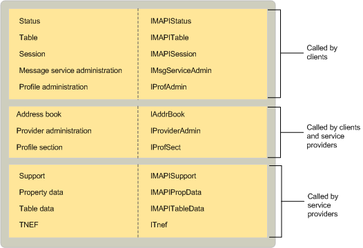

# MAPI-Implemented Objects

  
  
**Applies to**: Outlook 
  
MAPI implements several objects for use by client applications and service providers. The session object allows clients to use session services, to access tables, and to communicate with service providers. The address book object provides clients with integrated access to all of the different address book providers. 
  
MAPI supplies multiple table and status objects for clients to use for viewing and monitoring session and service provider information. For example, MAPI provides a profile table with information about all of the profiles that are installed on the computer and a message service table with information about all of the message services in the current profile. MAPI provides three different status objects: one that represents the overall subsystem, one for the MAPI spooler, and one for the integrated address book. 
  
MAPI implements four different objects for managing the configuration of message services, service providers, and profiles. Both clients and service providers use provider administration and profile section objects; these objects enable them to configure service providers and access profile properties. Clients use only message service and profile administration objects, the objects that support the administration of message services and profiles. 
  
MAPI provides two objects for service providers: a support object and a TNEF object. All service providers use one or more support objects; there are four different support object implementations. MAPI supplies an implementation to support configuration as well as specific implementations to support address book, message store, and transport providers. The TNEF object is used by transport providers that support the Transport Neutral Encapsulation Format (TNEF).
  
Two utility objects, table data and property data, are typically used by service providers. Table data objects help in the implementation of table objects; property data objects help to set and view property access and help in the implementation of [IMAPIProp : IUnknown](imapipropiunknown.md), the base property interface. 
  
The following table summarizes the purpose for each object that MAPI implements.
  
|**MAPI object**|**Description**|
|:-----|:-----|
|Address book    |Provides access to the integrated view of recipient information that belongs to all of the address book providers in the active profile.    |
|Message service administration    |Provides access to message service information for configuration.    |
|Profile administration    |Provides access to profile information for configuration.    |
|Profile section    |A part of a profile used to describe a particular message service or service provider.    |
|Property data    |Maintains access to properties and helps implement **IMAPIProp**.    |
|Provider administration    |Provides access to service provider information for configuration.    |
|Session    |Represents a connection to underlying messaging systems and provides clients with access to MAPI resources.    |
|Status    |Provides access to the state of the MAPI subsystem, the address book, or the MAPI spooler.    |
|Support    |Helps service providers handle client requests.    |
|Table    |Provides access to a summary view of object data in row and column format, similar to a database table.    |
|Table data    |Maintains access to underlying table data and implements table objects.    |
|TNEF    |Supports the use of the Transport Neutral Encapsulation Format (TNEF).    |
   
The following illustration shows the relationship between the objects that MAPI implements, the interfaces from which they inherit, and the components that use them. 
  
 **Objects that MAPI implements**
  

  
## See also

[IMAPIProp : IUnknown](imapipropiunknown.md)

[MAPI Object and Interface Overview](mapi-object-and-interface-overview.md)

