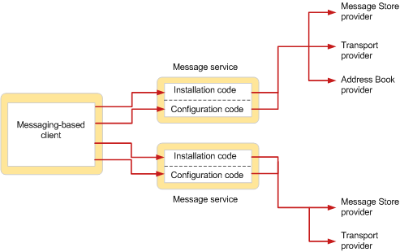

# MAPI Message Service Overview

  
  
**Applies to**: Outlook 
  
A message service defines a group of related service providers, typically service providers that work with the same messaging system. Whereas service providers perform the work of communicating between messaging systems and the MAPI subsystem, message services perform the work of interfacing between the user and service providers that work with a common messaging system.  
  
Message services exist to make the installation and configuration of service providers easier for users. Users never directly install or configure a service provider; the message service completely handles the installation and configuration of each of the service providers that belong to the service. Because of this feature, users do not need to be familiar with specific service provider configuration requirements. 
  
The following figure shows the relationship between a messaging-based client application and two message services.
  
 **Message service installation and configuration**
  

  
The user invokes the installation code of each message service to add the service and its service providers to a profile. In one of the message services shown in the figure, there are three service providers; in the other message service, there are two service providers. At some later time after installation is complete, typically at logon time, the service providers in each message service are configured. The configuration code in each message service handles the configuration of the providers in the service.
  
When a message service is installed, its installation program copies necessary files from the installation source to the user's local disk and updates a configuration file, Mapisvc.inf. The Mapisvc.inf file contains configuration settings for all of the message services and service providers that can be installed on the computer. It is organized in hierarchical sections, with links between each section at each level. The section at the top level contains information that is relevant for the MAPI subsystem, such as a list of all available message services, and for the online Help installation. The next level has sections for each message service, with information such as the DLL file name of the message service and the name of its configuration entry point function. The third level has sections with configuration data for each service provider in the message service. 
  
To handle configuration, a message service implements an entry point function that complies with a prototype defined by MAPI, and a tabbed dialog box known as a property sheet. MAPI calls the entry point function to service client requests that relate to profile management and the management of service providers in the message service. Property sheets are used for viewing and changing message service and service provider configuration properties. 
  
## See also

[MAPI Features and Architecture](mapi-features-and-architecture.md)

