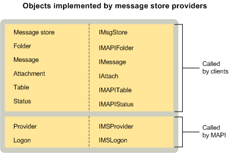

# MAPI Message Store Provider Objects

  
  
**Applies to**: Outlook 
  
Message store providers implement provider and logon objects, as do all service providers. They also implement a message store object, folders, messages, attachments, and tables. As an option, some message store providers implement status objects.
  
The following illustration shows each message store object with its corresponding interface and the MAPI component that uses it.
  

  
## See also

#### Concepts

[MAPI Service Provider Objects](mapi-service-provider-objects.md)

