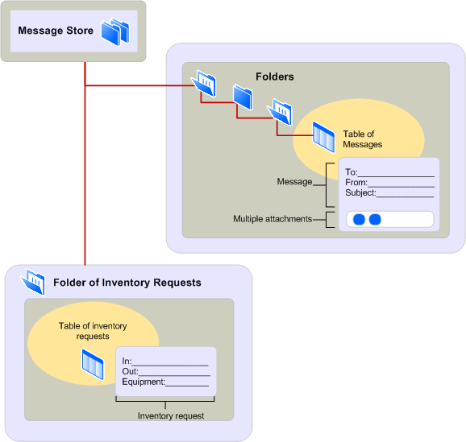

# MAPI message store provider overview
  
**Applies to**: Outlook 2013 | Outlook 2016 
  
Message store providers handle the storage and retrieval of messages and other information for the users of client applications. The message information is organized by using a hierarchical system known as a message store. The message store is implemented in multiple levels, with containers called folders holding messages of different types. There is no limit to the number of levels in a message store; folders can contain many subfolders. 
  
The following illustration shows the hierarchical message store architecture.
  
**Message store architecture**
  

  
The figure shows two folders, one with a subfolder. Client application users can access a summary view of the messages contained in each folder or view them individually with a form. Whether the client displays a standard form that MAPI supplies or a custom form that a form developer supplies depends on the type, or class, of the message. The first folder contains note messages and uses the MAPI standard note form. The second folder contains inventory request messages and uses a custom inventory form. The information on both forms represents the properties of the message.
  
You can use message store data in a variety of ways. In addition to using data for traditional electronic mail, you can use folders as a forum for public discussion, as a repository for reference documents, or as a container for voice mail, calendar, contacts, or tasks, for example. A single message store can hold many types of information. Multiple clients can install the same message store. This makes the sharing of data easy and fast. 
  
Message store folders enable you to sort and filter messages and to customize the message display in a user interface. Links to filtered messages are held in special folders called search-results folders. The user of a client application enters filtering criteria, which MAPI refers to as a restriction, and the criteria is applied to the messages stored in one or more folders. For example, a user might want to view only those messages that deal with a particular subject and have arrival dates that are more recent than last week. References to the messages that match the criteria are listed in the search folder, and the real messages remain in their regular folders.
  
Messages are the units of data that are transferred from one user or application to another user or application. Every message contains some message text, with simple or complex formatting, and message envelope information that is used for transmission. Some messages include one or more attachments, or additional data related to and transported with a message in the form of a file, another message, or an OLE object. 
  
Depending on the message store provider, a user can save a new message currently being written in addition to messages that have been sent or received. Messages can be copied or moved from one folder to another with each copy becoming a separate message that can be copied, deleted, or modified individually. Another feature that some message store providers enable is the ability to change a message after it has been received and to store it back in its folder. A user might take advantage of this feature for rotating a fax message that arrived upside down. The user can store the correct view in the folder for later viewing. 
  
## See also

- [MAPI Features and Architecture](mapi-features-and-architecture.md)

