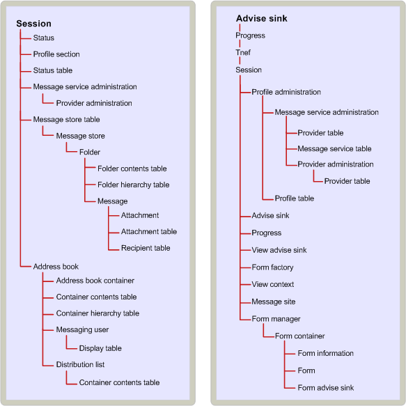

# MAPI object containment hierarchy
  
**Applies to**: Outlook 2013 | Outlook 2016 
  
The containment relationship between objects specifies the dependencies that some objects have on other objects for access. For a client application, access to particular objects enables access to others. In some cases, the containment relationship between objects implemented by a service provider follows a logical hierarchy. In other cases, it is arbitrary. 
  
A client must obtain access to a MAPI session object before it can use many other objects (for example, service providers and the MAPI address book).
  
Message store containment is based on the hierarchical relationship between objects in the message store: the message store object itself, folders, messages, and attachments. Logically, attachments are contained in messages, messages in folders, and folders in the message store. The containment relationship matches this logical hierarchy. To gain access to a message, for example, a client must first access the folder in which the message is contained. Profiles and status objects are examples of a more arbitrary containment relationship. Both of these objects are available through the session. 
  
With some objects, containers provide the only access. Attachments and recipients are examples of objects that are totally dependent on their containers. The only access to an attachment or a recipient is through the message to which it belongs. Other objects have alternate access paths. These objects are assigned binary identifiers, known as entry identifiers, by the service providers that create them. Entry identifiers can be used to access their objects directly, enabling clients to bypass the containment tree. 
  
The following illustration shows the MAPI containment hierarchy. The session is at the top of the tree because it is through the session that a client gains access to all other objects. The next level includes the message store table, a table object that lists properties for all of the message store providers in the current session, and the address book to supply access to all of the address book providers. The message store table and address book are used to access the objects implemented by particular service providers, shown next, in containment order.
  
**MAPI containment hierarchy**
  

  
## See also

- [MAPI Object and Interface Overview](mapi-object-and-interface-overview.md)

