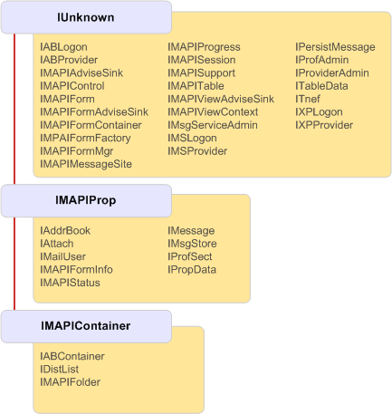

# MAPI Object Inheritance Hierarchy

**Applies to**: Outlook 
  
All interfaces implemented by MAPI objects ultimately inherit from [IUnknown](http://msdn.microsoft.com/library/33f1d79a-33fc-4ce5-a372-e08bda378332%28Office.15%29.aspx), the OLE interface that enables objects to communicate. Most interfaces directly inherit from **IUnknown**, but some inherit from one of two other base interfaces: [IMAPIProp : IUnknown](imapipropiunknown.md) or [IMAPIContainer : IMAPIProp](imapicontainerimapiprop.md). The following illustration shows the complete inheritance hierarchy in MAPI.
  
**MAPI inheritance hierarchy**
  

  
## See also

- [IMAPIProp : IUnknown](imapipropiunknown.md) 
- [IMAPIContainer : IMAPIProp](imapicontainerimapiprop.md)
- [MAPI Object and Interface Overview](mapi-object-and-interface-overview.md)

