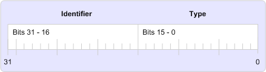

# MAPI Property Tags

 **Last modified:** July 23, 2011 
  
 * **Applies to:** Outlook * 
  
A property tag is a 32-bit number that contains a unique property identifier in bits 16 through 31 and a property type in bits 0 through 15 as shown in the following illustration. 
  
 **Property tag elements**
  

  
Property tags are used to identify MAPI properties and every property must have one, regardless of whether the property is defined by MAPI, a client, or a service provider. MAPI defines a set of property tag constants for its properties in the Mapitags.h header file; these properties are referred to as the "MAPI-defined properties". 
  
The property tag constants follow a naming convention for consistency and ease of use. There are two parts to the name of each property tag: a PR_ prefix and one or more character strings that describe the contents of the property. Multiple character strings are separated by underscores. For example, the property tag for the address type of a message recipient is **PR_ADDRTYPE** ( [PidTagOrgAddrtype](http://msdn.microsoft.com/library/d40b5707-e4d5-4746-88d4-8616a3789789%28Office.15%29.aspx)) and the entry identifier for the folder designated to receive a copy of every outbound message is **PR_IPM_SENTMAIL_ENTRYID** ( [PidTagIpmSentMailEntryId](pidtagipmsentmailentryid-canonical-property.md)).
  
A few macros are available to help work with property tags, among them [PROP_TYPE](prop_type.md), [PROP_ID](prop_id.md), and [PROP_TAG](prop_tag.md). **PROP_TYPE** extracts the property type from the property tag; **PROP_ID** extracts the identifier. **PROP_TAG** builds a property tag from a property type and identifier. 
  
## See also

#### Concepts

[MAPI Property Overview](mapi-property-overview.md)

