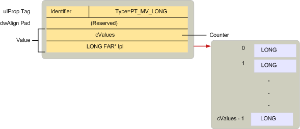
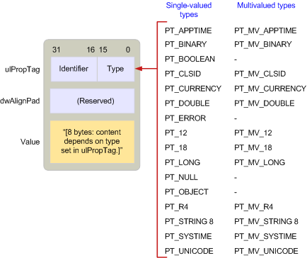

# MAPI Property Type Overview

 **Last modified:** July 23, 2011 
  
 * **Applies to:** Outlook * 
  
Property types are constants defined by MAPI in the MAPIDEFS.H header file that indicate the underlying data type of a property value. All properties, whether they are defined by MAPI, by client applications, or by service providers, use one of these types. 
  
Property types follow a similar naming convention to the one used for property tags. Many property types have both a single-value and multiple-value version. Single valued properties contain one value of its type such as a single integer or character string. The constant used to represent a single value property has two parts: the prefix PT_ and a string describing the actual type, such as LONG or STRING8. 
  
Multiple-value properties contain more than one value of its type. Unlike OLE variant arrays, every value in a multivalued property is of the same type. The constant used to represent multivalued properties is created by combining the MV_FLAG flag with the corresponding single value constant representing the base type. There are three parts: the prefix PT_ followed by MV_ followed by a string that describes the type. For example, the type for a property containing multiple integers is PT_MV_LONG and for multiple character strings is PT_MV_STRING8.
  
The following illustration shows the structure of an [SPropValue](spropvalue.md) structure to describe a multiple-value integer, a property of type PT_MV_LONG. The **Value** member is expanded to include a count of the number of integer values in the property and a pointer to an array of those values. 
  
 **Multiple-value properties**
  

  
Although support for multiple-value properties is optional, MAPI recommends that clients and service providers support both types of properties because doing so enables greater interaction between MAPI-compliant components.
  
The following illustration lists all of the different property type constants, showing where they are stored in an **SPropValue** structure. The size of the **Value** member is dependent on the particular type. Notice that not all of the single-value types have multiple-value equivalents. 
  
 **Property type constants**
  

  
Clients and service providers working with a property need to follow two steps:
  
1. Determine if the property is available or unavailable.
    
2. If available, retrieve the property's value.
    
Sometimes a client or service provider need only check for the existence of a property; other times it is necessary to check for a specific value. For example, transport providers have three different courses of action for processing the **PR_SEND_RICH_INFO** ( [PidTagSendRichInfo](pidtagsendrichinfo-canonical-property.md)) property, a Boolean value that indicates whether or not a message should be transmitted with formatted text. If **PR_SEND_RICH_INFO** is set to TRUE, the transport provider transmits the formatted text. If it is set to FALSE, the formatted text is discarded before transmission. If **PR_SEND_RICH_INFO** is unavailable, the transport provider follows its default course of action, whatever that is for the particular provider. 
  
MAPI defines a special property type, PT_UNSPECIFIED, that a client or service provider can use to retrieve a property when the property type is unknown.To retrieve a property without advance knowledge of its type, a client or service provider calls an object's [IMAPIProp::GetProps](imapiprop-getprops.md) method and passes a property tag made up of the property's identifier and the PT_UNSPECIFIED property type. **GetProps** returns an [SPropValue](spropvalue.md) structure for the property, replacing PT_UNSPECIFIED with the appropriate type. Service providers implementing **GetProps** are required to support PT_UNSPECIFIED. 
  
Some MAPI objects support properties that are themselves objects. Object properties have the type PT_OBJECT. Instead of using **IMAPIProp::GetProps** to access these properties, clients and service providers typically user either the [IMAPIProp::OpenProperty](imapiprop-openproperty.md) method, specifying the appropriate interface for access, or a method on the object supporting the property. 
  
Because accessing the value of an object property involves using one of the interfaces for the object, **GetProps** is inappropriate. With **GetProps**, the caller accesses a property's value through an **SPropValue** structure. With **IMAPIProp::OpenProperty**, the caller retrieves a pointer to an interface that can access the object. **OpenProperty** can always be used to retrieve an object property. The other option, calling a method on the object, is not available with every object property. 
  
For example, every folder supports two tables, a hierarchy table and a contents table. These tables are properties of the folder; their property tags are **PR_CONTAINER_HIERARCHY** ( [PidTagContainerHierarchy](pidtagcontainerhierarchy-canonical-property.md)) and **PR_CONTAINER_CONTENTS** ( [PidTagContainerContents](pidtagcontainercontents-canonical-property.md)). Tables are objects that require the **IMAPITable** interface for access. A client can call the folder's [IMAPIContainer::GetHierarchyTable](imapicontainer-gethierarchytable.md) method to access the hierarchy table, the folder's [IMAPIContainer::GetContentsTable](imapicontainer-getcontentstable.md) method to access the contents table, or the folder's [IMAPIProp::OpenProperty](imapiprop-openproperty.md) method to access either table. To call **OpenProperty**, a client passes the property tag for the property as the first parameter and an interface identifier for the interface to be used for access as the second parameter. These parameters would be **PR_CONTAINER_HIERARCHY** or **PR_CONTAINER_CONTENTS** and **IID_IMAPITable**.
  
For a complete list of the single-value and multiple-value property types, see [Property Types](property-types.md). 
  
## See also

#### Concepts

[MAPI Property Overview](mapi-property-overview.md)

