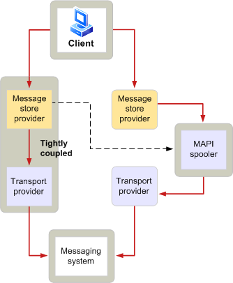

# MAPI spooler overview
  
**Applies to**: Outlook 
  
MAPI spooler is a function of the Microsoft Office Outlook process that is responsible for sending messages to and receiving messages from a messaging system. MAPI spooler plays a vital role in message receipt and delivery. When a messaging system is unavailable, MAPI spooler stores the messages and automatically forwards them at a later time. This ability to hold on to or send data when necessary is known as store and forward, a critical feature in environments where remote connections are common and network traffic is high. MAPI spooler runs as a background thread within Outlook.
  
MAPI spooler has additional responsibilities related to message distribution. These extra duties include the following:
  
- Keeping track of the recipient types that are handled by specific transport providers.
    
- Informing a client application when a new message has been delivered.
    
- Invoking message preprocessing and postprocessing.
    
- Generating reports that indicate that message delivery has occurred.
    
- Maintaining status on processed recipients.
    
The following illustration shows at a high level how a message flows from a client to the messaging system.
  
**Outgoing message flow**
  

  
The user of a client application sends a message to one or more recipients. The message store provider initiates the sending process, formatting the message with additional information needed for transmission.
  
MAPI spooler receives the message to process if any of the following conditions occur:
  
- The message store provider is not tightly coupled with a transport provider.
    
- The message requires preprocessing.
    
- The message store and transport provider are tightly coupled, but they cannot handle all the recipients to whom the message is addressed.
    
If MAPI spooler receives the message, it performs any required preprocessing and delivers the message to the appropriate transport provider. The transport provider gives the message to its messaging system, which sends it to its intended recipient.
  
With incoming messages, the flow is reversed. The transport provider receives a message from its messaging system and notifies MAPI spooler. Spooler performs any necessary postprocessing and informs the message store provider that a new message has arrived. This notification causes the client to refresh its message display, enabling the user to read the new message.
  
## See also

- [MAPI Features and Architecture](mapi-features-and-architecture.md)

