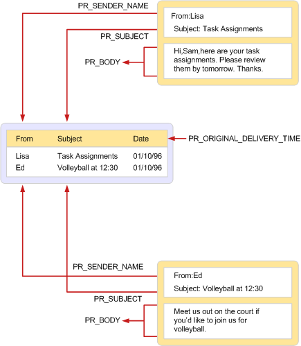

# MAPI tables
  
**Applies to**: Outlook 
  
A MAPI table is a MAPI object that is used to view a collection of properties belonging to other MAPI objects of a particular type. MAPI tables are structured in a row and column format with each row representing an object and each column representing a property of the object. One of the properties usually included in each row is the **PR_ENTRYID** ([PidTagEntryId](pidtagentryid-canonical-property.md)) property, an identifier that can be used to open and modify the object. 
  
Because rows contain property values, retrieving a row from a table is similar to getting a set of properties directly from the object that the row represents. Both operations result in the retrieval of a property value array. The main difference is in the handling of long string and binary properties. For inclusion in a table, some table implementers truncate these properties to 255 bytes. When retrieved directly from the object, the full value is always available.
  
Tables are implemented by address book and message store providers and by MAPI, depending on the type of table and the objects within it. A message store provider implements folders and a contents table for each folder that includes information about the messages in the folder. An address book provider implements address book containers and a hierarchy table that shows their organization. MAPI implements several different tables, some for use by client applications, some for use by service providers, and some for use by both. The status table is unique in that MAPI ultimately supplies the table, but the rows are comprised of contributions from all types of service providers in addition to MAPI. 
  
The following illustration shows one of the frequent uses of a table in MAPI: to display the contents of a folder. On the right is a display of two messages as might appear in a typical messaging client application. The display contains four pieces of information about each message: the sender, the recipient, the subject, and the message text. Each piece of information corresponds to a property of the message.
  
On the left is a view of the contents table that includes these two messages. Whereas the contents table may have ten rows because the folder has ten messages, with each row containing many more than three columns, this particular view is limited to only two rows and three columns.
  
The following table shows the properties that make up the column set for the table view.
  
|**Property**|**Description**|
|:-----|:-----|
|**PR_SENDER_NAME** ([PidTagSenderName](pidtagsendername-canonical-property.md))    |Sender name    |
|**PR_ORIGINAL_DELIVERY_TIME** ([PidTagOriginalDeliveryTime](pidtagoriginaldeliverytime-canonical-property.md))    |Date and time when the message was sent    |
|**PR_SUBJECT** ([PidTagSubject](pidtagsubject-canonical-property.md))    |Message subject line    |
   
Notice that the set of properties displayed in the message are not the same as the set of columns displayed in the table. The implementer of the table, in this case a message store provider, supplies a default set of columns in a default order. The client can modify this column set, requesting additional columns or rejecting default ones, and ask that they be ordered in a specific way. The client can also order the rows, sorting them according to the value of one or more columns.
  
**Using a table to display folder contents**
  

  
There are two interfaces for working with tables:
  
- [IMAPITable : IUnknown](imapitableiunknown.md) gives clients and service providers a read-only view of the underlying data of the table, allowing them to view and change only the presentation. Multiple users can access the same data concurrently with **IMAPITable**. **IMAPITable** is implemented by MAPI and by service providers. 
    
- [ITableData : IUnknown](itabledataiunknown.md) gives clients and service providers read/write access to the underlying data of the table, allowing them to make permanent changes. **IMAPITable** is implemented by MAPI and used primarily by service providers who access it by calling the [CreateTable](createtable.md) function. The **ITableData** implementation holds all the data for the table and any associated restrictions in memory, making it unsuitable for use with very large tables. Compound restrictions and complex operations such as categorization are unsupported. 
    
## See also

- [MAPI Concepts](mapi-concepts.md)

