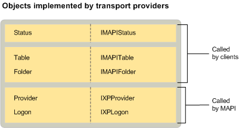

# MAPI Transport Provider Objects

 **Last modified:** July 23, 2011 
  
 * **Applies to:** Outlook * 
  
In addition to the standard provider and logon objects implemented by all service providers, transport providers are required to implement a status object. For the other service provider types, implementing a status object is optional. However, MAPI requires it for transport providers. Transport providers that support the downloading of message headers from a remote server also implement a folder and a table. 
  
The following illustration shows each of the objects that transport providers can implement with their corresponding interfaces. The illustration also indicates whether MAPI or a client is the object's user.
  

  
## See also

#### Concepts

[MAPI Service Provider Objects](mapi-service-provider-objects.md)

