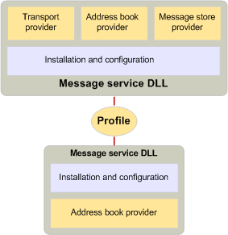

# Message services and profiles
  
**Applies to**: Outlook 2013 | Outlook 2016 
  
Some users require the services of several messaging systems, each with one or more service providers. Because it is cumbersome to install and configure each of these service providers individually, and because a messaging server usually requires a group of related providers to expose all its functionality, MAPI includes the concept of a message service. Message services help users install and configure their service providers.
  
To create a message service, a developer writes a message-service entry point program to handle the configuration of each provider in the service and a setup program to do the following:
  
- Install each provider in the service.
    
- Create registry and initialization file entries.
    
- Create entries in the MAPI configuration file, Mapisvc.inf.
    
The Mapisvc.inf file contains information that relates to the configuration of all message services and service providers installed on the computer. It is organized in hierarchical sections, with each level linked to the next. At the top are three sections that contain the following: 
  
- A list of message service Help files.
    
- A list of the most important, or default, message services.
    
- A list of all the services on the computer.
    
The next level contains sections for each message service, and the last level contains sections for each service provider in a service. MAPI requires that developers of service providers and message services add certain entries to Mapisvc.inf; developers can add other entries at their own discretion. Most of the information in Mapisvc.inf ends up in one or more profiles, a collection of configuration information for a user's preferred set of message services. Because a computer can have multiple users and a single user can have multiple sets of preferences, many profiles can exist on a computer. Each profile describes a different set of message services. Having multiple profiles enables a user to work, for example, at home with one set of message services and at the office with a different set.
  
Profiles are created at message service installation or logon time by a client application that provides configuration support. MAPI provides two such client applications: a Control Panel item and the Profile Wizard. The Control Panel item is a full-service configuration application with which users can create, delete, edit, and copy profiles, as well as make modifications to the entries in a profile. The Profile Wizard is a simple application designed to make adding a message service to a profile as easy as possible. The Profile Wizard consists of a series of dialog boxes, called property pages, that prompt the user through the process of installing and configuring a service. The user is prompted only for values for the most critical settings; all other settings inherit default values. Once the profile has been created, users are not allowed to make changes. 
  
Whereas the Control Panel item is always invoked through the Control Panel, there are a variety of scenarios that can cause the Profile Wizard to be called. Client applications can call the Profile Wizard to create a default profile at logon time when one has not yet been created. Rather than reimplementing code to add a profile, the Control Panel item or another client application can rely on the functionality already in the Profile Wizard. A message service, in its entry point function, can call the Profile Wizard when the service needs to be added to the default profile. Message services that use the Profile Wizard must write an extra entry point function and a standard Windows dialog box procedure. The Profile Wizard calls the entry point function to retrieve the service's configuration dialog box while the dialog box procedure handles the messages that are generated when this dialog box is in use. 
  
Profiles are organized in a similar way to the Mapisvc.inf file. Profiles have linked hierarchical sections; service providers own sections in the lowest level, message services own sections in the middle level, and MAPI owns sections in the highest level. Each section is identified with a unique identifier known as a [MAPIUID](mapiuid.md). The MAPI sections contain information internal to MAPI, such as the identifiers of all of the message service profile sections and links to each of the other sections. Each message service section stores links to its provider sections, and each provider section stores a link to its service section. 
  
The following illustration shows the contents of two typical profiles. Sam has two profiles on his computer, one for home use and one for office use. The home profile contains three message services. Message Service X is a single provider service for address book management. Message Services Y and Z have three providers — an address book provider, a message store provider, and a transport provider. Sam's Work Profile contains two different message services, each of which has an address book provider, a message store provider, and a transport provider. 
  
**Profile example**
  

  
The following illustration shows a profile that includes two message services. The code for installing and configuring the service providers that belong to the message service resides in the same DLL as the code for the providers. This code reads information from the profile at logon time to configure the service providers, and it prompts the user, if possible and necessary, for missing information. Requests from a client to view or change configuration settings for any of the providers are also handled by this common code.
  
**Installing and configuring service providers**
  

  
## See also

- [MAPIUID](mapiuid.md)
- [MAPI Programming Overview](mapi-programming-overview.md)

