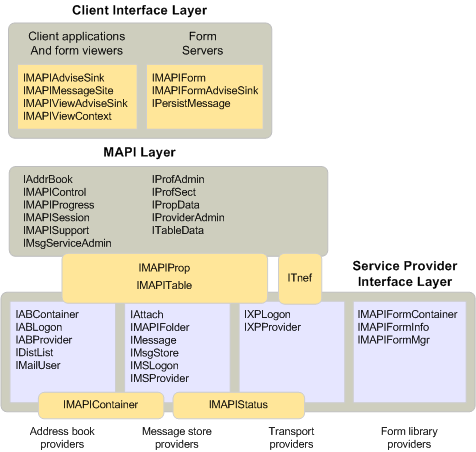

# Objects and the MAPI architecture

**Applies to**: Outlook 2013 | Outlook 2016 
  
All of the objects that MAPI defines fall into one or more layers in the MAPI architecture. The client interface layer contains all the objects that a client application, form viewer, or form server can implement. The service provider interface layer contains the objects that a service provider of any type can implement. This layer includes objects implemented by address books, message stores, transport providers, and form libraries. The layer that represents the MAPI subsystem is positioned between the client and service provider interface layers. The MAPI layer contains all of the objects that MAPI implements for clients or service providers to use. 
  
The following illustration shows where each of the MAPI objects fits into the MAPI architecture. The objects are represented with the names of their derived interfaces. For example, an advise sink object is shown as [IMAPIAdviseSink : IUnknown](imapiadvisesinkiunknown.md), the interface that derives from [IUnknown](https://msdn.microsoft.com/library/33f1d79a-33fc-4ce5-a372-e08bda378332%28Office.15%29.aspx) and that every advise sink object implements. The interfaces that bridge layers are either used or implemented by multiple components. Although the MAPI layer appears to separate the client and provider layers, implying that all communication must flow through MAPI, this is not the case. Clients can and do communicate directly to service provider objects. 
  
**Object layers in MAPI**
  

  
## See also

- [IMAPIAdviseSink : IUnknown](imapiadvisesinkiunknown.md)
- [MAPI Object and Interface Overview](mapi-object-and-interface-overview.md)

