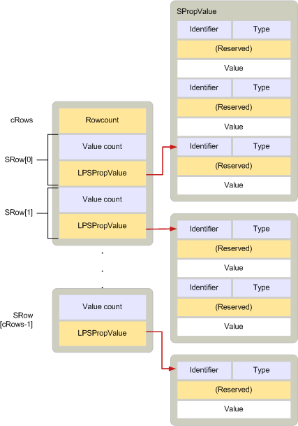

# SRow

**Applies to**: Outlook 2013 | Outlook 2016 
  
Describes a row from a table that contains selected properties for a specific object. 
  
|||
|:-----|:-----|
|Header file:  <br/> |Mapidefs.h  <br/> |
   
```cpp
typedef struct _SRow
{
  ULONG ulAdrEntryPad;
  ULONG cValues;
  LPSPropValue lpProps;
} SRow, FAR *LPSRow;

```

## Members

**ulAdrEntryPad**
  
> Padding bytes to properly align the property values pointed to by the **lpProps** member. 
    
**cValues**
  
> Count of property values pointed to by **lpProps**. 
    
**lpProps**
  
> Pointer to an array of [SPropValue](spropvalue.md) structures that describe the property values for the columns in the row. 
    
## Remarks

An **SRow** structure describes a row in a table. It is included in the [TABLE_NOTIFICATION](table_notification.md) structure that accompanies a table notification. 
  
**SRow** structures are used in the following methods: 
  
- [IAddrBook::GetSearchPath](iaddrbook-getsearchpath.md)
    
- [IAddrBook::SetSearchPath](iaddrbook-setsearchpath.md)
    
- [IMAPITable::QueryRows](imapitable-queryrows.md)
    
- [IMAPITable::ExpandRow](imapitable-expandrow.md)
    
- [ITableData : IUnknown](itabledataiunknown.md) (many methods) 
    
- [FBadRowSet](fbadrowset.md)
    
- [FreeProws](freeprows.md)
    
- [HrQueryAllRows](hrqueryallrows.md)
    
When more than one row needs to be described, an [SRowSet](srowset.md) structure is used. An **SRowSet** structure contains an array of **SRow** structures and a count of structures in the array. 
  
The following illustration shows the relationship between an **SRow** and an **SRowSet** data structure. 
  
**Relationship between SRow and SRowSet**
  

  
**SRow** structures are defined the same as [ADRENTRY](adrentry.md) structures. Therefore, a row of a recipient table and an entry in an address list can be treated the same. 
  
For information about how the memory for **SRow** structures should be allocated, see [Managing Memory for ADRLIST and SRowSet Structures](managing-memory-for-adrlist-and-srowset-structures.md).
  
## See also

- [ADRENTRY](adrentry.md)
- [SPropValue](spropvalue.md)
- [SRowSet](srowset.md)
- [TABLE_NOTIFICATION](table_notification.md)
- [MAPI Structures](mapi-structures.md)
- [Managing Memory for ADRLIST and SRowSet Structures](managing-memory-for-adrlist-and-srowset-structures.md)

