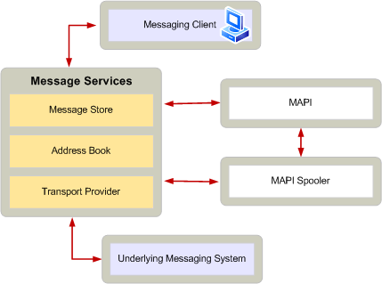

# Transport provider role in the MAPI subsystem
  
**Applies to**: Outlook 
  
Transport provider dynamic-link libraries (DLLs) provide the interface between the MAPI spooler and the part of a messaging system responsible for message sending and receiving. The MAPI spooler and the transport provider work together to handle the responsibilities of sending a message or receiving a message. The MAPI spooler loads the transport provider DLL when it is first used and releases it when it is no longer needed. Multiple transport providers can be installed on the same system, but MAPI supplies the one spooler required.
  
Client applications do not typically communicate directly with the transport provider. Rather, clients submit messages through a store provider and the MAPI spooler sends outgoing messages to the appropriate transport provider and delivers incoming messages to the appropriate message store. The MAPI spooler does its work and makes its calls to transport providers when foreground applications are idle. After optionally displaying dialog boxes when the transport provider is first logged on, transport providers operate in the background unless called by the client to flush send and receive queues. 
  
Transport providers have the following responsibilities in a MAPI messaging system:
  
- Register the address types they can accept with the MAPI spooler so the MAPI spooler can submit messages to the appropriate transport provider depending on the destination address of the messages. One transport provider can register more than one address type. Transport providers can also register specific recipients' addresses with the MAPI spooler. Messages addressed to one of these addresses will be submitted to the transport provider that registered the address with the MAPI spooler. For more information, see [Transport Provider and MAPI Spooler Operational Model](transport-provider-and-mapi-spooler-operational-model.md).
    
- Deliver incoming messages to the MAPI spooler. Depending on the nature of the messaging system, a transport provider can either directly notify the MAPI spooler when a new message arrives, or it can request that the MAPI spooler poll the transport provider periodically to check for new messages.
    
- Convert MAPI message properties to and from message properties native to the messaging system. For example, the transport provider might have to convert the sender's and recipient's addresses in an outgoing message to a form that is acceptable to the messaging system. Some messaging systems do not support all of the MAPI message properties. For more information about preserving MAPI message properties when delivering messages to a messaging system, see [Developing a TNEF-Enabled Transport Provider](developing-a-tnef-enabled-transport-provider.md).
    
- Register message and recipient options specific to the transport provider.
    
- Perform any verification of credentials required by the messaging system.
    
- Access outbound messages using the message object passed to it by the MAPI spooler.
    
- Translate message format as required by the underlying messaging system.
    
- Notify the MAPI spooler which recipients of an outgoing message the transport provider has accepted responsibility for handling by setting the **PR_RESPONSIBILITY** ([PidTagResponsibility](pidtagresponsibility-canonical-property.md)) property for those recipients.
    
- Inform the MAPI spooler when an incoming message needs to be handled.
    
- Pass incoming message data to the MAPI spooler by using message objects.
    
- Assign values to all required MAPI message properties on incoming messages.
    
- Delete the message from the underlying messaging system after delivery, if necessary.
    
- Provide status information for the MAPI spooler and client applications.
    
The following illustration shows a transport provider's role with respect to the other components of the MAPI architecture.
  
**Transport provider role in a messaging system**
  

  

