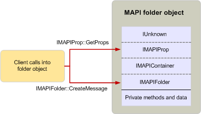

# Using MAPI objects

**Applies to**: Outlook 2013 | Outlook 2016 
  
Clients and service providers use MAPI objects by calling the methods in their interface implementations. This is the only way that MAPI objects can be used; methods that are implemented by an object outside of a MAPI interface are not publicly accessible. Because all of an object's interfaces are related through inheritance, an object's user can call methods in either the base interface or one of the inherited interfaces as if they belong to the same interface. 
  
When an object's user wants to make a call to a method and that object implements several interfaces related through inheritance, the user need not know to which interface the method belongs. The user can call any of the methods on any of the interfaces with a single pointer to the object. For example, the following illustration shows how a client application uses a folder object. Folder objects implement the [IMAPIFolder : IMAPIContainer](imapifolderimapicontainer.md) interface, which inherits from [IUnknown](https://msdn.microsoft.com/library/33f1d79a-33fc-4ce5-a372-e08bda378332%28Office.15%29.aspx) indirectly through [IMAPIProp : IUnknown](imapipropiunknown.md) and [IMAPIContainer : IMAPIProp](imapicontainerimapiprop.md). A client can call one of the **IMAPIProp** methods, such as [IMAPIProp::GetProps](imapiprop-getprops.md), and one of the [IMAPIFolder : IMAPIContainer](imapifolderimapicontainer.md) methods, such as [IMAPIFolder::CreateMessage](imapifolder-createmessage.md), in the same way with the same object pointer. A client is not aware of or affected by the fact that these calls belong to different interfaces.
  
**Client use of a folder object**
  

  
These calls translate into code differently depending on whether the client making the calls is written in C or C++. Before any call to a method can be made, a pointer to the interface implementation must be retrieved. Interface pointers can be obtained in the following ways:
  
- Calling a method on a different object.
    
- Calling an API function.
    
- Calling the [IUnknown::QueryInterface](https://msdn.microsoft.com/library/54d5ff80-18db-43f2-b636-f93ac053146d%28Office.15%29.aspx) method on the target object. 
    
MAPI provides several methods and API functions that return pointers to interface implementations. For example, clients can call the [IMAPISession::GetMsgStoresTable](imapisession-getmsgstorestable.md) method to retrieve a pointer to a table object that provides access to message store provider information through the [IMAPITable : IUnknown](imapitableiunknown.md) interface. Service providers can call the API function [CreateTable](createtable.md) to retrieve a pointer to a table data object. When there is no function or method available and clients or service providers already have a pointer to an object, they can call the object's **QueryInterface** method to retrieve a pointer to another of the object's interface implementations. 
  
## See also

- [MAPI Object and Interface Overview](mapi-object-and-interface-overview.md)

