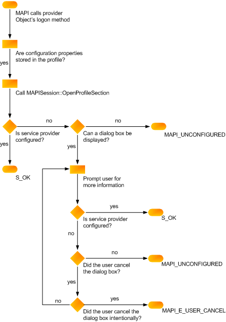

# Verifying Service Provider Configuration

 **Last modified:** March 09, 2015 
  
 * **Applies to:** Outlook * 
  
Your logon method ([IABProvider::Logon](iabprovider-logon.md), [IMSProvider::Logon](imsprovider-logon.md), or [IXPProvider::TransportLogon](ixpprovider-transportlogon.md)) must verify your provider's configuration. This involves checking that all of the properties needed for full operation are set correctly. Every provider requires a different number of properties; configuration depends on your provider and the degree of user interaction you allow. Some service providers keep all of the necessary properties in the profile. Other service providers keep a partial set of properties in the profile and prompt the user for missing values. Still other providers do not store properties in the profile at all, relying on the user to supply all of the information needed for configuration.
  
 **To retrieve properties stored in the profile**
  
1. Call [IMAPISupport::OpenProfileSection](imapisupport-openprofilesection.md), passing the [MAPIUID](mapiuid.md) of your provider as an input parameter. 
    
2. Call the profile section's [IMAPIProp::GetProps](imapiprop-getprops.md) or [IMAPIProp::GetPropList](imapiprop-getproplist.md) methods to retrieve individual properties or a property list. 
    
 **To set properties from user information**
  
Display a property sheet, if MAPI has not set a flag prohibiting the display. The following flags indicate that a user interface cannot be presented.
  
|**Flag**|**Service provider**|
|:-----|:-----|
|AB_NO_DIALOG    |Address book provider    |
|LOGON_NO_DIALOG    |Transport provider    |
|MDB_NO_DIALOG    |Message store provider    |
   
If your provider does not store all of its configuration properties in the profile, requiring user interaction, and MAPI passes one of the dialog box suppression flags to your logon method, return MAPI_E_UNCONFIGURED. Also return this error when the dialog suppression flag is not set, but the user does not supply all of the required information.
  
When your service provider fails its logon method with MAPI_E_UNCONFIGURED, MAPI calls your entry point function again. If the information cannot be located with the second call, the session might terminate, depending on how important your service provider is. 
  
The following illustration shows the logic required for configuration in your service provider logon method. 
  
 **Configuration verification flowchart**
  

  
## See also

#### Concepts

[Implementing Service Provider Logon](implementing-service-provider-logon.md)

