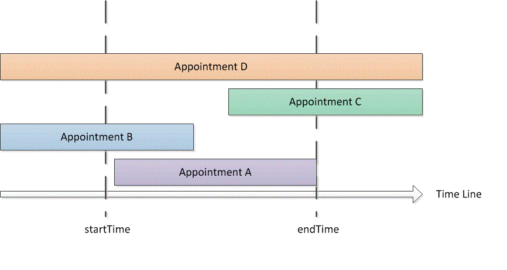

---
title: Search and obtain appointments in a time range
TOCTitle: Search and obtain appointments in a time range
ms:assetid: ce5205ad-6967-4f21-8a9d-503b731dbd40
ms:mtpsurl: https://msdn.microsoft.com/en-us/library/Gg619398(v=office.15)
ms:contentKeyID: 55119927
ms.date: 07/24/2014
mtps_version: v=office.15
---

# Search and obtain appointments in a time range

This example returns appointments in a specific time range in the default Microsoft Outlook calendar.

## Example

This code example contains two methods: DemoAppointmentsInRange and GetAppointmentsInRange. DemoAppointmentsInRange obtains the default calendar for the current signed-in Outlook profile, sets a date range of 5 days from 12:00 A.M. today, calls GetAppointmentsInRange to obtain appointments that fall in that time range, and displays the subject and start time of each of the returned appointments.

GetAppointmentsInRange accepts an Outlook folder, and the start and end **DateTime** values of the time range as input parameters. This method uses the [Restrict(String)](https://msdn.microsoft.com/en-us/library/bb612531\(v=office.15\)) method and a string filter in Jet format that returns appointments that start and end within the specified time range. Assuming \[Start\] and \[End\] are the start time and end time of an appointment, and startTime and endTime are the beginning and end time of the specified time range, GetAppointmentsInRange sets up a filter that looks for appointments with \[Start\]\>=startTime, and \[End\]\<=endTime. The following code shows the Jet filter in C\#.

```csharp
string filter = "[Start] >= '"
    + startTime.ToString("g")
    + "' AND [End] <= '"
    + endTime.ToString("g") + "'";
```

Before calling the **Items.Restrict** method to search for appointments, GetAppointmentsInRange does two other things to include recurring appointments that occur in the specified time range:

- Sets the [IncludeRecurrences](https://msdn.microsoft.com/en-us/library/bb646522\(v=office.15\)) property of the [Items](https://msdn.microsoft.com/en-us/library/bb645287\(v=office.15\)) collection.

- Sorts the appointment items in the given calendar folder by the [Start](https://msdn.microsoft.com/en-us/library/bb647263\(v=office.15\)) property.

Alternatively, if you are also interested in appointments that overlap partially or entirely with the specified time range, you would specify a different filter to return additional types of appointments (as shown in Figure 1):

  - Appointments that start and end within the specified time range (for example, appointment A):<br/>`[Start]>=startTime and [End]<=endTime`

  - Appointments that start before the specified time range but end within the time range (for example, appointment B):<br/>`[Start]<startTime and [End]<=endTime`

  - Appointments that start within the specified time range but end after the time range (for example, appointment C):<br/>`[Start]>=startTime and [End]>endTime`

  - Appointments that start before the specified time range and end after the time range (for example, appointment D):<br/> `[Start]<startTime and [End]>endTime`

**Figure 1. Types of appointments that occur within a time range, or overlap with that time range**


 

Because in any time range startTime\<=endTime, a filter with \[Start\]\<=endTime and \[End\]\>=startTime would capture the preceding types of appointments in that time range.

In C\#, you can express the Jet filter as follows.

```csharp
string filter = "[Start] <= '"
    + endTime.ToString("g")
    + "' AND [End] >= '"
    + startTime.ToString("g") + "'";
```

The following code shows the complete example. If you use Visual Studio to test this code example, you must first add a reference to the **Microsoft Outlook 15.0 Object Library** component and specify the Outlook variable when you import the **Microsoft.Office.Interop.Outlook** namespace. The **Imports** or **using** statement must not occur directly before the functions in the code example but must be added before the public Class declaration. The following lines of code show how to do the import and assignment in Visual Basic and C\#.

```vb
Imports Outlook = Microsoft.Office.Interop.Outlook
```

```csharp
using Outlook = Microsoft.Office.Interop.Outlook;
```

```csharp
private void DemoAppointmentsInRange()
{
    Outlook.Folder calFolder =
        Application.Session.GetDefaultFolder(
        Outlook.OlDefaultFolders.olFolderCalendar)
        as Outlook.Folder;
    DateTime start = DateTime.Now;
    DateTime end = start.AddDays(5);
    Outlook.Items rangeAppts = GetAppointmentsInRange(calFolder, start, end);
    if (rangeAppts != null)
    {
        foreach (Outlook.AppointmentItem appt in rangeAppts)
        {
            Debug.WriteLine("Subject: " + appt.Subject 
                + " Start: " + appt.Start.ToString("g"));
        }
    }
}

/// <summary>
/// Get recurring appointments in date range.
/// </summary>
/// <param name="folder"></param>
/// <param name="startTime"></param>
/// <param name="endTime"></param>
/// <returns>Outlook.Items</returns>
private Outlook.Items GetAppointmentsInRange(
    Outlook.Folder folder, DateTime startTime, DateTime endTime)
{
    string filter = "[Start] >= '"
        + startTime.ToString("g")
        + "' AND [End] <= '"
        + endTime.ToString("g") + "'";
    Debug.WriteLine(filter);
    try
    {
        Outlook.Items calItems = folder.Items;
        calItems.IncludeRecurrences = true;
        calItems.Sort("[Start]", Type.Missing);
        Outlook.Items restrictItems = calItems.Restrict(filter);
        if (restrictItems.Count > 0)
        {
            return restrictItems;
        }
        else
        {
            return null;
        }
    }
    catch { return null; }
}
```

## See also

- [Search and Filter](search-and-filter.md)

