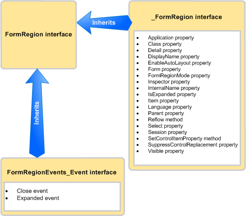

---
title: Methods and properties in the Outlook PIA
TOCTitle: Methods and properties in the Outlook PIA
ms:assetid: ec7742de-ead6-41dd-90a3-1280fdf09d54
ms:mtpsurl: https://msdn.microsoft.com/en-us/library/Bb612528(v=office.15)
ms:contentKeyID: 55119780
ms.date: 07/24/2014
mtps_version: v=office.15
---

# Methods and properties in the Outlook PIA

This topic describes how to access methods and properties of an object in managed code by using the Outlook Primary Interop Assembly (PIA).

## Where Helper objects come from

To create the Outlook PIA, Outlook uses the Type Library Importer (TLBIMP) in the .NET Framework to convert type definitions in the COM type library into equivalent definitions in a common language runtime (CLR) assembly. In COM, an object is actually a coclass that consists of the following:

- The primary interface (for example, the [\_FormRegion](https://msdn.microsoft.com/en-us/library/bb645761\(v=office.15\)) interface).

- The event interface (for example, the [FormRegionEvents](https://msdn.microsoft.com/en-us/library/bb611940\(v=office.15\)) interface).

TLBIMP imports the primary interface and the event interface for each object and creates a number of interfaces, delegates, and classes, among which are the following:

- The .NET event interface (for example, the [FormRegionEvents\_Event](https://msdn.microsoft.com/en-us/library/bb647619\(v=office.15\)) interface).

- The .NET class (for example, the [FormRegionClass](https://msdn.microsoft.com/en-us/library/bb624204\(v=office.15\)) class).

- The .NET interface (for example, the [FormRegion](https://msdn.microsoft.com/en-us/library/bb652633\(v=office.15\)) interface).

## What the Helper objects are for

Continuing to use the **FormRegion** object as an example, the following list examines what each interface and class listed earlier contains.

- The \_FormRegion interface defines all the methods and properties of FormRegion. Typically you do not use this interface in code, except for a condition discussed below.

- The **FormRegionEvents** interface defines methods mapping to events of FormRegion. You do not use this interface in code.

- TLBIMP further processes the **FormRegionEvents** interface to create the **FormRegionEvents**\_Event interface that defines all the events of FormRegion. Typically you do not use this interface in code, except for a condition discussed below.

- The FormRegionClass class defines all the method, property, and event members of FormRegion. This is the class that the FormRegion interface is attributed to associate with behind the scenes so that you can write code to create an instance of the FormRegion interface. However, you do not use this interface directly in code.

- The FormRegion interface inherits the \_FormRegion interface and the **FormRegionEvents**\_Event interface. Figure 1 illustrates this inheritance relationship.
    
  **Figure 1. The FormRegion interface inherits methods and properties from the \_FormRegion interface, and inherits events from the FormRegionEvents\_Event interface**

  
    
  Typically, FormRegion is the one interface you use in managed code to access the object and the method, property, and event members of the **FormRegion** object.

Using the **Application** object as another example, you access the **Application** object, methods, properties, and events through the [Application](https://msdn.microsoft.com/en-us/library/bb646615\(v=office.15\)) interface. There are however three exceptions where you must use a different interface, or depending on the language, you would want to use a different interface:

- When you access a method that shares the same name as an event, a good practice is to cast to the primary interface to call the method. For example, the **Application** object has a [Quit](https://msdn.microsoft.com/en-us/library/bb646614\(v=office.15\)) method and a [Quit](https://msdn.microsoft.com/en-us/library/bb622595\(v=office.15\)) event. In Visual Basic .NET, you can access the Quit method through the Application interface. In C\#, you can avoid a compiler warning by casting the Quit method to the primary interface, as shown in the following code sample:
    
   ```csharp
      void DemoApp()
      {
          Outlook.Application myApp = new Outlook.Application();
          // Other application code here
          ((Outlook._Application)myApp).Quit();
      }
   ```

- When you access an event that shares the same name as a method of that object, you must cast to the appropriate event interface to connect to the event. Similar to the example above, to connect to the Quit event, you cast to the [ApplicationEvents\_11\_Event](https://msdn.microsoft.com/en-us/library/bb622725\(v=office.15\)) interface.

- When you connect to an earlier version of an event that has been subsequently extended in a later version of Outlook, you must connect to the version of the event in the earlier interface. For example, if you want to connect to the version of the Quit event for the **Application** object implemented for Outlook 2002 instead of the latest version, connect to the [Quit](https://msdn.microsoft.com/en-us/library/bb609660\(v=office.15\)) event defined in the [ApplicationEvents\_10\_Event](https://msdn.microsoft.com/en-us/library/bb610098\(v=office.15\)) interface, instead of the Quit event defined in the ApplicationEvents\_11\_Event interface.

## See also

- [Relating the Outlook PIA with the object model](relating-the-outlook-pia-with-the-object-model.md)
- [Objects in the Outlook PIA](objects-in-the-outlook-pia.md)
- [Events in the Outlook PIA](events-in-the-outlook-pia.md)

