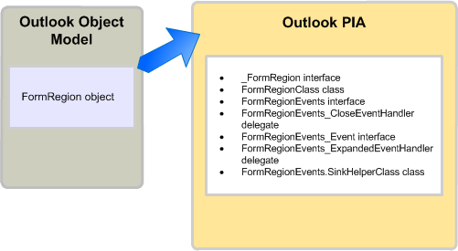

---
title: Objects in the Outlook PIA
TOCTitle: Objects in the Outlook PIA
ms:assetid: 1be732a6-d6da-4fa0-beaa-accf35db12d6
ms:mtpsurl: https://msdn.microsoft.com/en-us/library/Bb609459(v=office.15)
ms:contentKeyID: 55119778
ms.date: 07/24/2014
mtps_version: v=office.15
---

# Objects in the Outlook PIA

When browsing the Outlook Primary Interop Assembly (PIA) in an object browser, you may notice that many interfaces and classes have names referencing familiar objects in the Outlook object model. Some objects in the object model have a one-to-one mapping to interfaces in the PIA. 

For example, the **AddressEntry** is mapped to the [AddressEntry](https://msdn.microsoft.com/en-us/library/bb609728\(v=office.15\)) interface and the **AddressList** object is mapped to the [AddressList](https://msdn.microsoft.com/en-us/library/bb623538\(v=office.15\)) interface in the PIA. 

However, most other objects have a one-to-many mapping in the PIA. This one-to-many mapping applies to some objects that existed before Microsoft Office Outlook 2007, and all objects added since Outlook 2007. This topic lists the typical .NET interfaces, classes, and delegates that are mapped to a COM object and describes how to access an object in the Outlook PIA. It also describes a few exceptions in the Outlook PIA where the objects are hidden or deprecated in the COM-based object model.

## Helper objects

This section illustrates the typical helper classes for an object in the Outlook PIA by using the **FormRegion** object as an example. The **FormRegion** object was added to the object model in Outlook 2007. Related to the **FormRegion** object in the PIA are the interfaces, classes, and delegates, illustrated in Figure 1.

**Figure 1. The FormRegion object represented in the Outlook object model and in the Outlook PIA**



The one interface that you most often use to access the **FormRegion** object and its method, property, and event members is the [FormRegion](https://msdn.microsoft.com/en-us/library/bb652633\(v=office.15\)) interface. However, you should not consider the **FormRegion** .NET interface as an exact mirror image of the **FormRegion** COM object; if you look at the Object Browser in Visual Studio, you will find that the **FormRegion** interface inherits from another interface, the [\_FormRegion](https://msdn.microsoft.com/en-us/library/bb645761\(v=office.15\)) interface. In fact, the **FormRegion** interface is just one of the few interfaces and classes that result from creating the Outlook PIA based on the COM type library.

To create the Outlook PIA, Outlook uses the Type Library Importer (TLBIMP) in the .NET Framework to convert type definitions in the COM type library into equivalent definitions in a Common Language Runtime assembly. In COM, the **FormRegion** object is actually a coclass that consists of the following two interfaces defining the interfaces that the **FormRegion** object implements:

- The primary interface **\_FormRegion**

- The event interface [FormRegionEvents](https://msdn.microsoft.com/en-us/library/bb611940\(v=office.15\))

TLBIMP directly imports **\_FormRegion** and **FormRegionEvents** from the type library.

Other than importing the primary interface and event interface, TLBIMP creates a .NET interface that has the same name as the COM object, and a .NET class that uses the name of the object and appends it with "Class". In the case of the **FormRegion** object, TLBIMP creates the following:

- The .NET interface **FormRegion**

- The .NET class [FormRegionClass](https://msdn.microsoft.com/en-us/library/bb624204\(v=office.15\))

Of the .NET interfaces and .NET class mentioned in this topic, you always use the .NET interface that TLBIMP creates to access an object. For example, to access a **FormRegion** object in VB, you always use the **FormRegion** interface, as in the following code example:

```vb
Imports Outlook = Microsoft.Office.Interop.Outlook
Sub DemoFormRegion(ByVal Region As Outlook.FormRegion)
    Dim MyFormRegion As Outlook.FormRegion = Region
    ' Additional method code here
End Sub
```

<br/>

```csharp
using Outlook = Microsoft.Office.Interop.Outlook; 
void DemoFormRegion(Outlook.FormRegion region) 
{
    Outlook.FormRegion myFormRegion = region; 
    // Additional method code here
}
```

For information about the purpose of the primary interface and the .NET class that TLBIMP imports and creates respectively, see [Methods and properties in the Outlook PIA](methods-and-properties-in-the-outlook-pia.md). For information about the purpose of the event-related interfaces, delegates, and sink helper classes, see [Events in the Outlook PIA](events-in-the-outlook-pia.md).

## Deprecated objects

Objects deprecated in the type library are exposed in the Outlook PIA. For example, the **\_DDocSiteControl** and **\_DRecipientControl** objects are hidden in the type library but are exposed in the PIA.

Another example of a deprecated object is the **MAPIFolder** object. Starting in Outlook 2007, the **Folder** object has replaced the **MAPIFolder** object in the object model. Existing solutions should replace references to **MAPIFolder** by **Folder**, and all solutions new for Outlook 2007 and after should use only the **Folder** object. For unmanaged solutions, the Object Browser of the Visual Basic Editor no longer lists the **MAPIFolder** object, not even as a hidden object. 

For managed solutions, even though the Outlook PIA exposes a [Folder](https://msdn.microsoft.com/en-us/library/bb645774\(v=office.15\)) interface through which you access the **Folder** object and its members, the Outlook PIA also exposes [MAPIFolder](https://msdn.microsoft.com/en-us/library/bb624369\(v=office.15\)) as an interface that defines the members of the **Folder** object.

## See also

- [Relating the Outlook PIA with the object model](relating-the-outlook-pia-with-the-object-model.md)


