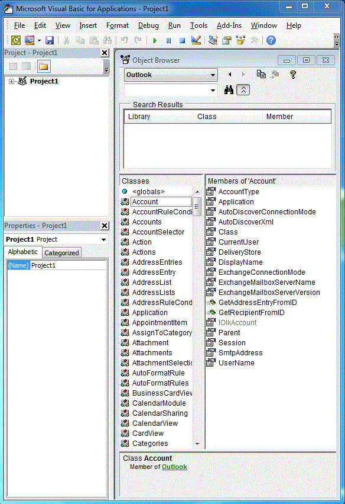
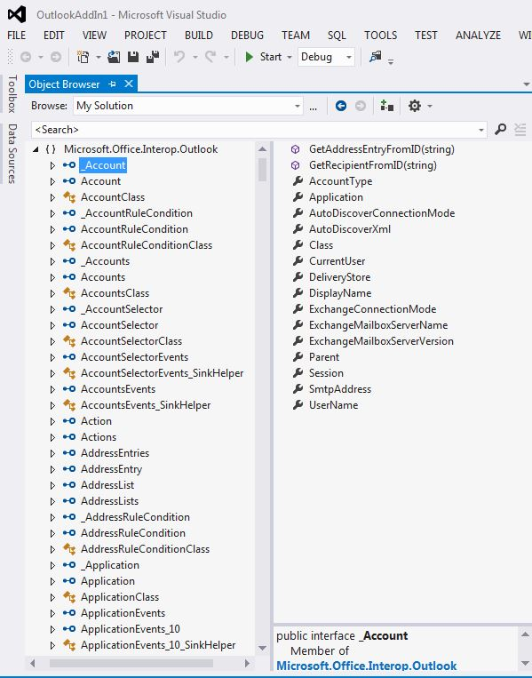

# Relating the Outlook PIA with the object model

The Outlook Primary Interop Assembly (PIA) is an interop assembly officially published by Outlook defining a managed interface for managed add-ins to interact with the COM-based Outlook object model. [Introduction to interoperability between COM and .NET](introduction-to-interoperability-between-com-and-net.md) describes technically how an interop assembly supports a managed client programming against a COM-based type library. This topic gives an overview of how objects and members in the COM-based Outlook object model are mapped to corresponding managed interfaces and classes in the PIA.

## Helper objects

When you compare the objects of the Outlook type library listed in the object browser of the Visual Basic Editor, as in Figure 1, with the objects of the PIA listed in the object browser of Visual Studio, as in Figure 2, you might be overwhelmed by the large number of extra helper objects that exist in the PIA. You might notice that some objects, such as the **Action** object, maps to one interface, the [Action](https://msdn.microsoft.com/library/bb646971\(v=office.15\)) interface, but other objects, like the **Account** object, do not necessarily map to exactly one corresponding interface in the PIA.

**Figure 1. Object browser showing objects in the COM-based Outlook type library**

**Figure 2. Object browser showing objects in Outlook**

Among these interfaces, many of them have names that begin with an underscore ('\_') followed by an object name. For example, the **Account** object maps to a public interface \_Account and a public class Account in the Visual Studio object browser. In fact, though not shown explicitly in the Visual Studio object browser, the **Account** object is mapped to two interfaces and one class in the PIA: an [\_Account](https://msdn.microsoft.com/library/bb609471\(v=office.15\)) interface, an [Account](https://msdn.microsoft.com/library/bb645103\(v=office.15\)) coclass, and an [AccountClass](https://msdn.microsoft.com/library/bb645768\(v=office.15\)) class. 

For more information about these interfaces, coclasses and classes, where they come from, and how objects are mapped from the type library to the PIA, see [Objects in the Outlook PIA](objects-in-the-outlook-pia.md).

## Separate event interfaces

If you examine objects that have events, events in the PIA are not grouped together with other method and property members of that object, but are grouped to form their own interfaces, event handlers, and classes. 

For more information about how methods and properties are mapped from the type library to the PIA, see [Methods and properties in the Outlook PIA](methods-and-properties-in-the-outlook-pia.md). For more information about event interfaces, delegates, and classes, see [Events in the Outlook PIA](events-in-the-outlook-pia.md).

## Hidden and deprecated objects

The PIA also contains objects, members, and enumerations that have been deprecated and optionally marked as hidden in the COM object model. Most of these objects, members, and enumerations are exposed in the PIA. However, they are exposed for the completeness of the PIA; they are no longer intended to be used by solution developers and are therefore minimally documented. A few exceptions exist such as the **\_DocSiteControl** and **\_RecipientControl** objects, which are hidden in the type library but are exposed and documented as first class objects in the PIA reference. 

For more information about the **\_DocSiteControl** object, see [\_DDocSiteControl](https://msdn.microsoft.com/library/bb609520\(v=office.15\)). For more information about the **\_RecipientControl** object, see [\_DRecipientControl](https://msdn.microsoft.com/library/bb609501\(v=office.15\)).

