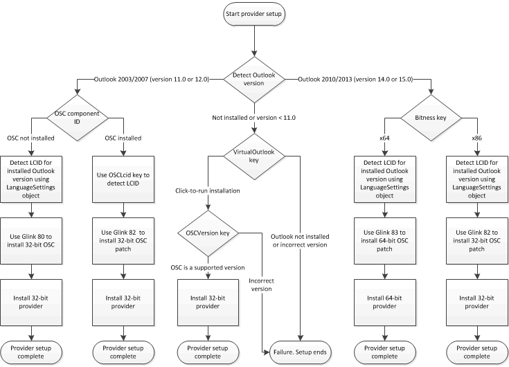

# Installation checklist

This topic describes prerequisites for successfully installing an Outlook Social Connector (OSC) provider, and the installation checks that your provider installer should complete to work correctly.
  
## Installation overview

Users should install OSC providers only if a supporting version of Outlook is present and the OSC is installed and enabled on the client computer. Supporting versions of Outlook are Office Outlook 2003, Office Outlook 2007, Outlook 2010 and Outlook 2013 (installed on the client computer or, in the case of Outlook 2010 and Outlook 2013, delivered by Click-to-Run on the client computer). To ensure a successful installation, your provider installer should do the following:
  
- Verify whether a supported version of Outlook is present.
    
- Verify whether the OSC is installed.
    
> [!NOTE]
> Click-to-Run is a virtual environment in which Outlook 2010 (32-bit) or Outlook 2013 (32-bit) can run. For Outlook 2013, verify if the VirtualOutlook key exists in HKEY_LOCAL_MACHINE\Software\Microsoft\Office\15.0\Common\InstallRoot\Virtual\VirtualOutlook of the Windows registry. For more information about delivering Outlook as a Click-to-Run product on a client computer, see [How to Verify if Outlook is Available on a Computer as a Click-to-Run Product](https://blogs.msdn.com/b/officedevdocs/archive/2010/03/09/how-to-verify-if-outlook-is-available-on-a-computer-as-a-click-to-run-product.aspx). 
  
The user, however, has to ensure that the OSC is enabled before installing the provider.
  
Third parties, including OSC providers, cannot redistribute the OSC. However, if the OSC is not installed, the provider installer can use appropriate g-links to install the OSC on the client computer. A g-link is a specially constructed URL on https://g.live.com that forwards a user to a corresponding webpage to download the OSC. An OSC g-link is formatted as https://g.live.com/0CR _LCID_/ _Glink_, where  _LCID_ and  _Glink_ specify the locale, version, and bitness of Outlook on the client computer. Each g-link points to an executable and is specific to the specified  _LCID_ and  _Glink_ values. 
  
For example, the g-link to install the latest version of the OSC for Outlook 2003 or Outlook 2007 for the LCID 1033 (US English) is as follows:
  
https://g.live.com/0CR1033/80
  
For details about  _Glink_ values for different versions and bitness of Outlook, and  _LCID_ values for supported locales, see #7 in the section [Installation Checklist](#olosc_InstallationOverview_InstallationChecklist) below. 

<a name="olosc_InstallationOverview_InstallationChecklist"> </a>

## Installation checklist

The provider setup package should perform a series of installation checks, as shown in Figure 1, to ensure that the provider installs successfully.
  
**Figure 1. Provider installation logic**


  
The following procedure describes the installation checks outlined in Figure 1.
  
1. As a prerequisite, detect whether Outlook is installed or present, and if installed or present, determine whether the version of Outlook supports the OSC. For more information about detecting the installed version of Outlook, see [Check the Version of Outlook](https://msdn.microsoft.com/library/672fc380-a29b-4e99-9211-949fd5065723%28Office.15%29.aspx).
    
   - If the installed version of Outlook is earlier than Outlook 2003, the provider installation procedure cannot complete. Inform the user to obtain a supported version of Outlook and the OSC before proceeding to install the OSC provider.
    
   - If Outlook is not installed, proceed to step 2.
    
   - If Outlook 2003 or Outlook 2007 is installed, proceed to step 3. 
    
   - If Outlook 2010 or Outlook 2013 is installed, proceed to step 4.
    
2. **Proceed with this step if Outlook is not installed on the client computer:**
    
   1. Check whether the OSC is installed as a default component of a Click-to-Run installation of Outlook 2010 or Outlook 2013. Examine the  `VirtualOutlook` key in the following location in the Windows registry: 
      
      - For Outlook 2010,  `HKEY_LOCAL_MACHINE\Software\Microsoft\Office\14.0\Common\InstallRoot\Virtual\VirtualOutlook`
      
      - For Outlook Social Connector 2013,  `HKEY_LOCAL_MACHINE\Software\Microsoft\Office\15.0\Common\InstallRoot\Virtual\VirtualOutlook`
      
      The  `VirtualOutlook` key is a REG_SZ value that contains the locale tag, such as "en-us", of the installed product. 
      
   2. If the  `VirtualOutlook` key does not exist, Outlook is not present on the client computer, and the provider installation procedure cannot complete. Inform the user to obtain a supported version of Outlook and the OSC before proceeding to install the OSC provider. 
      
   3. If the  `VirtualOutlook` key does exist, Outlook was delivered by Click-to-Run on the client computer. Proceed to check the installed version of the OSC type library by examining the  `OSCVersion` key in the following location in the Windows registry: 
      
      `HKEY_LOCAL_MACHINE\Software\Microsoft\Office\Outlook\SocialConnector\OSCVersion`
      
      The value of  `OSCVersion` is a string that specifies the type library version number of Socialprovider.dll (for example, "1.0", "1.1", or "15"). 
      
   4. If  `OSCVersion` is "1.0", "1.1" or "15", an appropriate version of OSC is installed. Proceed to step 6 to find the current Outlook user interface locale to prepare for installing the latest version of the OSC. 
      
   5. Otherwise,  `OSCVersion` does not contain an expected value. Proceed to step 6 to find the current Outlook user interface locale to prepare for installing an appropriate version of the OSC. 
    
3. **Proceed with this step if Outlook 2003 or Outlook 2007 is installed on the client computer:**
    
   1. Verify whether the OSC is installed by writing an installer custom action to test for the existence of the following qualified component ID:
      
      `{A3B82DA3-8AD9-4935-AEA8-54B754459483}`
      
      The qualified component ID is a GUID that provides a method of single-level indirection, similar to a pointer. For more information about Windows Installer, see [Roadmap to Windows Installer Documentation](https://docs.microsoft.com/windows/desktop/msi/roadmap-to-windows-installer-documentation).
      
   2. If the specified qualified component exists, a version of the OSC is installed. Proceed to step 5 to find the current Outlook user interface locale to prepare for installing the latest version of the OSC.
      
   3. Otherwise, the OSC is not installed. Proceed to step 6 to find the current Outlook user interface locale to prepare for installing an appropriate version of the OSC.
      
4. **Proceed with this step if Outlook 2010 or Outlook 2013 is installed on the client computer:**
    
   1. Determine the bitness of the installed version of Outlook by examining the  `Bitness` key in the following location in the Windows registry: 
      
      - For Outlook 2010, look at  `HKEY_LOCAL_MACHINE\SOFTWARE\Microsoft\Office\14.0\Outlook`
      
      - For Outlook 2013, look at  `HKEY_LOCAL_MACHINE\SOFTWARE\Microsoft\Office\15.0\Outlook`
      
      The  `Bitness` key is "x86" for 32-bit Outlook, or "x64" for 64-bit Outlook. 
      
   2. If your provider is a managed provider, and you compiled the provider component specifying the target platform as **Any CPU**, proceed with step 6 to find the current Outlook user interface locale to prepare for installing the latest version of the OSC. Your provider will work on both 32-bit and 64-bit versions of the OSC.
      
   3. If your provider is a native COM component, examine the bitness of the installed version of Outlook:
      
      - If the installed version of Outlook is 32-bit, your installation procedure will have to install a 32-bit provider (in step 8), after ensuring that an appropriate OSC is installed.
      
      - Otherwise, the installed version of Outlook is 64-bit, and your installation procedure will have to install a 64-bit provider (in step 8), after ensuring that an appropriate OSC is installed. 
      
   4. Proceed with step 6 to find the current Outlook user interface locale to prepare for installing an appropriate version of the OSC.
    
5. **Proceed with this step if Outlook 2003 or Outlook 2007 is installed, and the OSC is installed on the client computer:** Check the current Outlook user interface locale by examining the  `OSCLcid` key in the following location in the Windows registry: 
    
   `HKEY_LOCAL_MACHINE\Software\Microsoft\Office\Outlook\SocialConnector\OSCLcid`
    
   The  `OSCLcid` key is a DWORD value that specifies the Internet Engineering Task Force (IETF) locale tag (defined by [[RFC4646]](https://www.ietf.org/rfc/rfc4646.txt) and [[RFC4647]](https://www.ietf.org/rfc/rfc4647.txt)), that represents the current Outlook user interface locale. Proceed with step 7 to install the latest OSC on the client computer.
    
6. **Proceed with this step if Outlook 2003 or Outlook 2007 is installed, or Outlook 2010 or Outlook 2013 is present, but the latest OSC is not necessarily installed on the client computer:**
    
   Use the **LanguageSettings** object to determine the LCID of the Outlook user interface locale. The following Visual Basic Scripting Edition (VBScript) code snippet demonstrates how to obtain the LCID of the Outlook user interface locale. 
    
   ```vb
    Function GetOutlookUI_LCID()
        ' Declare variables.
        Dim msoLanguageIDUI, olApp
        msoLanguageIDUI = 2
        Set olApp = CreateObject("Outlook.Application")
        ' Return Outlook UI LCID.
        GetOutlookUI_LCID = olApp.LanguageSettings.LanguageID(msoLanguageIDUI)
    End Function
   ```

7. **Proceed with this step if the installer has the LCID of the installed version of Outlook, but the latest OSC is not necessarily installed on the client computer:**
    
   Chain a g-link into your installation package to ensure that the latest version of the OSC is installed on the client computer. The g-link format is as follows:
    
   https://g.live.com/0CR _LCID_/ _Glink_
    
   Refer to Table 1 below for the supported  _LCID_ values, and Table 2 for the supported  _Glink_ values. For example, the g-link to install the latest version of the 32-bit OSC for 32-bit Outlook Social Connector 2013 (US English) is as follows: 
    
   https://g.live.com/0CR1033/82
    
8. Install the provider. The provider installation procedure must register the programmatic identifier (ProgID) in the appropriate Windows registry location. For more information, see [Registering a Provider](registering-a-provider.md). Also, be sure that the bitness of the provider to be installed is the same as the bitness of the version of Outlook present on the client computer. For example, install a 32-bit provider if 32-bit Outlook 2013 is present, and a 64-bit provider if 64-bit Outlook 2013 is installed. For Outlook 2003 or 2007, only the 32-bit version of your provider applies. 
    
**Table 1: Supported locale and corresponding LCID values in hexadecimal for the OSC**
  
|**Locale**|**LCID**|
|:-----|:-----|
|ar-sa  <br/> |1025  <br/> |
|bg-bg  <br/> |1026  <br/> |
|ca-es  <br/> |1027  <br/> |
|cs-cz  <br/> |1029  <br/> |
|da-dk  <br/> |1030  <br/> |
|de-de  <br/> |1031  <br/> |
|el-gr  <br/> |1032  <br/> |
|en-us  <br/> |1033  <br/> |
|es-es  <br/> |3082  <br/> |
|et-ee  <br/> |1061  <br/> |
|eu-es  <br/> |1069  <br/> |
|fi-fi  <br/> |1035  <br/> |
|fr-fr  <br/> |1036  <br/> |
|gl-es  <br/> |1110  <br/> |
|he-il  <br/> |1037  <br/> |
|hi-in  <br/> |1081  <br/> |
|hr-hr  <br/> |1050  <br/> |
|hu-hu  <br/> |1038  <br/> |
|it-it  <br/> |1040  <br/> |
|ja-jp  <br/> |1041  <br/> |
|kk-kz  <br/> |1087  <br/> |
|ko-kr  <br/> |1042  <br/> |
|lt-lt  <br/> |1063  <br/> |
|lv-lv  <br/> |1062  <br/> |
|nb-no  <br/> |1044  <br/> |
|nl-nl  <br/> |1043  <br/> |
|pl-pl  <br/> |1045  <br/> |
|pt-br  <br/> |1046  <br/> |
|pt-pt  <br/> |2070  <br/> |
|ro-ro  <br/> |1048  <br/> |
|ru-ru  <br/> |1049  <br/> |
|sk-sk  <br/> |1051  <br/> |
|sl-si  <br/> |1060  <br/> |
|sr-cyrl-cs  <br/> |3098  <br/> |
|sr-latn-cs  <br/> |2074  <br/> |
|sv-se  <br/> |1053  <br/> |
|th-th  <br/> |1054  <br/> |
|tr-tr  <br/> |1055  <br/> |
|uk-ua  <br/> |1058  <br/> |
|zh-cn  <br/> |2052  <br/> |
|zh-tw  <br/> |1028  <br/> |
   
**Table 2: Supported Glink values for the OSC**
  
|**Glink value**|**Function**|
|:-----|:-----|
|80  <br/> |Installs the latest version of OSC for Outlook 2003 or Outlook 2007.  <br/> |
|82  <br/> |Installs the latest patch of 32-bit OSC for Outlook 2007, Outlook 2010, or Outlook Social Connector 2013.  <br/> |
|83  <br/> |Installs the latest patch of 64-bit OSC for Outlook 2010 or Outlook Social Connector 2013.  <br/> |
   
## See also

- [Registering a Provider](registering-a-provider.md) 
- [Quick Steps for Learning to Develop a Provider](quick-steps-for-learning-to-develop-a-provider.md)
- [Deploying a Provider](deploying-a-provider.md)

