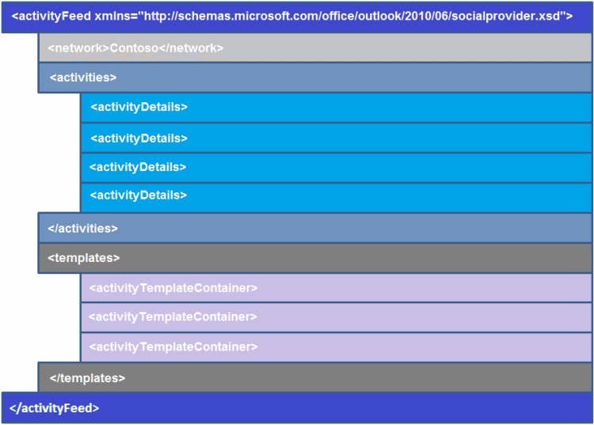

# Overview of XML for an Activity Feed Item

An activity feed consists of one or more activities occurring on a social network. Each activity feed is represented by an **activityFeed** element, and is characterized by these three pieces of information: 
  
- **network**—Name of the social network from which the activities originated.
    
- **activities**—Container for activities happening on the logged on user's account on that social network.
    
- **templates**—Container for templates that are used to display the corresponding activity item in **activities**.
    
To create an activity feed item, you must conform to the Outlook Social Connector (OSC) provider extensibility XML schema. Figure 1 shows the activity feed XML structure.
  
**Figure 1. Activity feed XML structure**

  
For each activity feed item, the two most important parts of this schema are the **activityDetails** and **activityTemplateContainer** elements: 
  
- The **activityDetails** element stores specific information for each activity feed item, such as the activity owner's name or the URL for the pictures uploaded. 
    
- The **activityTemplateContainer** element stores the format or layout for each activity feed item. It consists of templates, represented by individual **activityTemplate** elements, that can be reused for multiple feed items. 
    
For an individual activity feed item, the **activityTemplate** element specifies the following four pieces of information: 
  
- **icon**—Specifies the URL for the icon to display the activity feed item.
    
- **title**—Describes the activity feed item.
    
- **type**—Specifies the type of activity, such as a status, photo, or document update.
    
- **data**—Specifies any extra information displayed with activity feed item.
    
> [!TIP]
> The icon displayed in the activity feed is always the same as the provider icon returned by the **ISocialProvider::SocialNetworkIcon** property. 
  
See the following topics for more information about the **activityDetails** element, the **activityTemplateContainer** element, template tokens, and template variables: 
  
- [activityDetails Element](activitydetails-element.md)
    
- [activityTemplateContainer Element](activitytemplatecontainer-element.md)
    
- [Template Variables](template-variables.md)
    
- [Guidelines for Properly Displaying Activities](guidelines-for-properly-displaying-activities.md)
    
For an example of activity feed XML, see [Activity Feed XML Example](activity-feed-xml-example.md).
  
## See also

#### Concepts

[XML for Activities](xml-for-activities.md)
  
[Outlook Social Connector Provider XML Schema](outlook-social-connector-provider-xml-schema.md)
#### Other resources

[Developing a Provider with the OSC XML Schema](developing-a-provider-with-the-osc-xml-schema.md)

