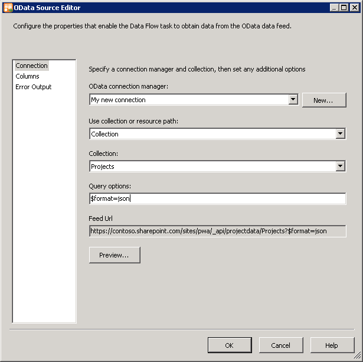

# Best practices for querying OData feeds for Project reporting data

You can speed up your download times and access your Project Web App (PWA) data faster by reducing payload size. Project 2013 provides the **ProjectData** service as the OData source for PWA reporting data for both Project Server 2013 and Project Online. By following best practices for querying **ProjectData**—such as filtering data requests and creating delta syncs—you can greatly improve performance when reporting in Excel, replicating data with SQL Server Integration Services (SSIS) packages, or reporting in custom apps.
  
> [!NOTE]
> The endpoint URI for the **ProjectData** service is  `<pwa_url>/_api/projectdata` (example:  `https://contoso.sharepoint.com/sites/pwa/_api/projectdata`). For more information about using **ProjectData**, see [Querying OData feeds for Project reporting data](querying-odata-feeds-for-project-reporting-data.md). 
  
## Request the JSON format

In SSIS and custom reporting apps, we recommend that you request data in the JSON format. The **ProjectData** service can send OData feeds in the Atom (XML) or JSON light format, but JSON light has a smaller payload size. In internal tests, JSON light regularly resulted in much smaller payloads than XML. It also resulted in improved sync times, as shown in Table 1. 
  
**Table 1. XML and JSON light sync times on a test tenant**

|**Sync scope**|**Payload**|**Sync time**|
|:-----|:-----|:-----|
|AssignedTimePhasedDataset    |40,000 rows using XML    |4 minutes 37 seconds    |
|AssignedTimePhasedDataset    |40,000 rows using JSON light    |3 minutes 12 seconds (30% faster)    |
   
Table 2 shows which reporting tools support JSON light.
  
**Table 2. Reporting tool support for XML and JSON light**

|**Tool**|**XML**|**JSON light**|
|:-----|:-----|:-----|
|Excel (native)    |Yes    |No    |
|Power Query    |Yes    |Yes (default)    |
|SSIS    |Yes (default)    |Yes    |
|Custom reporting tool    |Yes    |Yes    |
   
> [!NOTE]
> Learn more about the Atom and JavaScript Object Notation (JSON) formats at [www.odata.org](http://www.odata.org/). 
  
### Specifying the JSON light format in SSIS

In your SSIS data flow package, you can add the  `$format=json` query option to the OData source connection, as shown in Figure 1. 
  
**Figure 1. Specifying the JSON light format in the OData Source Editor**

  
### Specifying the JSON light format in a custom app

In a custom reporting app, you can request the JSON light format by using a query option in the URL or by specifying the format in the **Accept** header of the request. 
  
 **Example:** Request JSON light in the URL 
  
 `~/_api/projectdata/Resources?$format=json`
  
 **Example:** Request JSON light in the **Accept** header (jQuery) 
  
 `headers:{"accept":"application/json"}`
  
The server returns JSON in the  `minimalmetadata` format by default. 
  
## Use $select to request only the properties you need

Use the **$select** query option to request only the properties that you need for your report. By default, the **ProjectData** service sends all entities and all their properties in the response payload. Depending on your report, this can be a waste of time and downloaded bytes. For example, a Task entity contains 100 properties, but reports often only use a few of them. So, by selecting the six properties you need instead of retrieving all 100 properties, you reduce the payload by over 90%. 
  
 **Example:** Select only four properties 
  
 `~/_api/projectdata/Resources?$select=ResourceId,ResourceName,ResourceIsActive,ResourceGroup`
  
Selecting only indexed properties ([keys](best-practices-for-querying-odata-feeds-for-project-reporting-data.md#FilterQueryOption)) results in the best query and sync times.
  
## Use $filter to request specific entities by using keys

Use the **$filter** query option to filter your data request and reduce payload size. For best performance, we recommend that you filter on keys. Filtering on keys is especially important when working with large entities. Using keys for querying large entities is often the critical differentiator between a sync that runs for hours and a sync that can reliably run in minutes. 
  
Filtering is useful even when you want to download all the properties on an entity. For example, you'll get a faster sync time for all tasks in PWA by first getting all projects and then getting all tasks per project based on the **ProjectId** key. 
  
 **Example:** Filter for all tasks in a specific project by using the ProjectId key 
  
 `~/_api/projectdata/Tasks?$filter=ProjectId eq guid'456d8654-56a5-e311-8c46-22155d085820'`
  
You can use multiple keys in a filter.
  
 **Example:** Filter for timephased data for a specific project and date range by using the ProjectId and TimeByDay key 
  
 `~_api/projectdata/AssignmentTimephasedDataSet?$filter=ProjectId eq guid'3a9acc04-3ce6-e111-9724-00155d344f1a' and TimeByDay gt datetime'2014-07-13'`
  
> [!IMPORTANT]
> Microsoft reserves the right to enforce the usage of keys when querying large entities. 
  
The following tables show the keys you can use to filter the respective entity set. Queries for these OData entities should include at least one key.
  
**AssignmentBaselineTimephasedDataSet entity set**

|**Key**|**Type**|
|:-----|:-----|
|AssignmentId    |GUID    |
|BaselineNumber    |Int32    |
|ProjectId    |GUID    |
|TimeByDay    |DateTime    |
   
**AssignmentTimephasedDataSet entity set**

|**Key**|**Type**|
|:-----|:-----|
|AssignmentId    |GUID    |
|ProjectId    |GUID    |
|TimeByDay    |DateTime    |
   
**TaskBaselineTimephasedDataSet entity set**

|**Key**|**Type**|
|:-----|:-----|
|BaselineNumber    |Int32    |
|ProjectId    |GUID    |
|TaskId    |GUID    |
|TimeByDay    |DateTime    |
   
**TaskTimephasedDataSet entity set**

|**Key**|**Type**|
|:-----|:-----|
|ProjectId    |GUID    |
|TaskId    |GUID    |
|TimeByDay    |DateTime    |
   
**ResourceTimephasedDataSet entity set**

|**Key**|**Type**|
|:-----|:-----|
|ResourceId    |GUID    |
|TimeByDay    |DateTime    |
   
## Use $top and $skip to page data

In SSIS and custom reporting apps, use the **$top** and **$skip** query options to retrieve data in batches of 100. Retrieving rows in batches is much faster than requesting all rows at once. 
  
In tests using a PWA instance with 37 projects and 12,000 tasks, it took 17 minutes to retrieve all tasks when using the following OData request:
  
 `https://contoso.sharepoint.com/sites/pwa/_api/projectdata/Tasks`
  
But it took only 5-10 minutes to retrieve all 12,000 tasks by using 170+ batched requests. The following procedure describes the process used to batch the requests:
  
1. Get all projects from the PWA instance.
    
     `https://contoso.sharepoint.com/sites/pwa/_api/projectdata/Projects`
    
2. Save the ProjectId keys and the number of tasks per project.
    
3. Filter for the first project by using the ProjectId key, and use the **$top** query option to get the first 100 tasks. 
    
     `~/_api/projectdata/Tasks?$filter=ProjectId eq guid'456d8654-56a5-e311-8c46-22155d085820'&amp;$top=100`
    
4. Use the **$top** and **$skip** query options to get all the tasks for the project in batches of 100. Use the number of tasks you saved in step 2 to determine how many queries you'll need to get all the tasks for the project. 
    
     `~/_api/projectdata/Tasks?$filter=ProjectId eq guid'456d8654-56a5-e311-8c46-22155d085820'&amp;$top=100&amp;$skip=100`
    
5. Repeat steps 3 and 4 for each project.
    
> [!IMPORTANT]
> Microsoft reserves the right to enforce the usage of [keys](best-practices-for-querying-odata-feeds-for-project-reporting-data.md#FilterQueryOption) when querying large entities. 
  
## Filter your data set while creating Excel reports

When creating a report with Excel, you can minimize the refresh time of your reporting data by first creating the report on a limited number of rows, and then using your report to trim the request. The following procedure describes this process:
  
1. Request only the first 100 rows of report data.
    
     `https://contoso.sharepoint.com/sites/pwa/_api/projectdata/Tasks?$top=100`
    
2. Create the report by using this subset of data.
    
3. Identify the properties that you need for the report.
    
4. Update the query to request only the properties you need, keeping the **$top** query option. 
    
     `~/_api/projectdata/Tasks?$select=TaskName,ProjectName,TaskActualDuration,TaskFinishDate,TaskPercentCompleted&amp;$top=100`
    
5. Finalize the report.
    
6. Remove the top 100 row limit from the query.
    
     `~/_api/projectdata/Tasks?$select=TaskName,ProjectName,TaskActualDuration,TaskFinishDate,TaskPercentCompleted`
    
## Schedule regular delta syncs in SSIS

When using SSIS to replicate reporting data to a SQL Server database, we recommend that you request data in the JSON format, schedule your data synchronization package to run regularly, and configure the package to update only data that has changed. To detect changes since your last sync, use the **ProjectModifiedDate** property that is available on the Project entity. 
  
> [!NOTE]
> You can't use the modified date on the Task entity because all tasks are updated when a project is published. 
  
You can [download a sample SSIS package](http://www.microsoft.com/en-us/download/details.aspx?id=43736) that demonstrates best practices for querying **ProjectData** OData feeds. To learn about the sample's data flows, see [Project Online: SSIS package for OData delta sync](project-online-ssis-package-for-odata-delta-sync.md).
  
## Additional resources

- [ProjectData - Project OData service reference](projectdataproject-odata-service-reference.md)
    
- [Querying OData feeds for Project reporting data](querying-odata-feeds-for-project-reporting-data.md)
    
- [Create a Project add-in that uses REST with an on-premises Project Server OData service](http://msdn.microsoft.com/library/196e08ba-0d1d-4353-9b95-20c16de365d4%28Office.15%29.aspx)
    

