# Bulk update custom fields and create project sites from a workflow in Project Online

To help customers get the most out of Project Online and improve our service extensibility and flexibility, we've added two methods to the client-side object model that you can use in Project Online apps and workflows.
  
|||
|:-----|:-----|
|**UpdateCustomFields**   |Bulk updates project custom fields.           For Project Online only. Available only in the REST API.    |
|**CreateProjectSite**   | Creates a Project site.           For Project Online only. Available in the REST API, managed client object model, and JavaScript client object model.    |
   
In addition to providing more flexibility, these methods also offer significant performance improvements when saving and publishing projects in a workflow. This article describes how to use the methods in the REST API and provides instructions for creating a workflow that bulk updates custom fields and a workflow that creates a Project site.
  
> [!NOTE]
> To learn more about calling REST APIs from SharePoint 2013 workflows, see [Using SharePoint REST services from workflow with POST method](http://mysharepointinsight.blogspot.com/2013/05/using-sharepoint-rest-services-from.mdl) and [Calling the SharePoint 2013 Rest API from a SharePoint Designer Workflow](https://sergeluca.wordpress.com/2013/04/09/calling-the-sharepoint-2013-rest-api-from-a-sharepoint-designer-workflow/). 
  
## Bulk update project custom fields from a workflow

Previously, workflows could only update one custom field at a time. Updating project custom fields one at a time can result in a poor end-user experience when users transition between Project Detail Pages. Each update required a separate server request using the **Set Project Field** action, and updating multiple custom fields on a high-latency, low-bandwidth network resulted in a non-trivial overhead. To resolve this issue, we added the **UpdateCustomFields** method to the REST API that lets you bulk update custom fields. To use **UpdateCustomFields**, you pass in a dictionary that contains the names and values of all the custom fields you want to update.
  
The REST method can be found at the following endpoint:
  
 `https://<site-url>/_api/ProjectServer/Projects('<guid>')/Draft/UpdateCustomFields()`
  
> [!NOTE]
> Replace the  `<site-url>` placeholder in the examples with the URL of your Project Web App (PWA) site and the  `<guid>` placeholder with your project UID. 
  
This section describes how to create a workflow that bulk updates custom fields for a project. The workflow follows these high-level steps:
  
- Wait for the project that you want to update to get checked in
    
- Build a data set that defines all your custom field updates for the project
    
- Check out the project
    
- Call **UpdateCustomFields** to apply the custom field updates to the project 
    
- Log relevant information to the workflow history list (if required)
    
- Publish the project
    
- Check in the project
    
The final, end-to-end workflow looks like this:
  
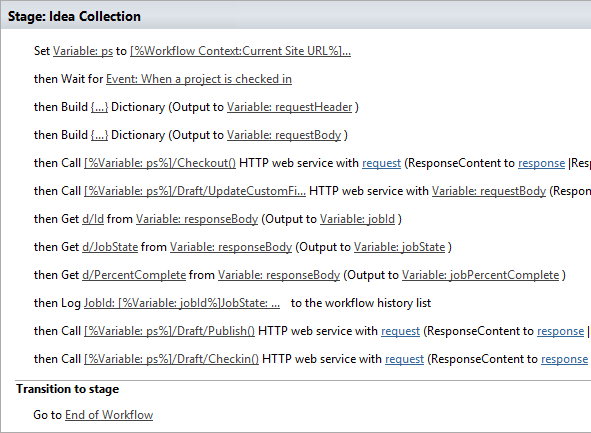
  
### To create a workflow that bulk updates custom fields

1. Optional. Store the full URL of your project in a variable that you can use throughout the workflow.
    
     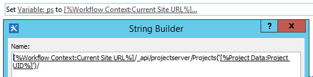
  
2. Add the **Wait for Project Event** action to the workflow and choose the **When a project is checked in** event. 
    
     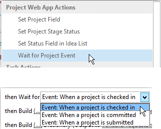
  
3. Create a **requestHeader** dictionary using the **Build dictionary** action. You'll use the same request header for all the web service calls in this workflow. 
    
     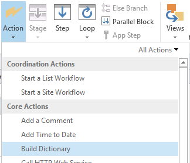
  
4. Add the following two items to the dictionary.
    
|**Name**|**Type**|**Value**|
|:-----|:-----|:-----|
|Accept    |String    |application/json; odata=verbose    |
|Content-Type    |String    |application/json; odata=verbose    |
   
     
  
5. Create a **requestBody** dictionary using the **Build dictionary** action. This dictionary stores all the field updates that you want to apply. 
    
    Each custom field update requires four rows: the field's (1) metadata type, (2) key, (3) value, and (4) value type.
    
- **__metadata/type** The field's metadata type. This record is always the same and uses the following values: 
    
  - Name: customFieldDictionary(i)/__metadata/type *(where **i** is the index of each custom field in the dictionary, starting with 0) * 
    
  - Type: String
    
  - Value: SP.KeyValue
    
     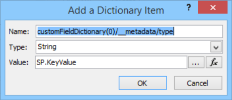
  
- **Key** The internal name of the custom field, in the format:  *Custom_ce23fbf43fa0e411941000155d3c8201* 
    
    You can find the internal name of a custom field by navigating to it's **InternalName** endpoint: 
    
     `https://<site-url>/_api/ProjectServer/CustomFields('<guid>')/InternalName`
    
    If you created your custom fields manually, the values will differ from site to site. If you plan to reuse the workflow across multiple sites, make sure the custom field IDs are correct.
    
- **Value** The value to assign to the custom field. For custom fields that are linked to lookup tables, you need to use the internal names of the lookup table entries instead of the actual lookup table values. 
    
    You can find the internal name of the lookup table entry at the following endpoint:
    
     `https://<site-url>/_api/ProjectServer/CustomFields('<guid>')/LookupEntries('<guid>')/InternalName`
    
    If you have a lookup table custom field set up to accept multiple values, use  `;#` to concatenate values (as shown in the example dictionary below). 
    
- **ValueType** The type of the custom field you are updating. 
    
  - For Text, Duration, Flag, and LookupTable fields, use Edm.String
    
  - For Number fields, use Edm.Int32, Edm.Double, or any other OData-accepted number type
    
  - For Date fields, use Edm.DateTime
    
    The example dictionary below defines updates for three custom fields. The first is for a multiple value lookup table custom field, the second is for a number field, and the third is for a date field. Note how the **customFieldDictionary** index increments. 
    
    > [!NOTE]
    > These values are for illustration purposes only. The key-value pairs you'll use depend on your PWA data. 
  
|**Name**|**Type**|**Value**|
|:-----|:-----|:-----|
|customFieldDictionary(0)/__metadata/type    |String    |SP.KeyValue    |
|customFieldDictionary(0)/Key    |String    |Custom_ce23fbf43fa0e411941000155d3c8201    |
|customFieldDictionary(0)/Value    |String    |Entry_b9a2fd69279de411940f00155d3c8201 ;#Entry_baa2fd69279de411940f00155d3c8201    |
|customFieldDictionary(0)/ValueType    |String    |Edm.String    |
|customFieldDictionary(1)/__metadata/type    |String    |SP.KeyValue    |
|customFieldDictionary(1)/Key    |String    |Custom_c7f114c97098e411940f00155d3c8201    |
|customFieldDictionary(1)/Value    |String    |90.5    |
|customFieldDictionary(1)/ValueType    |String    |Edm.Double    |
|customFieldDictionary(2)/__metadata/type    |String    |SP.KeyValue    |
|customFieldDictionary(2)/Key    |String    |Custom_c6fb67e0b9a1e411941000155d3c8201    |
|customFieldDictionary(2)/Value    |String    |2015-04-01T00:00:00.0000000    |
|customFieldDictionary(2)/ValueType    |String    |Edm.DateTime    |
   
     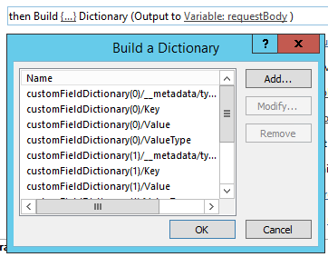
  
6. Add a **Call HTTP Web Service** action to check the project out. 
    
     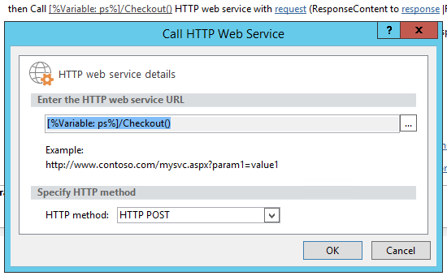
  
7. Edit the properties of the web service call to specify the request header. To open the **Properties** dialog box, right-click the action and choose **Properties**.
    
     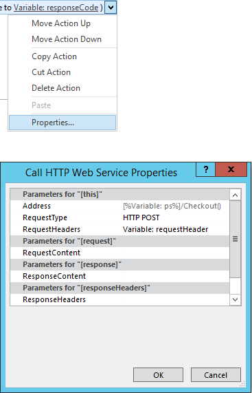
  
8. Add a **Call HTTP Web Service** action to call the **UpdateCustomFields** method. 
    
     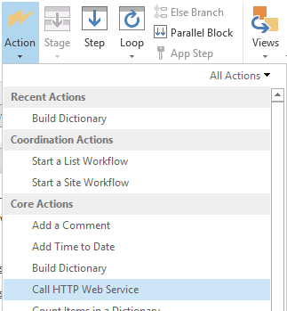
  
    Note the  `/Draft/` segment in the web service URL. The full URL should look like this: 
    
     `https://<site-url>/_api/ProjectServer/Projects('<guid>')/Draft/UpdateCustomFields()`
    
     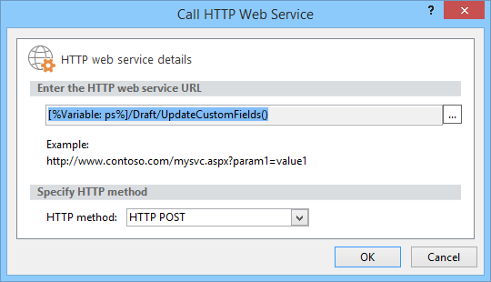
  
9. Edit the properties of the web service call to bind the **RequestHeader** and **RequestContent** parameters to the dictionaries you created. You can also create a new variable to store the **ResponseContent**.
    
     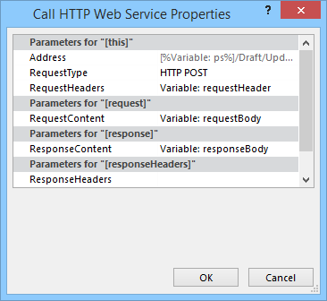
  
10. Optional. Read from the response dictionary to check the state of the queue job and log the information in the workflow history list.
    
     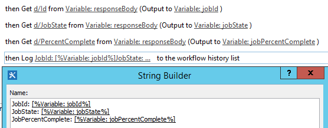
  
11. Add a web service call to the **Publish** endpoint to publish the project. Always use the same request header. 
    
     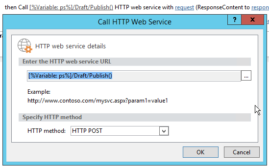
  
     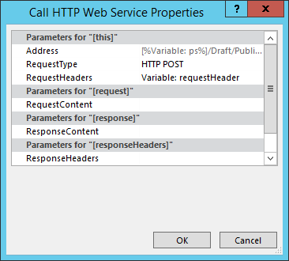
  
12. Add a final web service call to the **Checkin** endpoint to check the project in. 
    
     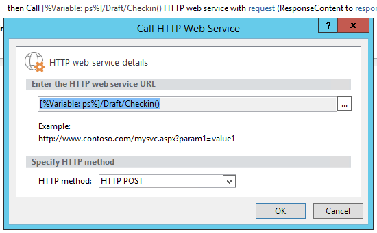
  
     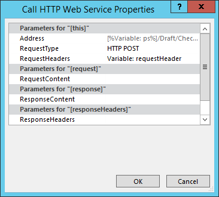
  
## Create a Project site from a workflow

Every project can have its own dedicated SharePoint sites where team members can collaborate, share documents, raise issues, and so on. Previously, sites could only be created automatically on first publish or manually by the project manager in Project Professional or by the administrator in PWA settings, or they could be disabled.
  
We've added the **CreateProjectSite** method so you can choose when to create project sites. This is particularly useful for organizations who want to create their sites automatically when a project proposal reaches a specific stage in a pre-defined workflow, rather than on first publish. Postponing project site creation significantly improves the performance of creating a project. 
  
 **Prerequisite:** Before you can use **CreateProjectSite**, the **Allow users to choose** setting must be set for project site creation in **PWA Settings** > ** Connected SharePoint Sites ** > **Settings**.
  
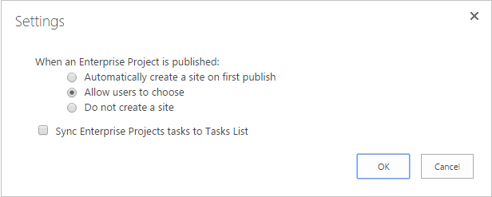
  
### To create a workflow that creates a Project site

1. Create or edit an existing workflow and select the step where you want to create your Project sites.
    
2. Create a **requestHeader** dictionary using the **Build dictionary** action. 
    
     
  
3. Add the following two items to the dictionary.
    
|**Name**|**Type**|**Value**|
|:-----|:-----|:-----|
|Accept    |String    |application/json; odata=verbose    |
|Content-Type    |String    |application/json; odata=verbose    |
   
     
  
4. Add the **Call HTTP Web Service** action. Change the request type to use **POST**, and set the URL using the following format:
    
     `https://<site-url>/_api/ProjectServer/Projects('<guid>')/CreateProjectSite('New web name')`
    
     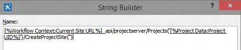
  
    Pass the name of the Project site to the **CreateProjectSite** method as a string. To use the project name as the site name, pass an empty string. Be sure to use unique names so the next project site you create will work. 
    
5. Edit the properties of the web service call to bind the **RequestHeader** parameter to the dictionary you created. 
    
     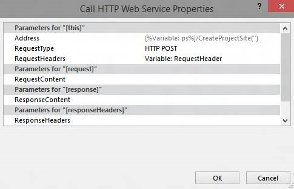
  
## See also

- [Project programming tasks](project-programming-tasks.md)
    
- [Client-side object model (CSOM) for Project 2013](client-side-object-model-csom-for-project-2013.md)
    
- [Workflows in SharePoint 2013](http://msdn.microsoft.com/library/e0602371-ae22-44be-8a7e-9e47e9f046d6%28Office.15%29.aspx)
    

