# Create a Project Server workflow for demand management

This article describes how to create a simple workflow by using SharePoint Designer 2013. You can export the workflow to Visio 2013 for visualization and editing, or use Visio 2013 to design Project Server 2013 workflows and import the design into SharePoint Designer 2013 for publication to Project Web App. For more information about the SharePoint workflow platform and creating workflows with Visio 2013 and SharePoint Designer 2013, see the [Workflows in SharePoint 2013](https://msdn.microsoft.com/library/jj163986%28office.15%29.aspx) articles in the SharePoint 2013 developer documentation. 
  
For information about preparing Project Server for workflows, see [Start: Set up and configure SharePoint 2013 Workflow Manager](https://msdn.microsoft.com/library/jj163276%28office.15%29.aspx).

## Creating a general workflow

Use the following steps to create a Project Server 2013 workflow by using SharePoint Designer 2013. The workflow is designed for demand management of project proposals.
  
For detailed steps, see the [Creating a branching workflow](#pj15_CreateWorkflowSPD_Detailed) section. 
  
### To create a Project Server workflow (general procedure)

1. Determine the requirements, and then design the workflow. Organize it into phases and stages, and determine the custom fields that the workflow will use.
    
2. In Project Web App, create the entities that the workflow requires:
    
    1. Review the existing workflow phases; create phases as necessary.
        
    2. Create the enterprise custom fields that the workflow will use. To be available in a workflow stage, a custom field must be controlled by a workflow.
        
    3. Edit or create the project detail pages (PDPs) that your workflow stages will use to collect information for the project. In this example, the stages use default PDPs that are edited to include a new custom field.
        
    4. Create the necessary workflow stages, and then associate each workflow stage with the correct phase.
    
3. In SharePoint Designer 2013, construct the workflow by using declarative statements in the **Text-Based Designer**:
    
    > [!NOTE]
    > You can also switch to the **Visual Designer** in SharePoint Designer 2013, or import an existing workflow from Visio 2013. Follow these steps to use the **Text-Based Designer**: 
    > 
    > 1. Open the Project Web App site, and then create a site workflow that uses the **SharePoint 2013 Workflow - Project Server** workflow platform. 
    > 2. Add the stages that the workflow uses.
    > 3. Insert the workflow steps, conditions, actions, and loops that are required in each stage.
    > 4. Check for any workflow errors and fix any that you find.
    > 5. (Optional) Switch the view to the **Visual Designer**, or export the workflow to a Visio 2013 file. You can modify the Visio view and save changes to the current workflow. You can edit the Visio file and import it in SharePoint Designer 2013 to create other workflows.
    > 6. Publish the workflow. After it is published, the workflow shows in the list of workflows for the Project Web App site.
    
4. In Project Web App, use the workflow for demand management of project proposals:
    
    1. Create an enterprise project template (EPT) that uses the workflow.
        
    2. On the Project Center page, create a project that uses the EPT for the workflow, and then follow through the workflow stages.
        
    3. Test the workflow thoroughly.
        
    4. Deploy the workflow to a production server.

## Creating a branching workflow

Before you can use SharePoint Designer 2013 to create a Project Server workflow, the Workflow Manager Client 1.0 service must be configured to use the Project Server 2013 workflow activities. For information about how to configure Workflow Manager Client 1.0, see the [Workflows in SharePoint 2013](https://msdn.microsoft.com/library/jj163986%28office.15%29.aspx) articles in the SharePoint Server 2013 developer documentation. 
  
The following detailed procedure includes the same steps as in the [Creating a general workflow](#pj15_CreateWorkflowSPD_General) section. 
  
### To create a Project Server branching workflow (detailed procedure)

#### 1. Plan and design the workflow.

A Project Server workflow can integrate with multiple stages and phases in a demand-management process. Because workflows can be complex, you must understand the business requirements and plan a workflow carefully. For a simple example, design a branching workflow that uses the estimated cost of a project proposal to determine whether the proposal is accepted. If the estimated cost is greater than $25,000 USD, reject the proposal; otherwise, accept the proposal and create the project.
    
Because you can use Visio 2013 and SharePoint Designer 2013 to help design and create workflows for Project Server 2013, you can more easily experiment with workflows than is possible with Project Server 2010. The sample workflow design in this article is the same as in the [Create a branching workflow](https://msdn.microsoft.com/library/a02cafdc-d881-4271-b446-d8b2cd456a52%28Office.15%29.aspx) article in the Project 2010 SDK. You can design and create a test workflow on a remote computer using a test instance of Project Web App—you do not have to create workflows directly on a Project Server 2013 computer. 
    
#### 2. Create the entities that your workflow requires.

In Project Web App, review the available workflow phases and stages, and the enterprise custom fields that are available. If necessary, create the entities that your workflow requires, as in the following steps:
    
1. **Workflow phases** The default installation of Project Web App includes the Create, Select, Plan, Manage, and Finished phases. For the branching workflow example, you do not have to create other phases. 
        
2. **Enterprise custom fields** The branching workflow requires a project cost custom field that is workflow-controlled. The value of a workflow-controlled custom field is set in a PDP that the workflow uses. For example, choose the **Settings** icon at the top-right of a Project Web App page, choose **PWA Settings**, and then choose **Enterprise Custom Fields and Lookup Tables**.
        
   Create a custom field named Proposal Cost for the **Project** entity, and select the type **Cost**. For the description, type Estimated cost of a project proposal. In the **Behavior** section, choose **Behavior controlled by workflow**.
        
3. **Project detail pages** Edit or create the PDPs that the workflow stages will use. For example, do the following steps: 
        
    1. Choose **Project Detail Pages** on the Server Settings page, and then choose the **ProjectInformation** PDP. 
            
    2. On the **PAGE** tab of the ribbon, in the **Edit** group, choose **Edit Page**.
            
    3. Choose the down arrow at the top-right of the **Basic Info** web part, and then choose **Edit web part**. Or, on the **WEB PART** tab of the ribbon, in the **Properties** group, choose **web part Properties** to show the editor part. 
            
    4. In the **Displayed Project Fields** section of the editor part (see Figure 1), choose **Modify**.
            
    5. Add the **Proposal Cost** custom field, move it above the **Owner** field in the **Selected Project Fields** list, and then choose **OK** (see Figure 1).
      
    6. In the editor part, choose **OK**, and then choose **Stop Editing** in the **Edit** group, on the **PAGE** tab of the ribbon. Figure 2 shows the **Proposal Cost** custom field that is added to the Project Information PDP. 

    **Figure 1. Editing the Project Fields web part in a PDP**

    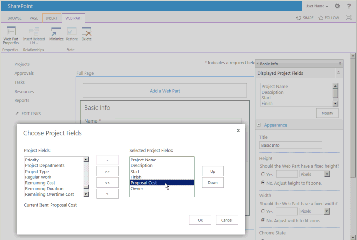

    **Figure 2. The edited PDP includes the Proposal Cost custom field**

    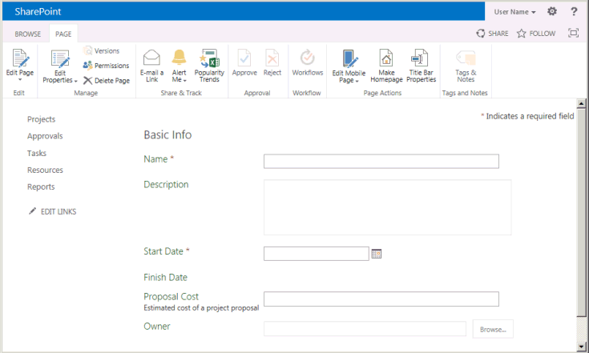
  
4. **Workflow stages** Create the stages that are required for each phase of the workflow. On the Server Settings page, choose **Workflow Stages**, and then choose **NEW WORKFLOW STAGE**. Figure 3 shows part of the Add Workflow Stage page.
    
    **Figure 3. Adding a workflow stage in Project Web App**

    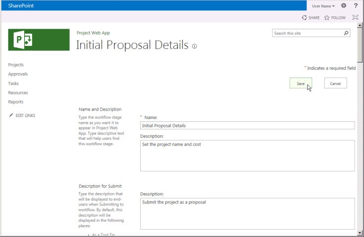
  
    The branching workflow example uses the four stages that are shown in Table 1. In the **Additional Settings for the Visible Project Detail Page** section of the Add Workflow Stage page (not shown in Figure 3), values are optional; they provide more information on the Workflow Status page. For example, because the Initial Proposal Details PDP requires user input, you can select the **The Project Detail Page requires attention** check box, and then add a specific description such as Set the project name and cost for this PDP.
    
    Figure 4 shows the four stages completed on the Workflow Stages page.
    
    **Table 1. Stages for the branching workflow**

    |Name|Description|Description for Submit|Phase|Visible PDPs|Custom Fields|
    |:-----|:-----|:-----|:-----|:-----|:-----|
    |Initial Proposal Details    |Set the project name and cost.    |Submit the project as a proposal.    |Create    |Project Information    Project Details    |Proposal Cost (required)    |
    |Project Details    |Provide details of the proposed project.    |Submit details to continue with the project.    |Create    |Project Information    Project Details    |Proposal Cost (read-only)    |
    |Automated Rejection    |The proposal is rejected, based on the information that is provided.    |   |Create    |Project Information    |Proposal Cost (read-only)    |
    |Execution    |The proposal is accepted, and ready for project management.    |   |Manage    |Project Information    Project Details    |Proposal Cost (read-only)    |
   
    **Figure 4. List of the workflow stages in Project Web App**

    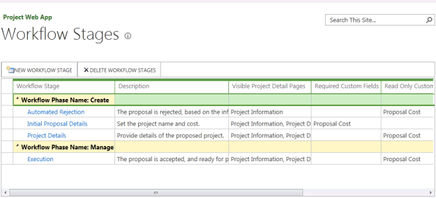
  
#### 3. Construct the workflow in the Text-Based Designer.

In SharePoint Designer 2013, construct the workflow by using declarative statements in the Text-Based Designer. You can start typing at the orange insertion line to get context-sensitive auto-completion statements for the workflow logic and steps, or you can insert the logic and steps by using controls in the **Insert** group on the **WORKFLOW** tab of the ribbon. 
    
1. In the Backstage view of SharePoint Designer 2013, choose **Open Site**. For example, open  `https://ServerName/pwa`. In the **Navigation** pane, choose **Workflows**. Then, on the **WORKFLOWS** tab of the ribbon, in the **New** group, choose **Site Workflow**. For this example, name the workflow Branching Workflow. Ensure that **SharePoint 2013 Workflow - Project Server** is selected in the **Platform Type** drop-down list (see Figure 5). 
    
    **Figure 5. Creating a Project Server site workflow**

    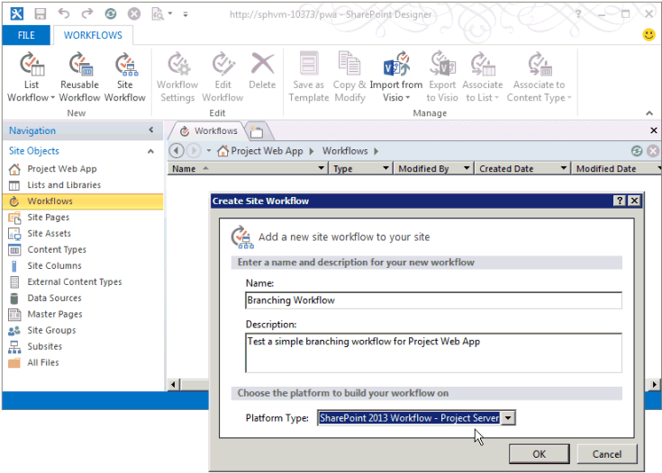
  
2. Select the **Branching Workflow** tab. Then, on the **WORKFLOW** tab of the ribbon, in the **Manage** group, in the **Views** drop-down list, choose **Text-Based Designer**. To show the view with the blinking orange insertion line (see Figure 6), click within the view.
    
    **Figure 6. Using the Text-Based Designer view for the workflow**

    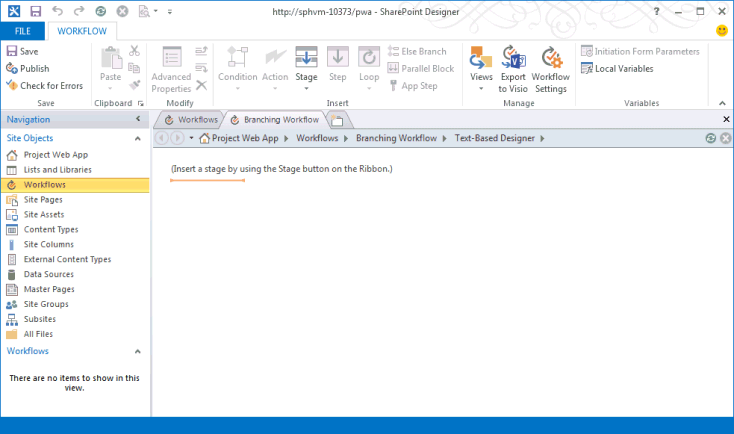
  
3. In the **Text-Based Designer** view, add the stages that the workflow uses. On the **WORKFLOW** tab of the ribbon, in the **Insert** group, in the **Stage** drop-down list under **Create**, choose **Initial Proposal Details**.
    
    Similarly, place the orange insertion line below the **Stage: Initial Proposal Details** box, and add the other stages that the workflow uses: **Project Details**, **Automated Rejection**, and **Execution** (see Figure 7). 
    
    **Figure 7. Adding a stage to a workflow in SharePoint Designer**

    
  
4. Add the workflow steps and logic within each stage: 
    
    1. In the **Initial Proposal Details** stage, place the orange insertion line at the top of the stage body. In the **Insert** group on the ribbon, choose **Action**, scroll down to **Project Web App Actions**, and then choose **Wait for Project Event**. Choose **this project event**, and then select **Event: When a project is submitted** in the drop-down list. 
    
    2. In the **Transition to stage** section of the **Initial Proposal Details** stage, insert **If any value equals value**. You can start typing the statement or use the **Condition** control in the **Insert** group on the ribbon. 
    
    3. Choose the first **value** control, and then choose **fx** to show the **Define Workflow Lookup** dialog box (see Figure 8). In the **Data source** drop-down list, select **Project Data**. In the **Field from source** drop-down list, select **Proposal Cost**.
    
       **Figure 8. Defining a lookup value in the workflow**

       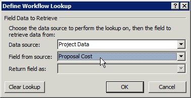
  
    4. Complete the  `If` statement so that it shows the following: **If Project Data:Proposal Cost is greater than 25000**
    
       > [!NOTE]
       > Alternately, you could create a workflow variable, set the variable to the custom field value, and then compare the variable with a value. For example, from the **Local Variables** drop-down list on the ribbon, create a variable named **TotalCost** (no spaces) of type **Number**. In the **Define Workflow Lookup** dialog box, select **Workflow Variables and Parameters** for the data source, and then select **Variable: TotalCost** as the field. The **If** statement would then be: **If Variable: TotalCost is greater than 25000**
  
    5. Place the orange insertion line within the  `If` branch, and then insert **Go to a stage** by using the **Action** control, in the **Insert** group on the ribbon. Choose the **a stage** drop-down control and select the **Automated Rejection** stage. 
    
       Similarly, in the  `Else` branch, insert the **Go to Project Details** statement. Figure 9 shows the completed **Initial Proposal Details** stage. 
    
       **Figure 9. Completed logic for the Initial Proposal Details stage**

       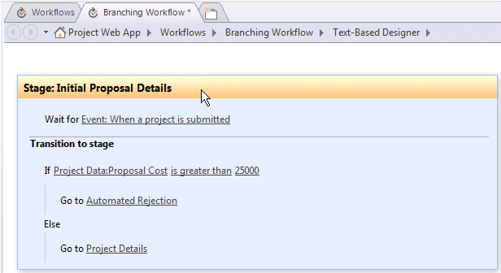
  
    6. In the **Automated Rejection** stage, unless you want to pause the workflow and show some data in a PDP, leave the first section empty. The **Transition to stage** section must contain a transition; because there is no other stage following a rejection, type Go to End of Workflow for the statement. 
    
    7. In the **Project Details** stage, add Go to Execution in the **Transition to stage** section. Unless there is additional data to add, or you want to pause the workflow, it is not necessary to wait for a submitted event. 
    
    8. In the **Execution** stage, unless you want to pause the workflow, leave the stage action section empty. In the **Transition to stage** section, add **Go to End of Workflow**.
    
5. In the **Save** group on the ribbon, choose **Check for Errors** to check for workflow errors (see Figure 10). Fix any errors, and then choose **Save**.
    
    **Figure 10. Checking the workflow for errors in SharePoint Designer**

    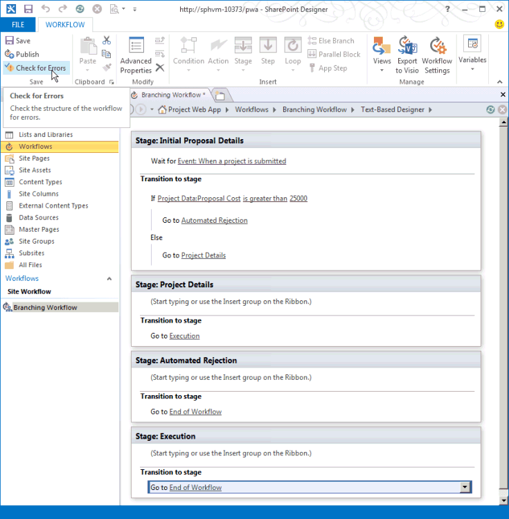
  
6. (Optional) In the **Manage** group on the ribbon, in the **Views** drop-down menu, choose **Visual Designer**. In Figure 11, the view is zoomed out to 50%.
    
    You can edit items in the workflow by using the Visual Designer. For example, select the **If any value equals value** condition, choose the tool icon at the bottom-left of the condition, and then select **Value** to show the comparison conditions in the **Properties** dialog box. 
    
    **Figure 11. Using the Visual Designer for a workflow**

    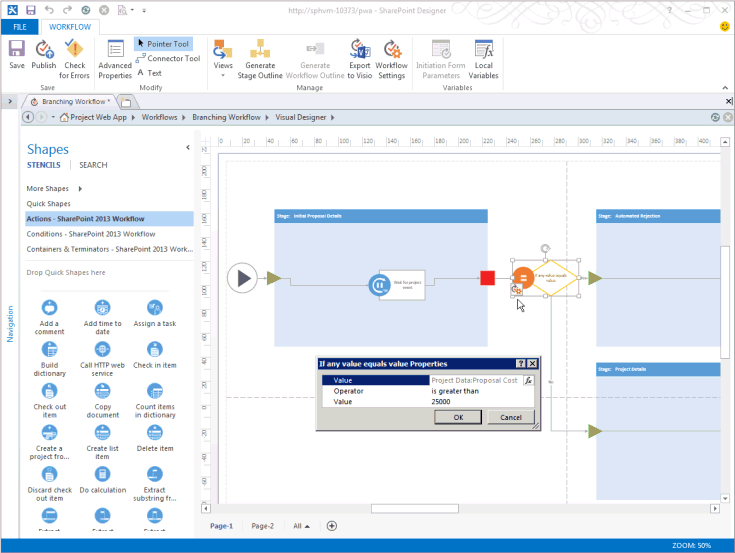
  
    When the workflow is in the Visual Designer view, to save the workflow in a Visio 2013 (.vsdx) file as a backup or for later use, you can choose **Export to Visio**.
    
7. Publish the workflow. When you use SharePoint Designer 2013 to publish the workflow to the active Project Web App site, the workflow is registered to the SharePoint site or in Azure and becomes available within Project Web App for new EPTs.

#### 4. Create an EPT for the workflow, and then test the workflow.

In Project Web App, create an EPT for the workflow, and then test the workflow by creating a project proposal:
    
1. On the PWA Settings page, choose **Enterprise Project Types**, and then create an EPT named Test Branching Workflow. Clear the **Create new projects as SharePoint Tasks List Projects** check box so that Project Server will maintain full control of projects that are created by the EPT. Select **Branching Workflow** in the **Site Workflow Association** drop-down list, and then select the **Project Information** PDP in the **New Project Page** drop-down list to be the first page that the workflow shows. 
    
    **Figure 12. Adding an EPT for the workflow**

    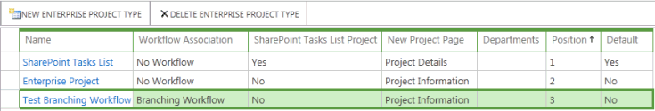
  
    > [!NOTE]
    > A **Yes** value in the **SharePoint Tasks List Project** column in the table of enterprise project types refers to an EPT that creates a SharePoint tasks list, where the tasks list is visible in Project Web App but SharePoint maintains control of the project. For more information about managing projects as SharePoint tasks lists, see [Project Server 2013 architecture](project-server-2013-architecture.md). 
  
2. Open the Projects page in Project Web App, and then create a project by using the new EPT (see Figure 13). Because **Test Branching Workflow** is associated with **Branching Workflow**, project creation starts under control of the workflow.
    
    **Figure 13. Creating a project with the Test Branching Workflow EPT**

    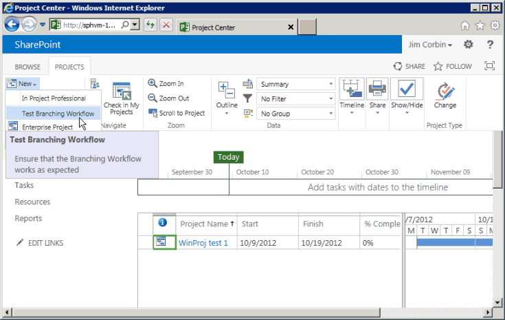
  
3. When the workflow displays the **Project Information** PDP, add data to the project fields. For example, enter a **Proposal Cost** value of 30000. The U.S. English version of Project Server changes the field to show $30,000 (see Figure 14).
    
    **Figure 14. Using the edited Project Information PDP**

    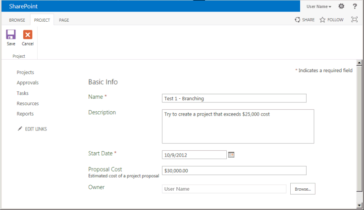
  
4. On the **PROJECT** tab of the ribbon, in the **Project** group, choose **Save**. Project Server adds the data in the PDP to the project, and then shows the Workflow Status page (see Figure 15). To see the full description of the Initial Proposal Details stage in the workflow status diagram, hover the pointer over the stage in the workflow visualization diagram.
    
    The **All Workflow Stages** grid uses a green arrow to show that the Initial Proposal Details stage is waiting for input. This is because the workflow waits for a submit event in the Initial Proposal Details stage. If the workflow did not wait for a submit event, you could choose **Next** in the **Page** group to advance to the next PDP. 
    
    **Figure 15. Using the Workflow Status page in the Initial Proposal Details stage**

    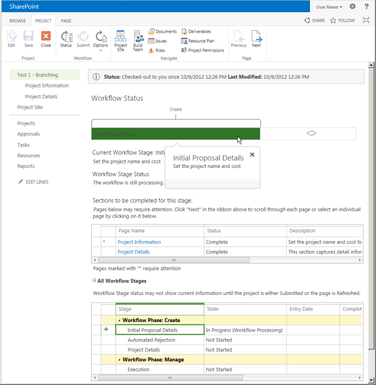
  
    The workflow visualization diagram shows the current stage in a green color. In the **Create** phase, the Initial Proposal Details stage is the current stage. 
    
5. On the ribbon, in the **Workflow** group, choose **Submit**.
    
    > [!TIP]
    > If the **Submit** control is disabled, refresh the page. 
  
    If the **Proposal Cost** value is greater than $25,000 USD, the workflow moves to the Automated Rejection stage. Figure 16 shows the Automated Rejection stage status when you choose **Submit** again. If the **Proposal Cost** is $25,000 USD or less, the workflow moves to the Project Details stage (see Figure 17). 
    
    **Figure 16. The workflow is completed in the Automated Rejection stage**

    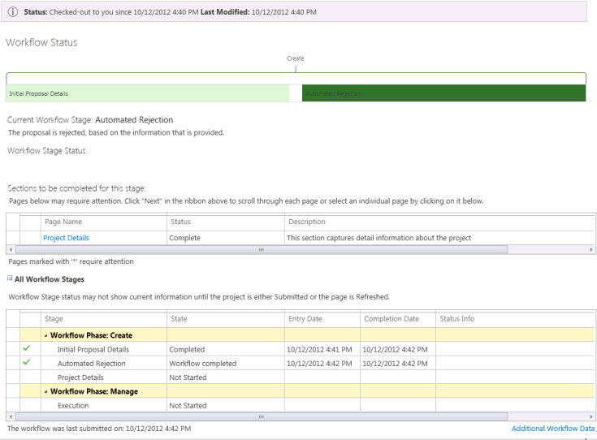
  
    Figure 17 shows another test with a project proposal named **Test 2 - Branching**, where the Project Details stage is current in the Create phase. The Manage phase shows in a light blue color, which indicates that phase is not yet active.
    
    **Figure 17. The workflow continues to the Project Details stage if the cost is less than $25,000**

    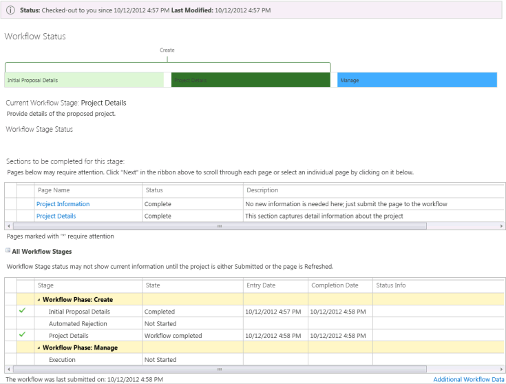
  
6. If you advance to the Project Details stage, there is no additional data to add in the default page. Choose **Submit** again to advance to the Execution stage (see Figure 18). 
    
    **Figure 18. The workflow is ready to manage in the Execution stage**

    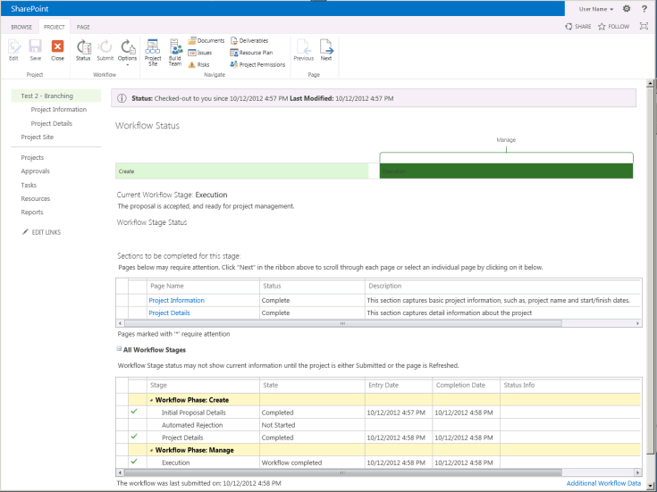
  
In the Project Details stage, the workflow does not wait for a submit event. If the Project Details PDP includes additional required fields, Project Server waits until you add data to the fields before continuing to the Execution stage. As defined in the Branching Workflow, the Execution stage also does not wait for a submit event. In the Execution stage, you can edit the project as a project manager or choose **Close** in the **PROJECT** tab of the ribbon. When you choose **Close**, you can check in the project and edit it later or leave the project checked out.

The **Branching Workflow** project is a simple example that has only one comparison test. The workflow involves three stages in the Create phase and one stage in the Manage phase of Demand Management. To thoroughly test a workflow, you should test all branches of the workflow and use extreme and typical values to see whether the behavior is as expected. 

## Importing a workflow from Visio

To change the workflow, you can create or modify workflow-controlled custom fields and create or modify workflow phases and stages. You can use SharePoint Designer 2013 to add conditions, actions, loops, and stages, and then save and republish the workflow. To reuse or keep a backup of a workflow, you can export it to a Visio 2013 file. 
  
You can also create or edit the workflow in Visio 2013 and import the file into SharePoint Designer 2013 for use by Project Web App. To use an unmodified workflow, the Project Web App instance must include workflow stage properties that are the same as those in the original Project Web App instance. For more information about using Visio to help create workflows, see [Workflow development in SharePoint Designer 2013 and Visio 2013](https://msdn.microsoft.com/library/jj163272%28office.15%29.aspx).
  
> [!NOTE]
> When you import a Visio 2013 file to a different instance of Project Web App, the stages have different stage GUIDs, even if the stage names are the same. After you import the workflow, you must configure the stage and action properties to use values that are specific to the Project Web App instance. 
> 
> If you create a workflow in Visio 2013, the stages and actions have no properties that are specific for a Project Web App instance because Visio does not connect with Project Web App. When you connect SharePoint Designer 2013 with Project Web App, create a workflow, and then import the VSDX file, you overwrite the active workflow. You must then configure the stage and action properties to match the values that SharePoint Designer 2013 gets from Project Web App. 
  
### To import a workflow from Visio to SharePoint Designer

1. In Visio 2013, create a simple workflow. For example, do the following steps:
    
   1. Open Visio, and then create a workflow. Choose the **CATEGORIES** pane for a new workflow, choose **Flowchart**, choose the **Microsoft SharePoint 2013 Workflow** template in the **New** pane, and then choose **Create**. The workflow opens with a Stage shape named **Stage 1**. The workflow includes a Start component, and an Enter shape and Exit shape as part of the Stage shape.
    
      When you hover over the Stage shape and choose the **Properties** icon, the selection is disabled. You can set the stage and action properties after you import the workflow diagram to SharePoint Designer 2013. 
    
      > [!NOTE]
      >  The only shape stencils you should use are the following in the list of Flowchart shapes: 
      > - **Actions - SharePoint 2013 Workflow**
      > - **Components - SharePoint 2013 Workflow**
      > - **Conditions - SharePoint 2013 Workflow**
  
   2. In the **Shapes** pane, choose **Quick Shapes**, and then drag the Condition shape named **If any value equals value** to the right of the Stage shape. 
    
   3. On the **HOME** tab of the ribbon, choose the **Connector** tool, and then connect the Exit shape on the stage with the Condition shape (see Figure 19). 
    
      **Figure 19. Connecting a Stage shape with a Condition shape in a Visio workflow diagram**

      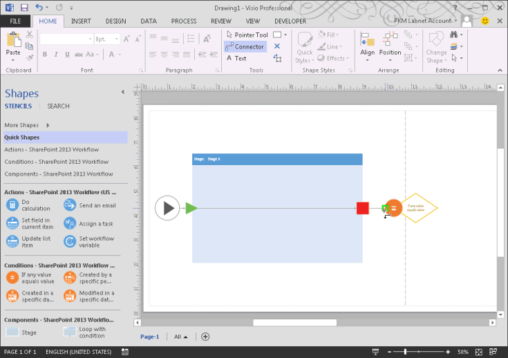
  
   4. Drag two more Stage shapes to the right of the condition shape. The shapes are named **Stage 2** and **Stage 3**.
    
   5. Using the **Connector** tool, connect the right side of the Condition shape to the Enter shape of **Stage 2**. Choose the **Pointer** tool, double-click the connection to show a textbox for the name, and then name the connection Yes.
    
   6. Connect the bottom of the Condition shape to the Enter shape of **Stage 3**. With the **Pointer** tool, right-click the connection, and then choose **No**. Either method works for naming the connectors **Yes** or **No**.
    
   7. In the **Shapes** pane, choose **Actions - SharePoint 2013 Workflow**, and then drag the **Wait for project event** action to the middle of the shape for **Stage 1** (see Figure 20). 
    
      **Figure 20. Completing the workflow in Visio**

      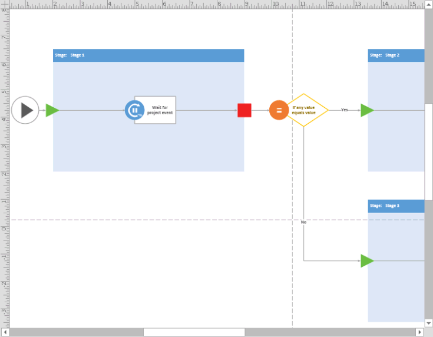
  
   8. On the **PROCESS** tab of the ribbon, in the **Diagram Validation** group, choose **Check Diagram**. Fix any errors, and then save the drawing. For example, name the file Test workflow from Visio.vsdx.
    
      For information about fixing workflow errors, see [Troubleshooting SharePoint Server 2013 workflow validation errors in Visio 2013](https://msdn.microsoft.com/library/jj163971%28v=office.15%29.aspx).
    
2. Open SharePoint Designer 2013, and then open the same Project Web App site that you used for the **Branching Workflow** example. 
    
3. Choose **Workflows** in the **Navigation** pane, and then create a site workflow (choose **Site Workflow** on the **WORKFLOWS** tab of the ribbon). For example, name the workflow Simple workflow from Visio.
    
   In the **Create Site Workflow** dialog box, ensure that the platform type is **SharePoint 2013 Workflow - Project Server**. Choose **Create**, and SharePoint Designer opens the **Text-Based Designer** pane for the new workflow. 
    
4. In the **Manage** group on the **WORKFLOW** tab of the ribbon, choose **Workflow Settings**.
    
5. In the **Manage** group on the **WORKFLOW SETTINGS** tab of the ribbon, choose **Import from Visio**, and then import the **Test workflow from Visio.vsdx** file that you previously saved. A **Microsoft SharePoint Designer** dialog box warns that the diagram you are importing contains no workflow properties, and asks whether to overwrite the current workflow. Choose **Yes**; SharePoint Designer imports the workflow diagram, generates stencils for the shapes, and displays the **Visual Designer** pane that contains the imported workflow. 
    
6. Set the properties of each stage shape in the workflow. For example, the first stage shape is named **Stage 1 (Invalid)**, because it does not represent a valid stage in the connected Project Web App instance. When you select or hover over the stage, you can choose the **Properties** icon at the lower left of the stage shape to show the **Stage Properties** dialog box (see Figure 21). Select the **Initial Proposal Details** stage in the **Project Stage** drop-down list, and then choose **OK**. SharePoint Designer renames the stage.
    
   **Figure 21. Setting the stage property in SharePoint Designer**

   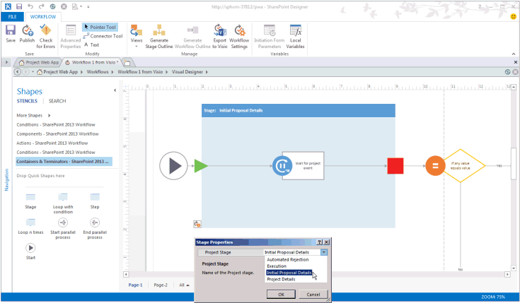
  
   For the second stage, set the **Project Stage** property to **Automated Rejection**. For the third stage, set the **Project Stage** property to **Execution**.
    
7. Similarly, for the **Wait for project event** action, set the **Event Name** property to **Event: When a project is submitted**.
    
8. Similarly, set the properties of the **If any value equals value** condition. For example, set the first **Value** property to **Project Data:Proposal Cost**. Set the **Operator** property to **is less than**. Set the second **Value** property to 5000.
    
9. Check the workflow for errors, and then save the workflow. If there are no errors, you can change the view to the **Text-Based Designer** (see Figure 22). 
    
   **Figure 22. Viewing the imported workflow in the Text-Based Designer**

   
  
10. Publish the workflow. If you save the workflow but do not publish it, the workflow will not be available when you create an enterprise project type.
    
11. To test the imported **Simple workflow from Visio** in Project Web App, create an EPT that uses the workflow, and then create projects that use the new EPT as you did for the **Branching Workflow** example. In this case, however, projects that are less than $5,000 cost are rejected. 
    
In working through this article, you created and tested a simple branching workflow by using SharePoint Designer 2013 to directly set the stages, conditions, and actions that the workflow uses. You also created a diagram for an even simpler branching workflow by using Visio 2013. You imported the Visio workflow diagram into SharePoint Designer 2013, where you set the properties of each stage, condition, and action from the connection with Project Web App.
  
Visio 2013 and SharePoint Designer together provide convenient ways for designers, project managers, workflow developers, and testers to create, share, and customize workflow designs for different installations of Project Server 2013 and Project Online. For workflows that require programmatic access to Project Server that SharePoint Designer does not provide, you can use Visual Studio 2012 with the client-side object model (CSOM).
  
## See also

- [Project Server 2013 architecture](project-server-2013-architecture.md)
- [Start: Set up and configure SharePoint 2013 Workflow Manager](https://msdn.microsoft.com/library/jj163276%28office.15%29.aspx)
- [Understanding how to package and deploy workflow in SharePoint 2013](https://msdn.microsoft.com/library/jj819316%28office.15%29.aspx)
- [Workflows in SharePoint 2013](https://msdn.microsoft.com/library/jj163986%28office.15%29.aspx)
- [Workflow development in SharePoint Designer 2013 and Visio 2013](https://msdn.microsoft.com/library/jj163272%28office.15%29.aspx)
- [Troubleshooting SharePoint Server 2013 workflow validation errors in Visio 2013](https://msdn.microsoft.com/library/jj163971%28v=office.15%29.aspx)
- [Workflow and Demand Management](https://msdn.microsoft.com/library/cf7433a3-a531-4467-ac0c-df0c5d6881ae%28Office.15%29.aspx)

