# Create a SharePoint-hosted Project Server add-in

Of the three types of apps that you can create for Project Online (autohosted, provider-hosted, and SharePoint-hosted), the SharePoint-hosted app is the simplest to create and deploy. A SharePoint-hosted app does not require OAuth authentication, and does not use Azure or require maintenance of a local site for the provider-hosted resources. The **App for SharePoint 2013** template in Visual Studio is a convenient framework for developing apps that can be published and sold in the Office Store or deployed to a private app catalog on SharePoint. 
  
In Project, statusing is a process where a team member can use the Tasks page in Project Web App to submit the status of an assigned task, such as the number of hours worked each day of a week spent working on the task. The assignment owner (usually the project manager) can approve or reject the status. When the status is approved, Project recalculates the schedule. The **QuickStatus** app displays assigned tasks, where the user can quickly update percent complete and submit status of the selected assignments for approval. Although the Tasks page in Project Web App has much more functionality, the **QuickStatus** app is an example that provides a simplified interface. 
  
The **QuickStatus** app is a sample for developers; it is not intended for use in a production environment. The primary purpose is to show an example of app development for Project Online, not to create a fully functional statusing app. For a better approach to statusing, see the recommendation in [Next steps](#pj15_StatusingApp_NextSteps).
  
For general information about statusing, see [Task progress](https://support.office.com/article/Find-information-about-Project-Server-2013-8b08a414-15a7-4076-b2db-c90d0214ea7f?ui=en-US&rs=en-US&ad=US#BKMK_TaskProgress). For more information about developing add-ins for SharePoint and Project Server, see [SharePoint Add-ins](http://msdn.microsoft.com/en-us/library/jj163230.aspx).

<a name="pj15_StatusingApp_Prerequisites"> </a>

## Prerequisites for creating an app for Project Server 2013

To develop relatively simple apps that can be deployed to Project Online or to an on-premises installation of Project Server 2013, you can use the Napa, which provide an online development environment. For more complex apps, modifying the Project Web App ribbon, and easier debugging during development, you can use Visual Studio 2012 or Visual Studio 2013. For example, with an on-premises installation, you can manually check the Drafts datatables for changes in the Project Server database. This article shows how to do app development with Visual Studio.
  
Development of Project Server apps with Visual Studio requires the following:
  
- Ensure that you have installed the most recent service packs and Windows updates on your local development computer. The operating system can be Windows 7, Windows 8, Windows Server 2008, or Windows Server 2012.
    
- You must have a computer that has SharePoint Server 2013 and Project Server 2013 installed, where the computer is configured for app isolation and sideloading of apps. Sideloading enables Visual Studio to temporarily install the app for debugging. You can use an on-premises installation of SharePoint and Project Server. For more information, see [Set up an on-premises development environment for apps for SharePoint](http://msdn.microsoft.com/en-us/library/fp179923%28Office.15%29.aspx).
    
   > [!NOTE]
   > For an on-premises installation, configure an isolated app domain  *before*  you create a corporate app catalog. 
  
- The development computer can be a remote computer that has Office Developer Tools for Visual Studio 2012 installed. Ensure that you have installed the most recent version; see the  *Tools*  section of the [Apps for Office and SharePoint downloads](http://msdn.microsoft.com/en-us/office/apps/fp123627.aspx).
    
- Verify that the Project Web App instance you will be using for development and testing is accessible in the browser.
    
For information about using the online tools, see [Set up an environment for developing apps for SharePoint on Office 365](http://msdn.microsoft.com/en-us/library/fp161179.aspx). For a walkthrough of building a simple app for Project Server that uses the online tools, see the EPMSource blog series, [Building your first Project Server app](http://epmsource.com/2012/11/20/building-your-first-project-server-app-part-zerothe-introduction/).

<a name="pj15_StatusingApp_UsingVisualStudio"> </a>

## Using Visual Studio to create a Project Server app

Office Developer Tools for Visual Studio 2012 includes a template for SharePoint apps that can be used with Project Server 2013. When you create an app solution, the solution includes the following files for your custom code:
  
- **AppManifest.xml** includes settings for the app title, permission request scope, and other properties. Procedure 1 includes steps to set the properties by using the Manifest Designer. 
    
- **Default.aspx** in the Pages folder is the main page of the app. Procedure 2 shows how to add HTML5 content for the **QuickStatus** app. 
    
- **App.js** in the Scripts folder is the primary file for the custom JavaScript code. Procedure 3 explains the JavaScript code for the **QuickStatus** app. 
    
   If you add commercial controls such as a jQuery-based grid or date picker, you can add references to additional JavaScript files in the Default.aspx file.
    
- **App.css** in the Content folder is the primary file for custom CSS3 styles. Procedure 2 and Procedure 3 include information about cascading style sheets (CSS) styles for the **QuickStatus** app. You can add references to additional CSS files in the Default.aspx file. 
    
- **AppIcon.png** in the Images folder is the 96 x 96 icon that the app displays in the Office Store or the app catalog. 
    
To modify the Project Web App ribbon, you can add a ribbon custom action. The [Example code for the QuickStatus app](#pj15_StatusingApp_Example) section includes the complete code for the modified Default.aspx, App.js, App.css, Elements.xml, and AppManifest.xml files. 
  
### Procedure 1. To create an app project in Visual Studio

1. Run Visual Studio 2012 as an administrator, and then select **New Project** on the Start page. 
    
2. In the **New Project** dialog box, expand the **Templates**, **Visual C#**, and **Office/SharePoint** nodes, and then select **Apps**. Use the default **.NET Framework 4.5** in the target framework drop-down list at the top of the center pane, and then select **App for SharePoint 2013** (see Figure 1). 
    
3. In the **Name** field, type QuickStatus, browse to the location where you want to save the app, and then choose **OK**.
    
   **Figure 1. Creating a Project Server app in Visual Studio**

   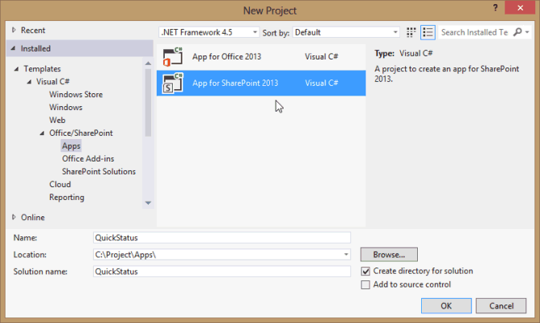
  
4. In the **New app for SharePoint** dialog box, fill in the following three fields: 
    
   - In the top text box, type the name that you want the app to display in Project Web App. For example, type Quick Status Update.
    
   - For the site to use for debugging, type the URL of the Project Web App instance. For example, type  `https://ServerName/ProjectServerName` (replacing  _ServerName_ and  _ProjectServerName_ with your own values), and then choose **Validate**. If all goes well, Visual Studio shows **Connection successful**. If you get an error message, ensure that the Project Web App URL is correct and that the Project Server computer is configured for app isolation and sideloading of apps. For more information, see the [Prerequisites for creating an app for Project Server 2013](#pj15_StatusingApp_Prerequisites) section. 
    
   - In the **How do you want to host your app for SharePoint** drop-down list, choose **SharePoint-hosted**.
    
   > [!CAUTION]
   > If you choose the default **Provider-hosted** project type by mistake, Visual Studio creates two projects in the solution: a **QuickStatus** project and a **QuickStatusWeb** project. If you see two projects, delete that solution and start again. 
  
5. Choose **OK** to create the **QuickStatus** solution, **QuickStatus** project, and default files. 
    
6. Open the Manifest Designer view (for example, double-click the AppManifest.xml file). On the **General** tab, the **Title** text box should show the app name that you typed in step 4. Choose the **Permissions** tab to add the following permission requests for the app (see Figure 2): 
    
   - In the first row of the **Permission requests** list, in the **Scope** column, choose **Statusing** in the drop-down list. In the **Permission** column, choose **SubmitStatus**.
    
   - Add a row where the **Scope** is **Multiple Projects** and the **Permission** is **Read**.
    
   **Figure 2. Setting the permission scope for a statusing app**

   
  
The **QuickStatus** app enables a Project Web App user to read assignments for that user from multiple projects, change the assignment percent complete, and submit the update. The other permission request scopes shown in the drop-down list in Figure 2 are not required for this app. The permission request scopes are the permissions that the app requests on behalf of the user. If the user does not have those permissions in Project Web App, the app does not run. An app can have multiple permission request scopes, including those for other SharePoint permissions, but should have only the minimum necessary for the app functionality. Following are the permission request scopes that are related to Project Server: 

- **Enterprise Resources**: Resource manager permissions, to read or write information about other Project Web App users.
    
- **Multiple Projects**: Read or write to more than one project, where the user has the permissions requested.
    
- **Project Server**: Requires the app user to have administrator permissions for Project Web App.
    
- **Reporting**: Read the **ProjectData** OData service for Project Web App (requires only log on permission for Project Web App). 
    
- **Single Project**: Read or write to a project where the user has the permissions requested.
    
- **Statusing**: Submit updates for status of assignments, such as times worked, percent complete, and new assignments.
    
- **Workflow**: If the user has permission to run Project Server workflows, the app then runs with elevated permissions for the workflow.
    
For more information about permission request scopes for Project Server 2013, see the  *Project apps*  section in [Updates for developers in Project 2013](updates-for-developers-in-project-2013.md) and [App permissions in SharePoint 2013](http://msdn.microsoft.com/library/fp142383.aspx).


<a name="pj15_StatusingApp_HTML"> </a>

### Creating the HTML content for the QuickStatus app

Before you start coding the HTML content, design the user interface and user experience for the QuickStatus app (Figure 3 shows an example of the completed page). A design can also include an outline of the JavaScript functions that interact with the HTML code. For general information, see [UX design for apps in SharePoint 2013](http://msdn.microsoft.com/library/fp179934.aspx).
  
**Figure 3. Design of the QuickStatus app page**

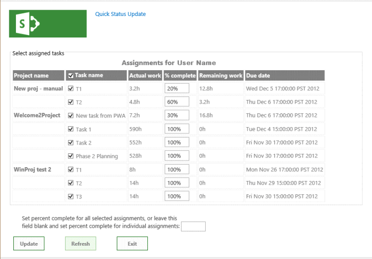
  
The app shows the display name at the top, which is the value of the **Title** element in AppManifest.xml. 
  
By default, the page uses HTML5. Following are the standard HTML elements for the main UI objects that the **QuickStatus** app contains in the body of the page: 
  
- A **form** element contains all of the other UI elements. 
    
- A **fieldset** element creates a container and border for the table of assignments; the child **legend** element provides a label for the container. 
    
- A **table** element includes a caption and only a table header. JavaScript functions change the table caption and add rows for the assignments. 
    
   > [!NOTE]
   > To easily add paging and sorting, a production app would probably use a commercial jQuery-based grid control instead of a table. 
  
   The table includes columns for the project name, task name with a check box, actual work, percent complete, remaining work, and the assignment finish date. JavaScript functions create the check box and the text input field for the percent complete of each task.
    
- An **input** element for a text box sets percent complete for all selected assignments. 
    
- A **button** element submits the status changes. 
    
- A **button** element refreshes the page. 
    
- A **button** element exits the app and returns to the Tasks page in Project Web App. 
    
The bottom text box and button elements are within **div** elements, so that CSS can easily manage the position and appearance of the UI objects. A JavaScript function adds a paragraph at the bottom of the page that contains results for success or failure of the status update. 
  
### Procedure 2. To create the HTML content

1. In Visual Studio, open the Default.aspx file.
    
   The file includes two **asp:Content** elements: The element with the  `ContentPlaceHolderID="PlaceHolderAdditionalPageHead"` attribute is added within the page header, and the element with the  `ContentPlaceHolderID="PlaceHolderMain"` attribute is placed within the page **body** element. 
    
2. In the  `<asp:Content ContentPlaceHolderID="PlaceHolderAdditionalPageHead" runat="server">` control for the page header, add a reference to the PS.js file on the Project Server computer. For testing and debugging, you can use PS.debug.js. 
    
   ```HTML
     <script type="text/javascript" src="/_layouts/15/ps.debug.js"></script>
   ```

   The app infrastructure uses the `/_layouts/15/` virtual directory for the SharePoint site in IIS. The physical file is  `%ProgramFiles%\Common Files\Microsoft Shared\Web Server Extensions\15\TEMPLATE\LAYOUTS\PS.debug.js`.
    
   > [!NOTE]
   > Before you deploy the app for production use, remove  `.debug` from the script references to improve performance. 
  
3. In the  `<asp:Content ContentPlaceHolderID="PlaceHolderMain" runat="server">` control for the page body, delete the generated **div** element, and then add the HTML code for the UI objects. The **table** element contains only a header row. The **Task name** column includes a check box input control. Text for the **caption** element is replaced by the **onGetUserNameSuccess** callback for the **getUserInfo** function in the App.js file. 
    
    ```HTML
    <form>
        <fieldset>
        <legend>Select assigned tasks</legend>
        <table id="assignmentsTable">
            <caption id="tableCaption">Replace caption</caption>
            <thead>
            <tr id="headerRow">
                <th>Project name</th>
                <th><input type="checkbox" id="headercheckbox" checked="checked" />Task name</th>
                <th>Actual work</th>
                <th>% complete</th>
                <th>Remaining work</th>
                <th>Due date</th>
            </tr>
            </thead>
        </table>
        </fieldset>
        <div id="inputPercentComplete" >
        Set percent complete for all selected assignments, or leave this
        <br /> field blank and set percent complete for individual assignments: 
        <input type="text" name="percentComplete" id="pctComplete" size="4"  maxlength="4" />
        </div>
        <div id="submitResult">
        <p><button id="btnSubmitUpdate" type="button" class="bottomButtons" ></button></p>
        <p id="message"></p>
        </div>
        <div id="refreshPage">
        <p><button id="btnRefresh" type="button" class="bottomButtons" >Refresh</button></p>
        </div>
        <div id="exitPage">
        <p><button id="btnExit" type="button" class="bottomButtons" >Exit</button></p>
        </div>
    </form>
    ```

4. In the App.css file, add CSS code for the position and appearance of the UI elements. For the complete CSS code of the **QuickStatus** app, see the [Example code for the QuickStatus app](#pj15_StatusingApp_Example) section. 
    
Procedure 3 adds the JavaScript functions to read the assignments and create the table rows, and to change and update the assignment percent complete. The actual steps are more iterative in developing an app, where you alternately create some of the HTML code, add and test related styles and JavaScript functions, modify or add more HTML code, and then repeat the process.

<a name="pj15_StatusingApp_JavaScript"> </a>

### Creating the JavaScript functions for the QuickStatus app

The Visual Studio template for a SharePoint app includes the App.js file, which contains default initialization code that gets the SharePoint client context and demonstrates basic get and set actions for the app page. The JavaScript namespace for the SharePoint client-side SP.js library is **SP**. Because a Project Server app uses the PS.js library, the app uses the **PS** namespace to get the client context and access the JSOM for Project Server. 
  
JavaScript functions in the **QuickStatus** app include the following: 
  
- The document **ready** event handler runs when the document object model (DOM) is instantiated. The **ready** event handler does the following four steps: 
    
    1. Initializes the **projContext** global variable with the client context for the Project Server JSOM and the **pwaWeb** global variable. 
        
    2. Calls the **getUserInfo** function to initialize the **projUser** global variable. 
        
    3. Calls the **getAssignments** function, which gets specified assignment data for the user. 
        
    4. Binds click event handlers to the table header check box, and to the check boxes in each row of the table. The click event handlers manage the **checked** attribute of the check boxes when the user selects or clears any check box in the table. 
    
- If the **getAssignments** function is successful, it calls the **onGetAssignmentsSuccess** function. That function inserts a row in the table for each assignment, initializes the HTML controls in each row, and then initializes the bottom button properties. 
    
- The **onClick** event handler for the **Update** button calls the **updateAssignments** function. That function gets the percent complete value that is applied to each selected assignment; or if the percent complete text box is empty, the function gets the percent complete of each selected assignment in the table. The **updateAssignments** function then saves and submits the status updates and writes a message about the results to the bottom of the page. 
    
### Procedure 3. To create the JavaScript functions

1. In Visual Studio, open the App.js file, and then delete all the content in the file.
    
2. Add the global variables and the document **ready** event handler. The **document** object is accessed by using a jQuery function. 
    
   The click event handler for the table header check box sets the checked state of the row check boxes. If all of the row check boxes are selected or all are clear, the click event handler for the row check boxes sets the checked state of the header check box. The click event handlers also set the results message at the bottom of the page to an empty string.
    
   ```js
    var projContext;
    var pwaWeb;
    var projUser;
    // This code runs when the DOM is ready and creates a ProjectContext object.
    // The ProjectContext object is required to use the JSOM for Project Server.
    $(document).ready(function () {
        projContext = PS.ProjectContext.get_current();
        pwaWeb = projContext.get_web();
        getUserInfo();
        getAssignments();
        // Bind a click event handler to the table header check box, which sets the row check boxes
        // to the checked state of the header check box, and sets the results message to an empty string.
        $('#headercheckbox').live('click', function (event) {
            $('input:checkbox:not(#headercheckbox)').attr('checked', this.checked);
            $get("message").innerText = "";
        });
        // Bind a click event handler to the row check boxes. If any row check box is cleared, clear
        // the header check box. If all of the row check boxes are selected, select the header check box.
        $('input:checkbox:not(#headercheckbox)').live('click', function (event) {
            var isChecked = true;
            $('input:checkbox:not(#headercheckbox)').each(function () {
                if (this.checked == false) isChecked = false;
                $get("message").innerText = "";
            });
            $("#headercheckbox").attr('checked', isChecked);
        });
    });
   ```

3. Add the **getUserInfo** function, which calls **onGetUserNameSuccess** if the query is successful. The **onGetUserNameSuccess** function replaces the contents of the **caption** paragraph with a table caption that includes the user name. 
    
   ```js
        // Get information about the current user.
        function getUserInfo() {
            projUser = pwaWeb.get_currentUser();
            projContext.load(projUser);
            projContext.executeQueryAsync(onGetUserNameSuccess,
                // Anonymous function to execute if getUserInfo fails.
                function (sender, args) {
                    alert('Failed to get user name. Error: ' + args.get_message());
            });
        } 
        // This function is executed if the getUserInfo call is successful.
        function onGetUserNameSuccess() {
            var prefaceInfo = 'Assignments for ' + projUser.get_title();
            $('#tableCaption').text(prefaceInfo);
        }
   ```

4. Add the **getAssignments** function, which calls **onGetAssignmentsSuccess** (see step 5) if the assignment query is successful. The **Include** option limits the query to return only the fields specified. 
    
   ```js
    // Get the collection of assignments for the current user.
    function getAssignments() {
        assignments = PS.EnterpriseResource.getSelf(projContext).get_assignments();
        // Register the request that you want to run on the server. The optional "Include" parameter 
        // requests only the specified properties for each assignment in the collection.
        projContext.load(assignments,
            'Include(Project, Name, ActualWork, ActualWorkMilliseconds, PercentComplete, RemainingWork, Finish, Task)');
        // Run the request on the server.
        projContext.executeQueryAsync(onGetAssignmentsSuccess,
            // Anonymous function to execute if getAssignments fails.
            function (sender, args) {
                alert('Failed to get assignments. Error: ' + args.get_message());
            });
    }
   ```

5. Add the **onGetAssignmentsSuccess** function, which adds a row for each assignment to the table. The **prevProjName** variable is used to determine whether a row is for a different project. If so, the project name is shown in a bold font; if not, the project name is set to an empty string. 
    
   > [!NOTE]
   > The JSOM does not include **TimeSpan** properties that the CSOM includes, such as **ActualWorkTimeSpan**. Instead, the JSOM uses properties for the number of milliseconds, such as the [PS.StatusAssignment.actualWorkMilliseconds](http://msdn.microsoft.com/library/736bce1e-f734-0efe-6c5f-e0e891ab00ef%28Office.15%29.aspx) property. The method to get that property is **get\_actualWorkMilliseconds**, which returns an integer value. > The **get_actualWork** method returns a string such as "3h". You could use either value in the **QuickStatus** app, but display it differently. The assignments query includes both properties, so you can test the value during debugging. If you remove the **actualWork** variable, you can also remove the **ActualWork** property in the assignments query. 
  
   Finally, the **onGetAssignmentsSuccess** function initializes the **Update** button and the **Refresh** button with click event handlers. The text value of the **Update** button could also be set in the HTML code. 
    
   ```js
        // Get the enumerator, iterate through the assignment collection, 
        // and add each assignment to the table.
        function onGetAssignmentsSuccess(sender, args) {
            if (assignments.get_count() > 0) {
                var assignmentsEnumerator = assignments.getEnumerator();
                var projName = "";
                var prevProjName = "3D2A8045-4920-4B31-B3E7-9D0C5195FC70"; // Any unique name.
                var taskNum = 0;
                var chkTask = "";
                var txtPctComplete = "";
                // Constants for creating input controls in the table.
                var INPUTCHK = '<input type="checkbox" class="chkTask" checked="checked" id="chk';
                var LBLCHK = '<label for="chk';
                var INPUTTXT = '<input type="text" size="4"  maxlength="4" class="txtPctComplete" id="txt';
                while (assignmentsEnumerator.moveNext()) {
                    var statusAssignment = assignmentsEnumerator.get_current();
                    projName = statusAssignment.get_project().get_name();
                    // Get an integer, such as 3600000.
                    var actualWorkMilliseconds = statusAssignment.get_actualWorkMilliseconds(); 
                    // Get a string, such as "1h". Not used here.
                    var actualWork = statusAssignment.get_actualWork();
                    if (projName === prevProjName) {
                        projName = "";
                    }
                    prevProjName = statusAssignment.get_project().get_name();
                    // Create a row for the assignment information.
                    var row = assignmentsTable.insertRow();
                    taskNum++;
                    // Create an HTML string with a check box and task name label, for example:
                    // <input type="checkbox" class="chkTask" checked="checked" id="chk1" /> <label for="chk1">Task 1</label>
                    chkTask = INPUTCHK + taskNum + '" /> ' + LBLCHK + taskNum + '">' 
                        + statusAssignment.get_name() + '</label>';
                    txtPctComplete = INPUTTXT + taskNum + '" />';
                    // Insert cells for the assignment properties.
                    row.insertCell().innerHTML = '<strong>' + projName + '</strong>';
                    row.insertCell().innerHTML = chkTask;
                    row.insertCell().innerText = actualWorkMilliseconds / 3600000 + 'h';
                    row.insertCell().innerHTML = txtPctComplete;
                    row.insertCell().innerText = statusAssignment.get_remainingWork();
                    row.insertCell().innerText = statusAssignment.get_finish();
                    // Initialize the percent complete cell.
                    $get("txt" + taskNum).innerText = statusAssignment.get_percentComplete() + '%'
                }
            }
            else {
                $('p#message').attr('style', 'color: #0f3fdb');     // Blue text.
                $get("message").innerText = projUser.get_title() + ' has no assignments'
            }
            // Initialize the button properties.
            $get("btnSubmitUpdate").onclick = function() { updateAssignments(); };
            $get("btnSubmitUpdate").innerText = 'Update';
            $get('btnRefresh').onclick = function () { window.location.reload(true); };
            $get('btnExit').onclick = function () { exitToPwa(); };
        }
   ```

6. Add the **updateAssignments** click event handler for the **Update** button. When the user changes a value for percent complete of a task, or adds a value in the **percentComplete** text box, the value could be entered in several formats such as "60", "60%", or "60 %". The **getNumericValue** method returns the numeric value of the input text. 
    
   > [!NOTE]
   > In an app that is designed for production use, input values for numeric information should include field validation and additional error checking. 
  
   The **updateAssignments** example includes some basic error checking, and displays information in the **message** paragraph at the bottom of the page—green if the update query is successful and red if there is an input error or the update query is unsuccessful. 
    
   Before using the **submitAllStatusUpdates** method, the app must save the updates to the server by using the **PS.StatusAssignmentCollection.update** method. 
    
   ```js
        // Update all checked assignments. If the bottom percent complete field is blank,
        // use the value in the % complete field of each selected row in the table.
        function updateAssignments() {
            // Get percent complete from the bottom text box.
            var pctCompleteMain = getNumericValue($('#pctComplete').val()).trim();
            var pctComplete = pctCompleteMain;
            var assignmentsEnumerator = assignments.getEnumerator();
            var taskNum = 0;
            var taskRow = "";
            var indexPercent = "";
            var doSubmit = true;
            while (assignmentsEnumerator.moveNext()) {
                var pctCompleteRow = "";
                taskRow = "chk" + ++taskNum;
                if ($get(taskRow).checked) {
                    var statusAssignment = assignmentsEnumerator.get_current();
                    if (pctCompleteMain === "") {
                        // Get percent complete from the text box field in the table row.
                        pctCompleteRow = getNumericValue($('#txt' + taskNum).val());
                        pctComplete = pctCompleteRow;
                    }
                    // If both percent complete fields are empty, show an error.
                    if (pctCompleteMain === "" && pctCompleteRow === "") {
                        $('p#message').attr('style', 'color: #e11500');     // Red text.
                        $get("message").innerHTML =
                            '<b>Error:</b> Both <i>Percent complete</i> fields are empty, in row '
                            + taskNum
                            + ' and in the bottom textbox.<br/>One of those fields must have a valid percent.'
                            + '<p>Please refresh the page and try again.</p>';
                        doSubmit = false;
                        taskNum = 0;
                        break;
                    }
                    if (doSubmit) statusAssignment.set_percentComplete(pctComplete);
                }
            } 
            // Save and submit the assignment updates.
            if (doSubmit) {
                assignments.update();
                assignments.submitAllStatusUpdates();
                projContext.executeQueryAsync(function (source, args) {
                    $('p#message').attr('style', 'color: #0faa0d');     // Green text.
                    $get("message").innerText = 'Assignments have been updated.';
                }, function (source, args) {
                    $('p#message').attr('style', 'color: #e11500');     // Red text.
                    $get("message").innerText = 'Error updating assignments: ' + args.get_message();
                });
            }
        }
        // Get the numeric part for percent complete, from a string. For example, with "20 %", return "20".
        function getNumericValue(pctComplete) {
            pctComplete = pctComplete.trim();
            pctComplete = pctComplete.replace(/ /g, "");    // Remove interior spaces.
            indexPercent = pctComplete.indexOf('%', 0);
            if (indexPercent > -1) pctComplete = pctComplete.substring(0, indexPercent);
            return pctComplete;
        }
   ```

7. Add the **exitToPwa** function, which uses the **SPHostUrl** query string parameter for the URL of the host Project Web App site. To navigate back to the Tasks page, append  `"/Tasks.aspx"` to the URL. For example, the **spHostUrl** variable would be set to  `https://ServerName/ProjectServerName/Tasks.aspx`.
    
   The **getQueryStringParameter** function splits the URL of the **QuickStatus** page to extract and return the specified parameter in the URL options. Following is an example of the **document.URL** value for the **QuickStatus** document (all on one line): 
    
   ```HTML
    https://app-ef98082fa37e3c.servername.officeapps.selfhost.corp.microsoft.com/pwa/
        QuickStatus/Pages/Default.aspx
        ?SPHostUrl=https%3A%2F%2Fsphvm%2D85178%2Fpwa
        &SPLanguage=en%2DUS
        &SPClientTag=1
        &SPProductNumber=15%2E0%2E4420%2E1022
        &SPAppWebUrl=https%3A%2F%2Fapp%2Def98082fa37e3c%2Eservername
            %2Eofficeapps%2Eselfhost%2Ecorp%2Emicrosoft%2Ecom%2Fpwa%2FQuickStatus
   ```

   For the previous URL, the **getQueryStringParameter** function returns the **SPHostUrl** query string value,  `https://ServerName/pwa`. 
    
   ```js
        // Exit the QuickStatus page and go back to the Tasks page in Project Web App.
        function exitToPwa() {
            // Get the SharePoint host URL, which is the top page of PWA, and add the Tasks page.
            var spHostUrl = decodeURIComponent(getQueryStringParameter('SPHostUrl'))
                            + "/Tasks.aspx";
            // Set the top window for the QuickStatus IFrame to the Tasks page.
            window.top.location.href = spHostUrl;
        }
        // Get a specified query string parameter from the {StandardTokens} URL option string.
        function getQueryStringParameter(urlParameterKey) {
            var docUrl = document.URL;
            var params = docUrl.split('?')[1].split('&');
            for (var i = 0; i < params.length; i++) {
                var theParam = params[i].split('=');
                if (theParam[0] == urlParameterKey)
                    return decodeURIComponent(theParam[1]);
            }
        }
   ```

If you publish the **QuickStatus** app at this point and add it to Project Web App, the app can be run from the Site Contents page, but it is not easily available to users. To help users find and run the app, you can add a button for it to the ribbon on the Tasks page. Procedure 4 shows how to add a ribbon custom action. 

<a name="pj15_StatusingApp_ribbon"> </a>

### Adding a ribbon custom action

Ribbon tabs, groups, and controls for Project Web App are specified in the pwaribbon.xml file, which is installed in the  `[Program Files]\Common Files\Microsoft Shared\Web Server Extensions\15\TEMPLATE\FEATURES\PWARibbon\listtemplates` directory on the computer running Project Server. To help design custom actions for the Project Web App ribbon, the Project 2013 SDK download includes a copy of pwaribbon.xml. 
  
Project Web App uses different ribbon definitions for the Tasks page, depending on whether the Project Web App instance uses single entry mode that enables users to enter values for both the timesheet and task status. If you have administrative permissions for Project Web App, to determine the entry mode, choose **PWA Settings** in the drop-down settings menu at the top-right corner of the page. On the PWA Settings page, choose **Timesheet Settings and Defaults**, and then look at the **Single Entry Mode** check box at the bottom of the page. 
  
When single entry mode is off, the ribbon on the Tasks page is defined by the My Work region in pwaribbon.xml: 
  
```XML
   <!-- REGION My Work Ribbon-->
   <CustomAction
      Id="Ribbon.ContextualTabs.MyWork"
      . . .
```

When single entry mode is on, the Tasks page ribbon is defined by the Tied Mode region in pwaribbon.xml: 
  
```XML
   <!-- REGION Tied Mode Ribbon-->
   <CustomAction
      Id="Ribbon.ContextualTabs.TiedMode"
      . . .
```

Although the groups and controls in each region look similar, a control for the tied mode can call a different function than the same control for the non-tied mode. Procedure 4 shows how to add a button control for the **QuickStatus** app when single entry mode is off (the **Single Entry Mode** check box is clear). 
  
> [!NOTE]
> For general information about adding custom actions to a ribbon or to a menu in a SharePoint application, see [Create custom actions to deploy with apps for SharePoint](http://msdn.microsoft.com/en-us/library/jj163954.aspx). 
  
### Procedure 4. To add a ribbon custom action to the Tasks page

1. Examine the ribbon on the Tasks page in Project Web App. Select the **TASKS** tab on the ribbon and plan how to modify it. There are seven groups, such as **Submit**, **Tasks**, and **Period**. The **Submit** group has two controls, a **Save** button and a **Send Status** drop-down menu. You can add a control at any location in a group, add a group with a new control at any location in the **TASKS** tab, or add another ribbon tab that has custom groups and controls. In this example, we add a third button to the **Submit** group, where the button invokes the URL of the **QuickStatus** app. 
    
2. In the **Solution Explorer** pane in Visual Studio, right-click the **QuickStatus** project, and then add a new item. In the **Add New Item** dialog box, choose **Ribbon Custom Action** (see Figure 4). For example, name the custom action RibbonQuickStatusAction, and then choose **Add**.
    
   **Figure 4. Adding a ribbon custom action**

   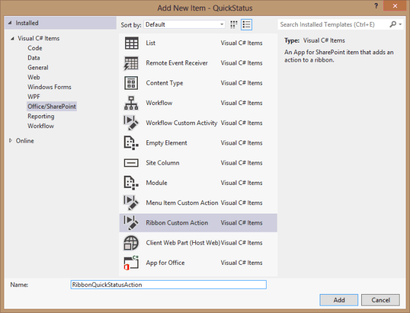
  
3. On the first page of the **Create Custom Action for Ribbon** wizard, leave the **Host Web** option selected, choose **None** in the drop-down list for the custom action scope, and then choose **Next** (see Figure 5). The items in the drop-down lists are relevant to SharePoint, not to Project Server. We will replace most of the generated XML for the custom action so that it applies to Project Server. 
    
   **Figure 5. Specifying properties for the ribbon custom action**

   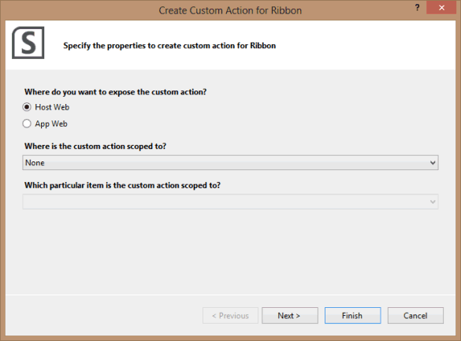
  
4. On the next page of the **Create Custom Action for Ribbon** wizard, leave all the default values for the settings, and then choose **Finish** (see Figure 6). Visual Studio creates the **RibbonQuickStatusAction** folder, which contains an Elements.xml file. 
    
   **Figure 6. Specifying the settings for a button control**

   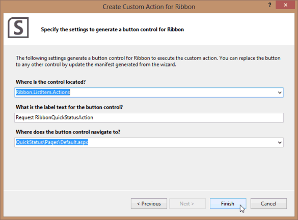
  
5. Modify the default generated code in the Elements.xml file for the ribbon custom action. Following is the default XML code:
    
   ```XML
    <?xml version="1.0" encoding="utf-8"?>
    <Elements xmlns="http://schemas.microsoft.com/sharepoint/">
        <CustomAction Id="21ea3aaf-79e5-4aac-9479-8eef14b4d9df.RibbonQuickStatusAction"
                    Location="CommandUI.Ribbon"
                    Sequence="10001"
                    Title="Invoke &apos;RibbonQuickStatusAction&apos; action">
        <CommandUIExtension>
            <!-- 
            Update the UI definitions below with the controls and the command actions
            that you want to enable for the custom action.
            -->
            <CommandUIDefinitions>
            <CommandUIDefinition Location="Ribbon.ListItem.Actions.Controls._children">
                <Button Id="Ribbon.ListItem.Actions.RibbonQuickStatusActionButton"
                        Alt="Request RibbonQuickStatusAction"
                        Sequence="100"
                        Command="Invoke_RibbonQuickStatusActionButtonRequest"
                        LabelText="Request RibbonQuickStatusAction"
                        TemplateAlias="o1"
                        Image32by32="_layouts/15/images/placeholder32x32.png"
                        Image16by16="_layouts/15/images/placeholder16x16.png" />
            </CommandUIDefinition>
            </CommandUIDefinitions>
            <CommandUIHandlers>
            <CommandUIHandler Command="Invoke_RibbonQuickStatusActionButtonRequest"
                                CommandAction="~appWebUrl/Pages/Default.aspx"/>
            </CommandUIHandlers>
        </CommandUIExtension >
        </CustomAction>
    </Elements>
   ```

   1. In the **CustomAction** element, delete the **Sequence** attribute and the **Title** attribute. 
    
   2. To add a control to the **Submit** group, find the first group in the  `Ribbon.ContextualTabs.MyWork.Home.Groups` collection in the pwaribbon.xml file, which is the element that begins,  `<Group Id="Ribbon.ContextualTabs.MyWork.Home.Page" Command="PageGroup" Sequence="10" Title="$Resources:pwafeatures,PAGE_PDP_CM_SUBMIT"`. To add a child control to the **Submit** group, the following code shows the correct **Location** attribute of the **CommandUIDefinition** element in the Elements.xml file: 
    
      ```XML
        <CommandUIDefinitions>
          <CommandUIDefinition Location="Ribbon.ContextualTabs.MyWork.Home.Page.Controls._children">
             . . .
          </CommandUIDefinition>
        </CommandUIDefinitions>
      ```

   3. Change the attribute values of the child **Button** element as follows: 
    
       ```XML
            <Button Id="Ribbon.ContextualTabs.MyWork.Home.Page.QuickStatus"
                    Alt="Quick Status app"
                    Sequence="30"
                    Command="Invoke_QuickStatus"
                    LabelText="Quick Status"
                    TemplateAlias="o1"
                    Image16by16="_layouts/15/1033/images/ps16x16.png" 
                    Image16by16Left="-80"
                    Image16by16Top="-144"
                    Image32by32="_layouts/15/1033/images/ps32x32.png" 
                    Image32by32Left="-32"
                    Image32by32Top="-288" 
                    ToolTipTitle="QuickStatus"
                    ToolTipDescription="Run the QuickStatus app" />
       ```

       - To make the button the third control in the group, the **Sequence** attribute can be any number higher than the  `Sequence="20"` value of the existing **Send Status** control (which is a **FlyoutAnchor** element in pwaribbon.xml). By convention, the sequence numbers of groups and controls are  `10, 20, 30, …`, which enables elements to be inserted in intermediate positions.
    
       - The **Command** attribute specifies the command to run in the **CommandUIHandler** element (see the following step 5.d). You can simplify the command name to make it easier for the next developer. For example  `Command="Invoke_QuickStatus"` is easier to read than  `Command="Invoke_RibbonQuickStatusActionButtonRequest"`.
    
       - The image attributes specify the 16 x 16-pixel icon and the 32 x 32-pixel icon for the button control. In the default Elements.xml file,  `Image32by32="_layouts/15/images/placeholder32x32.png"` specifies an orange dot. You can extract icons from the image map files (ps16x16.png and ps32x32.png) that are installed in the  `[Program Files]\Common Files\Microsoft Shared\Web Server Extensions\15\TEMPLATE\LAYOUTS\1033\IMAGES` directory on the computer running Project Server. For example, the 32 x 32-pixel icon is in the second column of icons from the left and the tenth row down from the top of the ps32x32.png image map (the top of the icon is after the end of the ninth row; 9 rows x 32 pixels/row = 288 pixels). 
    
       - To show a tool tip for the button control, add the **ToolTipTitle** attribute and the **ToolTipDescription** attribute. 
    
    4. Change the attributes of the **CommandUIHandler** element. For example, ensure that the **Command** attribute matches the **Command** attribute value for the **Button** element. For the **CommandAction** attribute,  `~appWebUrl` is a placeholder for the URL of the **QuickStatus** webpage. When the ribbon button invokes the **QuickStatus** app, the **{StandardTokens}** token is replaced by URL options that include **SPHostUrl**, **SPLanguage**, **SPClientTag**, **SPProductNumber**, and **SPAppWebUrl**.
    
        ```XML
            <CommandUIHandlers>
                <CommandUIHandler Command="Invoke_QuickStatus"
                                  CommandAction="~appWebUrl/Pages/Default.aspx?{StandardTokens}"/>
            </CommandUIHandlers>
        ```

6. In **Solution Explorer**, open the **Feature1.feature** designer, and move the **RibbonQuickStatusAction** item from the **Items in the Solution** pane to the **Items in the Feature** pane. If you then open the **Package.package** designer, the **RibbonQuickStatusAction** item will be in the **Items in the Package** pane. 
    
As you develop the app and add a ribbon button, you normally test the app and set breakpoints in the JavaScript code for debugging. When you press **F5** to start debugging, Visual Studio compiles the app, deploys it to the site that is specified in the **Site URL** property of the **QuickStatus** project, and displays a page that asks whether you trust the app. When you proceed and then exit the **QuickStatus** app, it returns to the Tasks page in Project Web App. 

> [!NOTE]
> Figure 7 shows that the **Quick Status** button on the **TASKS** tab of the ribbon is disabled. After many debug deployments with Visual Studio, custom ribbon controls can be blocked when you continue to debug or deploy the published app on the same test server. To enable the button, delete the **RibbonQuickStatusAction** item in Visual Studio, and then create a new ribbon action that has a different name and ID. If that doesn't solve the problem, try removing the app from the Project Web App test instance, and then recreate the app with a different app ID. 
  
**Figure 7. Viewing the tooltip of the disabled Quick Status button**

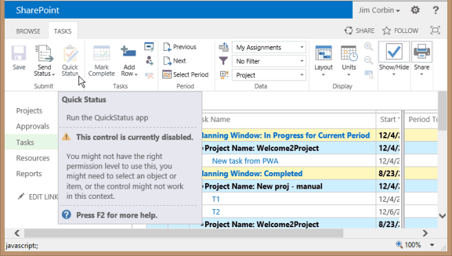
  
Procedure 5 shows how to deploy and install the **QuickStatus** app. Procedure 6 shows some additional steps in testing the app after you have installed it. 

<a name="pj15_StatusingApp_Deploying"> </a>

## Deploying the QuickStatus app

There are several ways to deploy an app to a SharePoint web application such as Project Web App. Which deployment you use will depend on whether you want to publish the app to a private SharePoint catalog or to the public Office Store, and whether SharePoint is installed on-premises or is an online tenancy. Procedure 5 shows how to deploy the **QuickStatus** app to an on-premises installation in a private app catalog. For more information, see [Install and manage apps for SharePoint 2013](http://technet.microsoft.com/library/fp161232.aspx) and [Publish apps for SharePoint](http://msdn.microsoft.com/library/jj164070.aspx)
  
> [!NOTE]
> Adding an app to a SharePoint catalog requires SharePoint administrator permissions. 
  
### Procedure 5. To deploy the QuickStatus app

1. In Visual Studio, save all of the files, and then right-click the **QuickStatus** project in the **Solution Explorer** and choose **Publish**.
    
2. Because the **QuickStatus** app is SharePoint-hosted, there are very few options for publishing (see Figure 8). In the **Publish apps for Office and SharePoint** dialog box, choose **Finish**.
    
   **Figure 8. Publishing the QuickStatus app**

   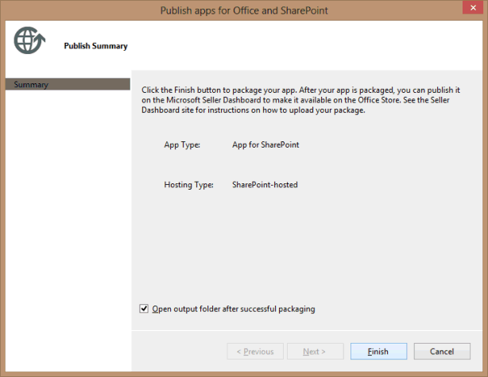
  
3. Copy the QuickStatus.app file from the  `~\QuickStatus\bin\Debug\app.publish\1.0.0.0` directory to a convenient directory on the local computer (or to the SharePoint computer for an on-premises installation). 
    
4. In SharePoint Central Administration, choose **Apps** in the Quick Launch, and then choose **Manage App Catalog**.
    
5. If an app catalog does not exist, create a site collection for the app catalog, by following the  *Configure the App Catalog site for a web application*  section in [Manage the App Catalog in SharePoint 2013](http://technet.microsoft.com/library/fp161234.aspx).
    
   If an app catalog exists, navigate to the site URL on the Manage App Catalog page. For example, in the following steps, the app catalog site is  `http://ServerName/sites/TestApps`.
    
6. On the app catalog page, choose **Apps for SharePoint** in the Quick Launch. On the Apps for SharePoint page, on the **FILES** tab of the ribbon, choose **Upload Document**.
    
7. In the **Add a document** dialog box, browse for the QuickStatus.app file, add comments for the version, and then choose **OK**.
    
8. When you add an app, you can also add local information for the app description, icon, and other information. In the **Apps for SharePoint - QuickStatus.app** dialog box, add the information that you want to show for the app in the SharePoint site collection. For example, add the following information: 
    
   1. **Short Description** field: Type Quick Status test app.
    
   2. **Description** field: Type Test app to update percent complete for tasks in multiple projects.
    
   3. **Icon URL** fields: Add a 96 x 96-pixel image for the app icon to the site assets for the app catalog. For example, navigate to  `http://ServerName/sites/TestApps`, choose **Site contents** in the **Settings** drop-down menu, choose **Site Assets**, and then add the quickStatusApp.png image. Right-click the **quickStatusApp** item, choose **Properties**, and then copy the **Address (URL)** value in the **Properties** dialog box. For example, copy  `http://ServerName/sites/TestApps/SiteAssets/QuickStatusApp.png`, and then paste the value in the **Icon URL** web address field. Type a description for the icon, for example (as in Figure 9), type QuickStatus app icon. Test that the URL is valid.
    
      **Figure 9. Adding an icon URL for the QuickStatus app**

      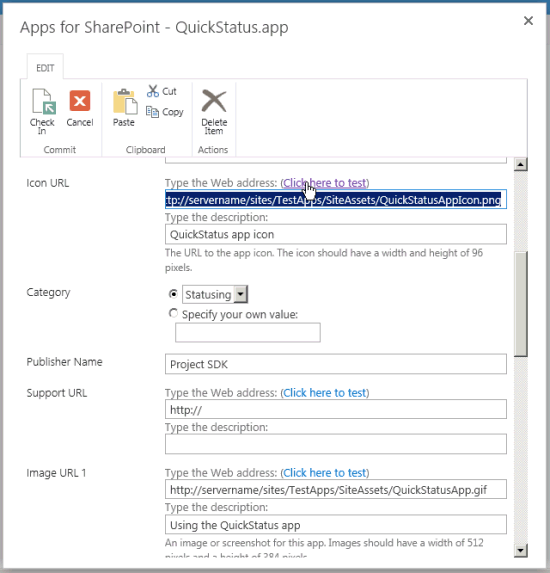
  
   4. **Category** field: Choose an existing category, or specify your own value. For example, type Statusing.
    
      > [!NOTE]
      > A category named **Statusing** is just for testing purposes. A typical category for Project Server apps is **Project Management**. 
  
   5. **Publisher name** field: Type the name of the publisher. In this example, type Project SDK.
    
   6. **Enabled** field: To make the app visible to Project Web App site administrators for installation, select the **Enabled** check box. 
    
   7. Additional fields are optional. For example, you can add a support URL and multiple help images for the app details page. In Figure 9, the **Image URL 1** fields include the URL for a screenshot of the app and a description of the screenshot. 
    
   8. In the **Apps for SharePoint - QuickStatus.app** dialog box, choose **Save**. In Figure 9, the **Quick Status Update** item in the Apps for SharePoint library is checked out for editing, so on the **EDIT** tab of the dialog box ribbon, you would choose **Check In** to complete the process (see Figure 10). 
    
      **Figure 10. The QuickStatus app is added to the Apps for SharePoint library.**

      
  
9. In Project Web App, in the **Settings** drop-down menu, choose **Add an app**. On the Your Apps page, in the Quick Launch, choose **From Your Organization**, and then choose **App Details** for the **Quick Status Update** app. Figure 11 shows the details page with the app icon, screenshot, and other information that you added in the previous step. 
    
   **Figure 11. Using the Quick Status Update details page in Project Web App**

   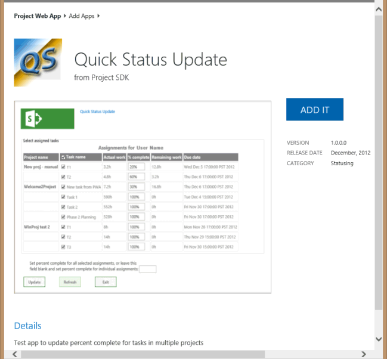
  
10. On the Quick Status Update details page, choose **ADD IT**. Project Web App displays a dialog box that lists the operations that the QuickStatus app can perform (see Figure 12). The list of operations is derived from the **AppPermissionRequest** elements in the AppManifest.xml file. 
    
    **Figure 12. Verifying that you trust the Quick Status app**

    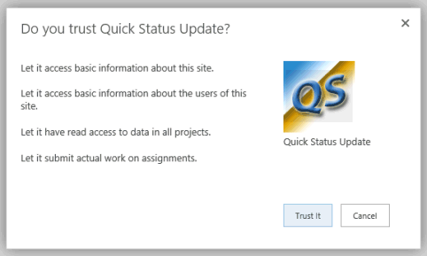
  
11. In the **Do you trust Quick Status Update** dialog box, choose **Trust It**. The app is added to the Project Web App Site Contents page (see Figure 13).
    
    **Figure 13. Viewing the Quick Status app on the Site Contents page**

    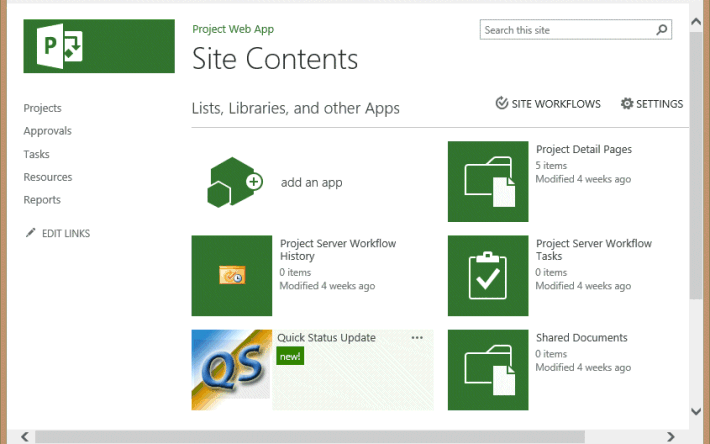
  
On the Site Contents page, you can select the **Quick Status Update** icon to run the app.

> [!NOTE]
> For additional commands that provide information about the app, on the Site Contents page, choose the region that contains the **Quick Status Update** name and the ellipsis (...). You can review the About page for the app, view the App Details page that contains information about app errors, review the app permissions page, or remove the app from Project Web App. 
  
On the Tasks page in Project Web App (see Figure 14), the **QuickStatus** button should be enabled on the ribbon. If the **Quick Status** button is disabled, try the actions described in the note for Figure 7. 

**Figure 14. Starting the QuickStatus app from the TASKS tab**

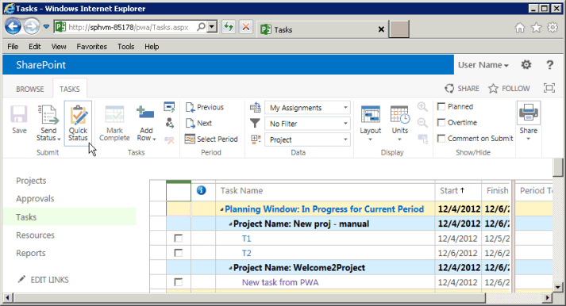
  
Procedure 6 shows some tests to make with the QuickStatus app.

<a name="pj15_StatusingApp_Testing"> </a>

## Testing the QuickStatus app

Every operation that a user might try in the **QuickStatus** app should be tested on a test installation of Project Server before deploying the app to a production server or to a production tenant of Project Online. A test installation enables you to change and delete assignments for users without affecting actual projects. Testing should also involve several users who have different sets of permissions, such as administrator, project manager, and team member. Thorough testing can uncover changes that should be made in the app, which were not apparent in testing during development. Procedure 6 lists several tests for the **QuickStatus** app, but does not include an exhaustive series of tests. 
  
### Procedure 6. To test the QuickStatus app

1. Run the **QuickStatus** app where the user has no assignments. The app should show a blue message at the bottom of the page, for example, **User Name has no assignments**.
    
   Choose **Update**, and the message changes to a green **Assignments have been updated**.
    
   > [!NOTE]
   > The app behavior should be changed so that the **Update** button is disabled when there are no assignments. 
  
2. Run the app where the user has multiple assignments in several different projects and some assignments are not complete. Notice the appearance of the app and perform actions as follows (see Figure 15):
    
   1. The **onGetAssignmentsSuccess** function creates a row in the table for each assignment for the current user. The project name shows only once, in a bold font, for the first assignment in each project. 
    
   2. Clear the check box in the **Task name** column header. The table header click event handler clears all of the other check boxes in the task rows. 
    
   3. Select all of the tasks. The click event handler for each row determines whether all rows are selected, and if so, selects the **Task name** column header. 
    
   4. Clear all of the check boxes again, and then select one assignment that has some remaining work. For example, Figure 15 shows the top task T1 has 20% remaining work to complete.
    
   5. In the **Set percent complete** text box, type 80, and then choose **Update**. The bottom of the page should show a green message, **Assignments have been updated**.
    
      **Figure 15. Updating an assignment in the QuickStatus app**

      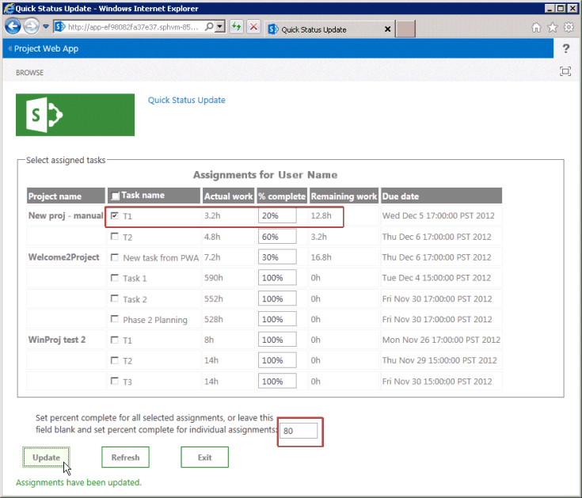
  
3. Choose **Refresh** (see Figure 16). All of the tasks are selected again, and the top task shows 80% complete. 
    
      **Figure 16. Refreshing the Quick Status Update page**

      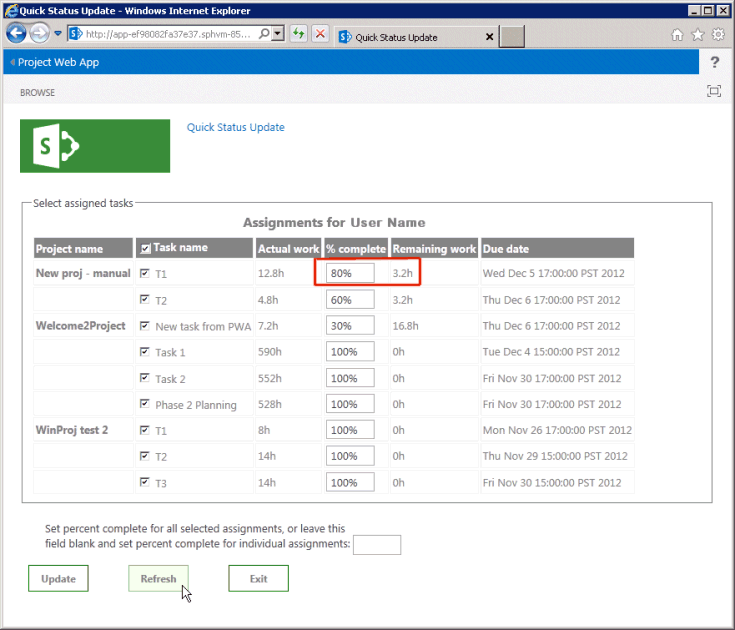
  
4. Clear all of the check boxes, and then select another task. For example, select **New task from PWA**. Leave the **Set percent complete** text box empty, delete all text in the **% complete** column for the selected task, and then choose **Update**. Because both text boxes are empty, the app shows a red error message (see Figure 17).
    
      **Figure 17. Testing the error message**

      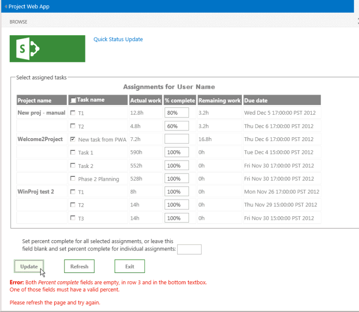
  
5. Update the previous task to 80% complete, and then choose **Exit**. The **exitToPwa** function changes the browser window location to the Tasks page in the SharePoint host application (that is, the URL changes to https://ServerName/pwa/Tasks.aspx). Figure 18 shows that the **T1** task and the **New task from PWA** task each show 80% complete. 
    
      **Figure 18. Verifying the tasks are updated in Project Web App**

      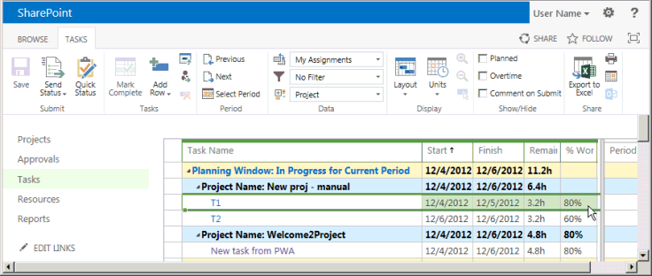
  
6. Before the updated status shows in Project Professional 2013, the changes must be submitted for approval, and then approved by the project manager.
    
Testing reveals several other changes that should be made in the **QuickStatus** app for improved usability. For example:

- There should be additional error checks and validation of text box values. Currently, a user can enter a non-numeric value or a negative value for percent complete, which results in an unfriendly error message. For example, with a negative value, the error message is **Error updating assignments: PJClientCallableException: StatusingSetDataValueInvalid**.
    
- The error message for blank text boxes could list the project and task, in addition to the row number.
    
- The success message could include a list of the tasks updated; or if the **updateAssignments** function is successful, it could perform an automatic page refresh and show updated tasks or percentages in a different color and bold font. 
    
- To avoid a very large table, the table of assignments should be limited to tasks that are less than 100% complete. Or, add an option to show all tasks. This problem could also be solved by using a jQuery-based grid instead of a table, where you can easily implement filtering and grid paging.
    
- Because the **QuickStatus** app does not submit status, the **Quick Status** icon on the **TASKS** tab of the ribbon would more logically be the first icon in the **Tasks** group, rather than the last icon in the **Submit** group. 
    
- Because the **onGetAssignmentsSuccess** function initializes the **btnSubmitUpdate** button text, but the other button text values are initialized in HTML, the page is left in a partially initialized state while the **getAssignments** function runs. Buttons on the page would appear more consistent if the text values were all initialized in HTML. 
    
Most importantly, the approach that the **QuickStatus** app uses, where it changes percent complete for assignments, should be revised in a production app. For more information, see the [Next steps](#pj15_StatusingApp_NextSteps) section. 

<a name="pj15_StatusingApp_Example"> </a>

## Example code for the QuickStatus app

### Default.aspx file

The following code is in the  `Pages\Default.aspx` file of the **QuickStatus** project: 
  
```HTML
    <%-- The following lines are ASP.NET directives needed when using SharePoint components --%>
    <%@ Page Inherits="Microsoft.SharePoint.WebPartPages.WebPartPage, Microsoft.SharePoint, Version=15.0.0.0, 
    Culture=neutral, PublicKeyToken=71e9bce111e9429c" MasterPageFile="~masterurl/default.master" Language="C#" %>
    <%@ Register TagPrefix="Utilities" Namespace="Microsoft.SharePoint.Utilities" Assembly="Microsoft.SharePoint, Version=15.0.0.0, 
    Culture=neutral, PublicKeyToken=71e9bce111e9429c" %>
    <%@ Register TagPrefix="WebPartPages" Namespace="Microsoft.SharePoint.WebPartPages" Assembly="Microsoft.SharePoint, Version=15.0.0.0, 
    Culture=neutral, PublicKeyToken=71e9bce111e9429c" %>
    <%@ Register TagPrefix="SharePoint" Namespace="Microsoft.SharePoint.WebControls" Assembly="Microsoft.SharePoint, Version=15.0.0.0, 
    Culture=neutral, PublicKeyToken=71e9bce111e9429c" %>
    <%-- The markup and script in the following Content element will be placed in the <head> of the page.
        For production deployment, change the .debug.js JavaScript references to .js. --%>
    <asp:Content ContentPlaceHolderID="PlaceHolderAdditionalPageHead" runat="server">
    <script type="text/javascript" src="../Scripts/jquery-1.7.1.min.js"></script>
    <script type="text/javascript" src="/_layouts/15/sp.runtime.debug.js"></script>
    <script type="text/javascript" src="/_layouts/15/sp.debug.js"></script>
    <script type="text/javascript" src="/_layouts/15/ps.debug.js"></script>
    <!-- CSS styles -->
    <link rel="Stylesheet" type="text/css" href="../Content/App.css" />
    <!-- Add your JavaScript to the following file -->
    <script type="text/javascript" src="../Scripts/App.js"></script>
    </asp:Content>
    <%-- The markup and script in the following Content element will be placed in the <body> of the page --%>
    <asp:Content ContentPlaceHolderID="PlaceHolderMain" runat="server">
    <form>
        <fieldset>
        <legend>Select assigned tasks</legend>
        <table id="assignmentsTable">
            <caption id="tableCaption">Replace caption</caption>
            <thead>
            <tr id="headerRow">
                <th>Project name</th>
                <th><input type="checkbox" id="headercheckbox" checked="checked" />Task name</th>
                <th>Actual work</th>
                <th>% complete</th>
                <th>Remaining work</th>
                <th>Due date</th>
            </tr>
            </thead>
        </table>
        </fieldset>
        <div id="inputPercentComplete" >
        Set percent complete for all selected assignments, or leave this
        <br /> field blank and set percent complete for individual assignments: 
        <input type="text" name="percentComplete" id="pctComplete" size="4"  maxlength="4" />
        </div>
        <div id="submitResult">
        <p><button id="btnSubmitUpdate" type="button" class="bottomButtons" ></button></p>
        <p id="message"></p>
        </div>
        <div id="refreshPage">
        <p><button id="btnRefresh" type="button" class="bottomButtons" >Refresh</button></p>
        </div>
    <div id="exitPage">
        <p><button id="btnExit" type="button" class="bottomButtons" >Exit</button></p>
    </div>
    </form>
    </asp:Content>
```

<br/>

### App.js file

The following code is in the  `Scripts\App.js` file of the **QuickStatus** project: 
  
```js
    var projContext;
    var pwaWeb;
    var projUser;
    // This code runs when the DOM is ready and creates a ProjectContext object.
    // The ProjectContext object is required to use the JSOM for Project Server.
    $(document).ready(function () {
        projContext = PS.ProjectContext.get_current();
        pwaWeb = projContext.get_web();
        getUserInfo();
        getAssignments();
        // Bind a click event handler to the table header check box, which sets the row check boxes
        // to the selected state of the header check box, and sets the results message to an empty string.
        $('#headercheckbox').live('click', function (event) {
            $('input:checkbox:not(#headercheckbox)').attr('checked', this.checked);
            $get("message").innerText = "";
        });
        // Bind a click event handler to the row check boxes. If any row check box is cleared, clear
        // the header check box. If all of the row check boxes are selected, select the header check box.
        $('input:checkbox:not(#headercheckbox)').live('click', function (event) {
            var isChecked = true;
            $('input:checkbox:not(#headercheckbox)').each(function () {
                if (this.checked == false) isChecked = false;
                $get("message").innerText = "";
            });
            $("#headercheckbox").attr('checked', isChecked);
        });
    });
    // Get information about the current user.
    function getUserInfo() {
        projUser = pwaWeb.get_currentUser();
        projContext.load(projUser);
        projContext.executeQueryAsync(onGetUserNameSuccess,
            // Anonymous function to execute if getUserInfo fails.
            function (sender, args) {
                alert('Failed to get user name. Error: ' + args.get_message());
        });
    }
    // This function is executed if the getUserInfo call is successful.
    // Replace the contents of the 'caption' paragraph with the project user name.
    function onGetUserNameSuccess() {
        var prefaceInfo = 'Assignments for ' + projUser.get_title();
        $('#tableCaption').text(prefaceInfo);
    }
    // Get the collection of assignments for the current user.
    function getAssignments() {
        assignments = PS.EnterpriseResource.getSelf(projContext).get_assignments();
        // Register the request that you want to run on the server. The optional "Include" parameter 
        // requests only the specified properties for each assignment in the collection.
        projContext.load(assignments,
            'Include(Project, Name, ActualWork, ActualWorkMilliseconds, PercentComplete, RemainingWork, Finish, Task)');
        // Run the request on the server.
        projContext.executeQueryAsync(onGetAssignmentsSuccess,
            // Anonymous function to execute if getAssignments fails.
            function (sender, args) {
                alert('Failed to get assignments. Error: ' + args.get_message());
            });
    }
    // Get the enumerator, iterate through the assignment collection, 
    // and add each assignment to the table.
    function onGetAssignmentsSuccess(sender, args) {
        if (assignments.get_count() > 0) {
            var assignmentsEnumerator = assignments.getEnumerator();
            var projName = "";
            var prevProjName = "3D2A8045-4920-4B31-B3E7-9D0C5195FC70"; // Any unique name.
            var taskNum = 0;
            var chkTask = "";
            var txtPctComplete = "";
            // Constants for creating input controls in the table.
            var INPUTCHK = '<input type="checkbox" class="chkTask" checked="checked" id="chk';
            var LBLCHK = '<label for="chk';
            var INPUTTXT = '<input type="text" size="4"  maxlength="4" class="txtPctComplete" id="txt';
            while (assignmentsEnumerator.moveNext()) {
                var statusAssignment = assignmentsEnumerator.get_current();
                projName = statusAssignment.get_project().get_name();
                // Get an integer value for the number of milliseconds of actual work, such as 3600000.
                var actualWorkMilliseconds = statusAssignment.get_actualWorkMilliseconds();
                // Get a string value for the assignment actual work, such as "1h". Not used here.
                var actualWork = statusAssignment.get_actualWork();                         
                if (projName === prevProjName) {
                    projName = "";
                }
                prevProjName = statusAssignment.get_project().get_name();
                // Create a row for the assignment information.
                var row = assignmentsTable.insertRow();
                taskNum++;
                // Create an HTML string with a check box and task name label, for example:
                //     <input type="checkbox" class="chkTask" checked="checked" id="chk1" /> 
                //     <label for="chk1">Task 1</label>
                chkTask = INPUTCHK + taskNum + '" /> ' + LBLCHK + taskNum + '">'
                    + statusAssignment.get_name() + '</label>';
                txtPctComplete = INPUTTXT + taskNum + '" />';
                // Insert cells for the assignment properties.
                row.insertCell().innerHTML = '<strong>' + projName + '</strong>';
                row.insertCell().innerHTML = chkTask;
                row.insertCell().innerText = actualWorkMilliseconds / 3600000 + 'h';
                row.insertCell().innerHTML = txtPctComplete;
                row.insertCell().innerText = statusAssignment.get_remainingWork();
                row.insertCell().innerText = statusAssignment.get_finish();
                // Initialize the percent complete cell.
                $get("txt" + taskNum).innerText = statusAssignment.get_percentComplete() + '%'
            }
        }
        else {
            $('p#message').attr('style', 'color: #0f3fdb');     // Blue text.
            $get("message").innerText = projUser.get_title() + ' has no assignments'
        }
        // Initialize the button properties.
        $get("btnSubmitUpdate").onclick = function() { updateAssignments(); };
        $get("btnSubmitUpdate").innerText = 'Update';
        $get('btnRefresh').onclick = function () { window.location.reload(true); };
        $get('btnExit').onclick = function () { exitToPwa(); };
    }
    // Update all selected assignments. If the bottom percent complete field is blank,
    // use the value in the % complete field of each selected row in the table.
    function updateAssignments() {
        // Get percent complete from the bottom text box.
        var pctCompleteMain = getNumericValue($('#pctComplete').val()).trim();
        var pctComplete = pctCompleteMain;
        var assignmentsEnumerator = assignments.getEnumerator();
        var taskNum = 0;
        var taskRow = "";
        var indexPercent = "";
        var doSubmit = true;
        while (assignmentsEnumerator.moveNext()) {
            var pctCompleteRow = "";
            taskRow = "chk" + ++taskNum;
            if ($get(taskRow).checked) {
                var statusAssignment = assignmentsEnumerator.get_current();
                if (pctCompleteMain === "") {
                    // Get percent complete from the text box field in the table row.
                    pctCompleteRow = getNumericValue($('#txt' + taskNum).val());
                    pctComplete = pctCompleteRow;
                }
                // If both percent complete fields are empty, show an error.
                if (pctCompleteMain === "" && pctCompleteRow === "") {
                    $('p#message').attr('style', 'color: #e11500');     // Red text.
                    $get("message").innerHTML =
                        '<b>Error:</b> Both <i>Percent complete</i> fields are empty, in row '
                        + taskNum
                        + ' and in the bottom textbox.<br/>One of those fields must have a valid percent.'
                        + '<p>Please refresh the page and try again.</p>';
                    doSubmit = false;
                    taskNum = 0;
                    break;
                }
                if (doSubmit) statusAssignment.set_percentComplete(pctComplete);
            }
        } 
        // Save and submit the assignment updates.
        if (doSubmit) {
            assignments.update();
            assignments.submitAllStatusUpdates();
            projContext.executeQueryAsync(function (source, args) {
                $('p#message').attr('style', 'color: #0faa0d');     // Green text.
                $get("message").innerText = 'Assignments have been updated.';
            }, function (source, args) {
                $('p#message').attr('style', 'color: #e11500');     // Red text.
                $get("message").innerText = 'Error updating assignments: ' + args.get_message();
            });
        }
    }
    // Get the numeric part for percent complete, from a string. 
    // For example, with "20 %", return "20".
    function getNumericValue(pctComplete) {
        pctComplete = pctComplete.trim();
        pctComplete = pctComplete.replace(/ /g, "");    // Remove interior spaces.
        indexPercent = pctComplete.indexOf('%', 0);
        if (indexPercent > -1) pctComplete = pctComplete.substring(0, indexPercent);
        return pctComplete;
    }
    // Exit the QuickStatus page and go back to the Tasks page in Project Web App.
    function exitToPwa() {
        // Get the SharePoint host URL, which is the top page of PWA, and add the Tasks page.
        var spHostUrl = decodeURIComponent(getQueryStringParameter('SPHostUrl'))
                        + "/Tasks.aspx";
        // Set the top window for the QuickStatus IFrame to the Tasks page.
        window.top.location.href = spHostUrl;
    }
    // Get a specified query string parameter from the {StandardTokens} URL option string.
    function getQueryStringParameter(urlParameterKey) {
        var docUrl = document.URL;
        var params = docUrl.split('?')[1].split('&');
        for (var i = 0; i < params.length; i++) {
            var theParam = params[i].split('=');
            if (theParam[0] == urlParameterKey)
                return decodeURIComponent(theParam[1]);
        }
    }
```

<br/>

### App.css file

The following CSS code is in the  `Content\App.css` file of the **QuickStatus** project: 
  
```css
    /* Custom styles for the QuickStatus app. */
    /*============= Table elements ========================================*/
    table {
        width: 90%;
    }
    caption {
        font-size: 16px;
        padding-bottom: 5px;
        font-weight: bold;
        color: gray;
    }
    table th {
        background-color: gray;
        color: white;
    }
    table td, th {
        width: auto;
        text-align: left;
        padding: 2px;
        border: solid 1px whitesmoke;
        color: gray;
    }
    /*=== Class for check boxes added to rows 
    */
    .chkTask {
        width: 12px;
        height: 12px;
        color: gray;
    }
    /*========== DIV id for the Percent Complete text box ================*/
    #inputPercentComplete {
        position: fixed;
        top: auto;
        height: auto;
        padding-top: 20px;
        margin-left: 30px;
    }
    /*========== DIV id for the Submit Result button ====================*/
    #submitResult {
        position: fixed;
        top: auto;
        height: auto;
        padding-top: 60px;
    }
    /*========== DIV id for the Refresh Page button ====================*/
    #refreshPage {
        position: fixed;
        top: auto;
        height: auto;
        padding-top: 60px;
        margin-left: 120px;
    }
    /*========== DIV id for the Exit Page button ====================*/
    #exitPage {
        position: fixed;
        top: auto;
        height: auto;
        padding-top: 60px;
        margin-left: 240px;
    }
    /*========== Class for the buttons at the bottom of the page =======*/
    .bottomButtons {
        color: gray;
        font-weight: bold; 
        font-size: 12px; 
        border-color: darkgreen;
        border-width: thin;
    }
```

<br/>

### Elements.xml file for the ribbon

The following XML definition, for the added button on the **TASKS** tab on the ribbon, is in the  `RibbonQuickStatusAction\Elements.xml` file of the **QuickStatus** project: 
  
```XML
    <?xml version="1.0" encoding="utf-8"?>
    <Elements xmlns="http://schemas.microsoft.com/sharepoint/">
    <CustomAction Id="21ea3aaf-79e5-4aac-9479-8eef14b4d9df.RibbonQuickStatusAction"
                    Location="CommandUI.Ribbon">
        <CommandUIExtension>
        <!-- 
        Add a button that invokes the QuickStatus app. The Quick Status button is displayed as  
        the third control in the Page group (the group title is "Submit").
        -->
        <CommandUIDefinitions>
            <CommandUIDefinition Location="Ribbon.ContextualTabs.MyWork.Home.Page.Controls._children">
            <Button Id="Ribbon.ContextualTabs.MyWork.Home.Page.QuickStatus"
                    Alt="Quick Status app"
                    Sequence="30"
                    Command="Invokae_QuickStatus"
                    LabelText="Quick Status"
                    TemplateAlias="o1"
                    Image16by16="_layouts/15/1033/images/ps16x16.png" 
                    Image16by16Left="-80"
                    Image16by16Top="-144"
                    Image32by32="_layouts/15/1033/images/ps32x32.png" 
                    Image32by32Left="-32"
                    Image32by32Top="-288" 
                    ToolTipTitle="Quick Status"
                    ToolTipDescription="Run the QuickStatus app" />
            </CommandUIDefinition>
        </CommandUIDefinitions>
        <CommandUIHandlers>
            <CommandUIHandler Command="Invoke_QuickStatus"
                            CommandAction="~appWebUrl/Pages/Default.aspx?{StandardTokens}"/>
        </CommandUIHandlers>
        </CommandUIExtension >
    </CustomAction>
    </Elements>
```

<br/>

### AppManifest.xml file

Following is the XML for the app manifest of the **QuickStatus** project, which includes the two permission request scopes that are necessary for updating the app user's assignment status in multiple projects: 
  
```XML
    <?xml version="1.0" encoding="utf-8" ?>
    <!--Created:cb85b80c-f585-40ff-8bfc-12ff4d0e34a9-->
    <App xmlns="http://schemas.microsoft.com/sharepoint/2012/app/manifest"
        Name="QuickStatus"
        ProductID="{bbc497e7-1221-4d7b-a0ae-141a99546008}"
        Version="1.0.0.0"
        SharePointMinVersion="15.0.0.0"
    >
    <Properties>
        <Title>Quick Status Update</Title>
        <StartPage>~appWebUrl/Pages/Default.aspx?{StandardTokens}</StartPage>
    </Properties>
    <AppPrincipal>
        <Internal />
    </AppPrincipal>
    <AppPermissionRequests>
        <AppPermissionRequest Scope="http://sharepoint/projectserver/statusing" Right="SubmitStatus" />
        <AppPermissionRequest Scope="http://sharepoint/projectserver/projects" Right="Read" />
    </AppPermissionRequests>
    </App>
```

<br/>

### AppIcon.png file

The complete Visual Studio solution for the **QuickStatus** app includes a custom AppIcon.png file. The solution will be included in the Project 2013 SDK download. 

<a name="pj15_StatusingApp_NextSteps"> </a>

## Next steps

The **QuickStatus** app is a relatively simple example of how to write apps that can be installed on Project Server 2013 and Project Online. The [Testing the QuickStatus app](#pj15_StatusingApp_Testing) section lists several improvements that can be made for better usability. The **QuickStatus** app uses JavaScript functions to update assignment status for Project Web App. But, changing the assignment percent complete is not a recommended project management practice. Another approach would be to update the actual start date and remaining duration of assigned tasks. For a discussion of the issues, see [Update Better](http://www.mpug.com/articles/update-better) in the MPUG newsletter. 

<a name="pj15_StatusingApp_AdditionalResources"> </a>

## See also

- [Project Server programming tasks](project-programming-tasks.md)
- [SharePoint Add-ins](http://msdn.microsoft.com/library/jj163230.aspx)
- [Managing task updates in Project Web App](https://technet.microsoft.com/en-us/library/hh767481%28v=office.14%29.aspx)
- [Create custom actions to deploy with SharePoint Add-ins](http://msdn.microsoft.com/library/jj163954.aspx)
    

