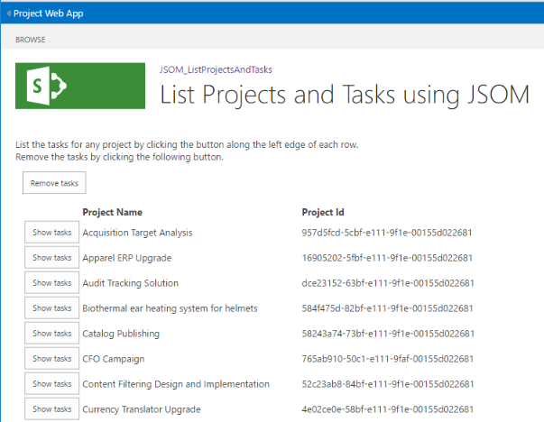

# Developing a Project Online add-in using the JavaScript Object Model (JSOM)

This article describes Microsoft Project Online Add-in development to enhance your experience with the Project Online. The development project is implemented as a walkthrough. The add-in used for this article reads and displays the project names and IDs of the published projects from your Project Online account and allows you to drill down to retrieve tasks associated with individual projects.
  
At run time, the add-in listing looks similar to the following illustration:
  

  
The focus of the example is the interaction with the Project Online, making queries and setting the context for each request from the service. User interface (UI) elements receive minimal attention. Instead, the source listings provide comments regarding the UI.
  
> [!NOTE]
> The source files for the example add-in, a Visual Studio project, are available at: https://github.com/OfficeDev/Project-JSOM-List-Projects-Tasks..... Keep the source files handy as a reference while you read the article, as each complements the other. The files in the Visual Studio project build and are executable with minimal changes—substituting the URL for your Project Online tenant down to the PWA folder. 
  
## Background

Project Online is a Office 365 service that provides companies with a project portfolio management (PPM) and project management office (PMO) solution to coordinate and manage portfolios, programs, and projects. Project Online is a different offering than the Project desktop editions; yet, Project Online still contains the functionality to maintain and track project details throughout the life of a project. Project Online is built on SharePoint Online.
  
A Project Online hosted add-in consists of JavaScript and resource files that interact with the Client-Side-Object-Model API. When the user visits the add-in, the JavaScript and resources are downloaded and executed within the browser. The add-In makes asynchronous calls to Project Online to interact with the service, whether creating, retrieving, updating, or deleting data. 
  
Project Online performs one more action to protect information that belongs to other tenants from the add-in; namely, Project Online creates an isolated site to interact with the requests from the add-in. No custom code runs on the Project Online host. 
  
The development setup for Project Online add-ins uses the Visual Studio SharePoint Add-in project type. The add-in is written in JavaScript, and uses the Project JavaScript object model (JSOM) to interact with the Project Online service. The JSOM inherits much of its functionality from the SharePoint JSOM.
  
> [!NOTE]
> Add-ins can be published and sold in the Office Store or deployed to a private app catalog on SharePoint. For more information, see [Deploy and publish your Office Add-in](http://dev.office.com/docs/add-ins/publish/publish.aspx). > The add-in used in this article is a sample for developers; it is not intended for use in a production environment. The primary purpose is to show an example of app development for Project Online. 
  
## Prerequisites

Add the following items to a supported Windows environment:
  
- **.NET Framework 4.0 or later**: Complete versions of the framework from version 4.0 are compatible. The download site is https://msdn.microsoft.com/en-us/vstudio/aa496123.aspx.
    
- **Visual Studio 2013 or later**:  
    
   - The professional edition of Visual Studio 2015 is ready to go out-of-the box and is available at https://www.visualstudio.com/en-us/products/visual-studio-professional-with-msdn-vs.aspx.
    
   - The community edition of Visual Studio 2015 is available at https://www.visualstudio.com/en-us/products/visual-studio-community-vs.aspx. This edition requires manual installation of the Microsoft Office Developer Tools for Visual Studio.
    
   The Microsoft Office Developer Tools for Visual Studio are available at https://www.visualstudio.com/en-us/features/office-tools-vs.aspx.
    
- **A Project Online account**: This provides access to the hosting service. For more information about obtaining a Project Online account, see https://products.office.com/en-us/Project/project-online-portfolio-management.
    
   Ensure that the add-in user has sufficient authorization to access some projects in the Project Online tenant. 
    
- **Projects on the hosting site** that are populated with information.
    
> [!NOTE]
> The standard .NET Framework is the correct framework to use. Do not use the ".NET Framework 4 Client Profile". 
  
### Set up the Visual Studio project

The application setup consists of creating a new project, linking the appropriate libraries and declaring the needed namespaces. Visual Studio presents several types of development projects. The section is brief and very basic. The value is having the information is coalesced in one place.
  
#### Select a Visual Studio project

To create a project of the appropriate type for the add-in, you must do the following steps. Keywords encountered on the screen have a **bold** attribute: 
  
1. From the File menu, choose **File** > **New** > **Project**. 
    
2. From the Installed templates in the left pane, select **C#** > **Office/SharePoint** > **Web Add-ins**. 
    
3. At the top of the central pane, select **.NET Framework 4** or later; the current version is 4.6. 
    
4. From the application types in the central pane, choose **SharePoint Add-in**. 
    
5. In the bottom section, specify a name and location for the project, and a solution name. 
    
6. Also in the bottom section, check the **Create directory for solution** box. 
    
7. Click **OK** to create the initial project. 
    
The Visual Studio Wizard asks a few follow-up questions about the Project Online settings site (called SharePoint settings in the dialogs) in a couple of dialogs that follow. Here are the questions:
  
1. What SharePoint site do you want to use for debugging your add-in? Specify the URL to your PWA site, such as https://contoso.sharepoint.com/sites/pwa.
    
2. How do you want to host your SharePoint Add-in? Choose [X] **SharePoint-hosted**.
    
   For more information about SharePoint Add-ins, including hosting options, see [SharePoint Add-ins](https://docs.microsoft.com/en-us/sharepoint/dev/sp-add-ins/sharepoint-add-ins).
    
3. Click **Next**. 
    
The second additional dialog asks you to specify the SharePoint Online version for the add-in: 
  
1. What's the earliest version of SharePoint that you want your add-in to target? Choose [X] S **harePoint-Online**. 
    
2. Click **Finish**. 
    
Visual Studio creates the project and accesses the Project Online site. 
  
### Enable sideloading on the Project Online site

Sideloading is the mechanism for testing and debugging Project Online add-ins. You need two scripts for sideloading: one to enable sideloading on your Project Online site and another to disable sideloading once you finish testing and debugging the add-in.
  
For more information about setting up sideloading, see [Enable app SideLoading in your non-developer site collection](https://blogs.msdn.microsoft.com/officeapps/2013/12/10/enable-app-sideloading-in-your-non-developer-site-collection/).
  
> [!NOTE]
> Sideloading apps is a developer/test feature. It is **not intended for production use**. Do not sideload apps regularly, or keep app sideloading enabled for longer than you are actively using the feature. 
  
## Add content to the add-in project

After creating a project and setting up the debugging mechanism, adding content to the app includes the following tasks:
  
- Setting the application scope
    
- Linking the JSOM library
    
- Adding UI Elements to the add-in
    
- Initializing and connecting to the Project Online service
    
- Retrieving projects and details/properties
    
- Displaying projects
    
- Displaying tasks for a Project
    
The add-in project consists of many files. In this example, you'll need to edit the following files: 
  
- AppManifest.xml
    
- Default.aspx
    
- App.js
    
- App.css - optional; contains style definitions developed for the add-in
    
If the Project Online tenant changes, such as moving from a trial to a subscription site, you can update the project properties, including the Server Connection and Site URL, using the Properties Window available through the **View** > **Properties Window** command. 
  
You can also add files to the project. If so, you'll need to update the Elements.xml file located in the same group (Content, Images, Pages, or Scripts) to include the new files. For more information about the project files, see [Explore the app manifest structure and the package of a SharePoint Add-in](https://msdn.microsoft.com/en-us/library/office/fp179918.aspx.aspx).
  
### Set application scope

The add-in needs scope or permission levels defined before the service returns information in query results. For this add-in, use the following scope to the Visual Studio project. This change is made to the AppManifest.xml file in the Permissions tab:

|Scope|Permission|
|:-----|:-----|
|Multiple Projects (Project Server)  <br/> |Read  <br/> |
   
Save the file after setting the application scope. Otherwise, no data will be returned from the service. 
  
### Link the JSOM library

The runtime Project Online libraries, PS.js and PS.debug.js, are provided by Project Online and are always the most recent version. JavaScript add-ins that use JSOM must link with one of these libraries. The linking definitions are added in the Default.aspx file. The commands to use the PS.js and/or PS.debug.js are part of the code located in the App.js file.
  
Add the following command for PS.js or PS.debug.js definition in the  `<asp:Content ContentPlaceHolderID="PlaceHolderAdditionalPageHead"` element following the "SharePoint:ScriptLink" for sp.js. 
  
```js
<SharePoint:ScriptLink name="PS.js" runat="server" OnDemand="false" LoadAfterUI="true" Localizable="false" />
```

> [!NOTE]
> The **OnDemand** attribute for PS.js or PS.debug.js set to **false**. 
  
### Add UI elements to the add-in

The example add-in consists of a few components. Static element descriptions are located in the Default.aspx file. Dynamic element descriptions and code for all components are located in the App.js file. For comments regarding the components, refer to the source code listings. Here is a list of the UI components in the add-in:
  
- Title
    
- Introductory verbiage
    
- Button to remove tasks from the table
    
- Table that lists the project ID and name, and the task information.
    
- Tasks Button (cloned once for each project) that imports task data into the table.
    
For details of the user interface, such as the title and the header portion of the project table, see the Default.aspx project file.
  
### Initialize and connect to the host system

The App.js file contains the JavaScript code. The add-in loads PS.js in the browser, and then calls the initializePage function. InitializePage retrieves a context to the Project Online endpoint and starts the loadProjects function.
  
```js
    'use strict';
    SP.SOD.executeOrDelayUntilScriptLoaded(initializePage, "PS.js");
    //Project PWA Context and published projects in PWA
    var projContext;
    var projects;
    function initializePage() {
        //Get the Project context for this web
        projContext = PS.ProjectContext.get_current();
        loadProjects();
    }
    //General CSOM failure event handler
    //Invoked when ExecuteQueryAsync returns unsuccessfully
    function onRequestFailed(sender, args) {
        alert("Failed to execute: " + args.get_message());
        return;
    };

```

### Retrieve the projects

The loadProjects function queries the service for the project names and IDs. 
  
The application retrieves the project name and project Id. Other information about the project is available and can be accessed by modifying the load method to identify explicitly the properties to retrieve. An example is provided in the code as a comment. 
  
If the query succeeds, the add-in continues by calling displayProjects. 
  
```js
    //Query CSOM and get the list of projects in PWA
    function loadProjects() {
        projects = projContext.get_projects();
    //Request to server - identifies what to retrieve
        projContext.load(projects, 'Include(Name, Id)');
        //Notice to server to execute query
        projContext.executeQueryAsync(displayProjects, onRequestFailed);
        // Syntax for requesting more fields to pull down from server
        // projContext.load(projects, 'Include(Name, Description, StartDate, 
        // Id, IsCheckedOut)');
    }

```

### Display the projects

The displayProjects function creates a table, one row per project, and a button to show the tasks for the specific project. 
  
```js
    //Display the projects with names and ids in a table
    function displayProjects() {
        //Current published project and ID
        var p, projId;
        //Project table rows to publish collectively
        var pTable = []; 
        var pEnum = projects.getEnumerator();
        //Build a 3-column table, with one project per row.
        while (pEnum.moveNext()) {
            p = pEnum.get_current();
        
            //Items used in getting information for table rows:
            //Current published project object, and ID and name
            // var project = p;
            // var projId = p.get_id();
            // var projName = p.get_name();
        
            //Continue processing/working with project object as needed.
        }
    }

```

> [!NOTE]
> The while loop accesses the ID and name properties. This is slightly different than the source code project that calls a function that, in turn, accesses the same properties. 
  
### Display the tasks for a project

The tasks, while part of the add-in, are not part of the initial loading. If the user is interested in the tasks associated with a project, clicking the "Show Tasks" button causes the tasks to display in the list using the btnLoadTasks event handler. 
  
The btnLoadTasks event handler, with the appropriate project ID, requests the tasks for the specified project from the server. Once retrieved, btnLoadTasks passes the task list to displayTasks to present the tasks onscreen.
  
```js
    //Query CSOM and get the list of tasks for a specific project
    function btnLoadTasks(pid) {
        //Event handler for the "Show tasks" buttons. 
        //
        //The project ID is the sole argument and is used to get the appropriate task 
        //info from the service.
        //The project ID is also the button name, and is used to identify where to place
        //the task information in the table.
        //
        //Project ID to pass to the event handler
        var projId = pid;
        //
        //Get the project reference
        var pProj = projects.getById(projId);
        //
        //Get the tasks collection reference associated with the project.
        var tasks = pProj.get_tasks();
        //
        projContext.load(tasks, 'Include(Id, Name, Start, ScheduledStart, Completion)');
        //
        //If the query succeeds, displayTasks presents the tasks to the user.
        projContext.executeQueryAsync(function () { displayTasks(tasks, projId) }, onRequestFailed);
    }

```

The displayTasks function displays the tasks associated with a specified project immediately beneath the project entry.
  
```js
    //Insert tasks for the specified project immediately underneath the project entry 
    //in the table.
    function displayTasks(tasks, projId) {
        //selected project ID
        var pId = projId;
        //individual task
        var t;
        //Task table rows to publish collectively
        var tTable = [];
        var tEnum = tasks.getEnumerator();
        //Build table one task per row.
        while (tEnum.moveNext()) {
            t = tEnum.get_current();
            //
            //Items used in getting information for table rows:
            //Current task object, and ID and name
            // var task = t;
            // var taskId = t.get_id();
            // var taskName = t.get_name();
            
            //Continue processing/working with task object as needed.
        }
    }

```

> [!NOTE]
> The while loop accesses the task ID and name properties. This is slightly different than the source code project that calls a function that, in turn, accesses the same properties. 
  
Sample output for the tasks of a single project follows.
  

  
## See also

For documentation and samples related to Project Online and application development using CSOM, see the [Project Development Portal](http://dev.office.com/project.aspx).
    

