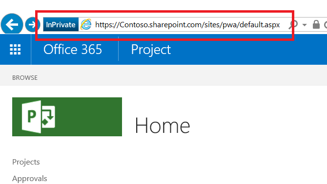

# Developing a Project Online application using the client-side object model (CSOM)

>[!NOTE] 
>This article describes Microsoft Project Online application development for using CSOM. We recommend you explore how to develop applications using the [new Project for the web](https://developer.microsoft.com/en-us/office/blogs/developing-applications-and-reports-using-the-new-project/).
  
## Background

Microsoft Project started as desktop application in the early 1990's. Today, Project is much more, as its several varieties attest:
  
- Project standard edition is a desktop application that runs as a stand-alone application.
    
- Project professional edition is a desktop application that can interact and share data with a server on a larger scale, as well as perform the functionality found in Project standard edition.
    
- Project Online is a Microsoft-hosted service that provides companies with a PMO-level solution to coordinate and manage projects, programs, and portfolios. A different offering than the desktop editions, Project Online can maintain and track project details throughout the life of a project. 
    
- Project Server is an enterprise-hosted service in which the enterprise manages and secures the server containing project, program, and portfolio information. Project Server, by virtue of securing the server in-house, offers the project, program, and portfolio oriented features of externally-hosted Project Online with a greater capacity for customization.
    
Project Online has three online API sets: Client-side Object Model (CSOM), JavaScript Object Model (JSOM), and Representational State Transfer (REST). 
  
- The .NET CSOM implementation is the preferred interface when developing Windows applications that interact with Project Online tenants. Typical environments for user-centric applications include Windows desktops and Microsoft Surface devices. Back-end applications written with .NET CSOM can connect to other servers for business logic and data sources that are external to Project Online. Retrieval requests to Project Online use a LINQ-like query system that offers several enhancements over basic retrieval functions.
    
- The JavaScript Object Model (JSOM) interface provides cross-browser support for Project Online Add-ins. An add-in is a web application that is stored in the Project Online tenant. When a user wants to run an add-in, the code for the add-in downloads and runs in the browser on the user machine. 
    
- The REST/Odata model provides HTTP-based communication, This interface is recommended for applications in non-Windows environments. Communication endpoints are the objects in the Project Web Application (PWA) site. Results provide normal HTTP status codes.
    
This article focuses on an application that uses the .NET CSOM interface.
  
## Prerequisites

Start with a base system running Windows 10, and add the following items:
  
- .Net Framework 4.0 or later -- Use the complete framework. The download site is https://msdn.microsoft.com/vstudio/aa496123.aspx.
    
- Visual Studio 2013 or later -- Any edition is acceptable. The community edition of Visual Studio 2015 was used to develop the sample application. The community edition is available at https://www.visualstudio.com/en-us/products/visual-studio-community-vs.aspx.
    
- SharePoint Client Components SDK -- Project Online and Project Server sit on top of SharePoint, and SharePoint assemblies. The SharePoint Client Components are included in Visual Studio Professional and Enterprise editions. If you use Visual Studio Community edition, the latest version of the Office Developer Tools SDK is available at the following site: https://www.microsoft.com/en-us/download/details.aspx?id=35585.
    
- A Project Online account -- This provides access to the hosting site. For more information about obtaining a Project Online account, see https://products.office.com/en-us/Project/project-online-portfolio-management.
    
- Projects on the hosting site that are populated with information
    
> [!NOTE]
> The standard .NET Framework (4.0 or later) is the correct framework to use. Do not use the .NET Framework 4 Client Profile. 
  
## Develop the application

In developing a desktop application for SharePoint, the preferred interface is the Project client side object model (CSOM). 
  
You can download the [Project CSOM samples](https://developer.microsoft.com/project/gallery/?filterBy=Samples,Project) from the Project Developer resource gallery on the Office Dev Center.
  
The first two topics cover basic issues: creating a Visual Studio project with appropriate namespaces and assemblies, and accessing the hosting server. The remaining topics deal with retrieving information through the CSOM, from one and many objects. 
  
Retrieving information from the host is a two-action process from client applications. First, the application specifies and sends one or more retrieval requests to the server. Second, the application issues a notification to the server to execute the submitted queries. The server responds by sending the query results to the client.
  
### Set up the Visual Studio project

The application setup consists of creating a new project, linking the appropriate assemblies and declaring the needed namespaces. Visual Studio presents several types of development projects. 
  
#### Select a Visual Studio project

1. Launch Visual Studio and select **Start A New Project** on the Start Page. 
    
   The New Project dialog displays available application templates, and data fields for any selected template. 
    
2. For this application, specify the following items. Keywords encountered on the screen have a bold attribute:
    
   1. From the Installed templates in the left pane, select **C#** => **Windows** => **Classic desktop**. 
    
   2. At the top of the central pane, select **.NET Framework 4**. 
    
   3. From the application types in the central pane, choose **Console Application**. 
    
   4. In the bottom section, specify a name and location for the project, and a solution name. 
    
   5. Also in the bottom section, check the **Create directory for solution** box. 
    
3. Click **OK** to create the initial project. 
    
#### Add assemblies

The VS solution needs the ProjectServerClient assembly from the Project 2103 SDK, a couple of assemblies from the SharePoint SDK, and the .NET Framework System.Security assembly.
  
1. In the VS Solution Explorer, right-click the References entry, and select **Add Reference…** from the shortcut menu. 
    
2. Check the **Microsoft.ProjectServer.Client.dll**. 
    
   If needed, click the **Browse…** button at the bottom of the dialog and navigate to the Project 2013 SDK installation directory to locate the assembly. 
    
3. Click **OK**. 
    
4. Add the PrjoctServer Client namespace to the .cs file.
    
   ```cs
    using Microsoft.ProjectServer.Client;
   ```

Add the SharePoint 2013 SDK assemblies using the NuGet Package Manager Console. 
  
1. From the VS Tools menu, click the following menus: **Tools =\> NuGet Package Manager =\> Package Manager Console**. 
    
2. In the Package Manager Console, enter the following command and press \<ENTER\>:
    
   ```cs
    Install-Package Microsoft.SharePointOnline.CSOM
   ```

   The **Package Manager Console** provides a description of the command results; and, the VS Solution Explorer displays the SharePoint assemblies in the project references. 
    
3. Add the namespaces to the .cs file:
    
   ```cs
    using Microsoft.SharePoint.Client;
   ```

The System.Security assembly is part of .NET Framework and was installed with the framework. The sample application needs one more namespace that provides an encrypted string to the hosting system for authentication. Once authenticated, the application can access projects on the hosting system. Add the System.Security namespace to the .cs file in this way:
  
1. In the VS Solution Explorer, right-click the References entry, and select **Add Reference…** from the shortcut menu. 
    
2. Select **Assemblies =\> Framework** in the left pane of the References Manager dialog, then check **System.Security**. 
    
3. Click **OK**. 
    
4. Add the System.Security namespace to the .cs file:
    
   ```cs
    using System.Security;
   ```

The start of the .cs file should contain the following namespaces:
  
- System
    
- System.Collections.Generic
    
- System.Linq
    
- System.Test
    
- Microsoft.ProjectServer.Client
    
- Microsoft.SharePoint.Client
    
- System.Security
    
### Connect to the host system

Project Online is a SharePoint application, so using SharePoint authentication is the correct approach. The following code fragment prepares to access the hosted environment.
  
```cs
    class Program
    {
        private static ProjectContext projContext;
        static void Main (string[] args)
        {
            using (ProjectContext projContext = new ProjectContext("https://Contoso.sharepoint.com/sites/pwa"))
            {
                SecureString password - new SecureString();
                foreach (char c in "password".ToCharArray()) password.AppendChar(c);
                //Using SharePoint method to load Credentials
                projContext.Credentials = new SharePointOnlineCredentials("sarad@Contoso.onmicrosoft.com", password);

```

Preparations to access the hosted environment include the following items:
  
1. Create a context object for the projects -- this is contained in the following code of the preceding code fragment. 
    
   ```cs
    private static ProjectContext projContext;
    
   ```

   The context is inherited by other components, allowing the system to manage the context of the Project object model.
    
2. Identify the host site -- this is done in the following code from the preceding code fragment.
    
   ```cs
    using (ProjectContext projContext = new ProjectContext("https://Contoso.sharepoint.com/sites/pwa"))
   ```

   When instantiating the projects context, the application needs to provide the root of the Projects site collection. The application uses a substring of the URL of the root of the Projects. A snapshot of this location is highlighted with a red rectangle in the following illustration. The authentication needs the string from its start through the substring "pwa". In the code listing, the application uses the string "https://XXXXXXXX.sharepoint.com/sites/pwa".
        
   
  
3. Place the password in a secure string -- this is done in the following code from the preceding code fragment.
    
   ```cs
    SecureString password - new SecureString();
    foreach (char c in "password".ToCharArray()) password.AppendChar(c);
    
   ```

   The password and user account are the credentials to access the host site. 
    
4. Add the user account and password to the credentials portion of the context object -- this is done in the following code from the preceding code fragment.
    
   ```cs
    projContext.Credentials = new SharePointOnlineCredentials("sarad@Contoso.onmicrosoft.com", password);
   ```

The instantiated project context is ready to use.
  
### List all published projects

Project Online and ProjectServer use proxies to communicate with the server for create, report, update, and delete (CRUD) operations. The host/server handles requests in an efficient manner and has the client perform the following actions in communicating with the server:
  
1. Establish a context for communication. 
    
   The context is used by the projects collection, as well as other objects and collections through inheritance, including the tasks collection, assignments collection, the stage object, and custom fields. 
    
2. Use the object model to specify an object, collection, or data to retrieve.
    
   This step uses LINQ as a query or as a method. The specification controls what you receive. Often, this step is embedded as the body of the Load method (step 3). 
    
3. Load the retrieval specification from the previous step using the Load() or LoadQuery() method.
    
   For loading collections and objects, use Load(). For queries with clauses such as "where" and "group", use LoadQuery(). 
    
4. Execute the request using the ExecuteQuery() method.
    
   The ExecuteQuery() method notifies the host that the query or queries are ready to execute. Once the host receives notification, it executes the queries and sends the results to the client. 
    
With the information at the client, the application can use it. The following code fragment cycles through the published projects and prints the Id and Name for each published project on the host.
  
```cs
// Get the list of projects in Project Web App.
var projects = projContext.Projects;
projContext.Load(projects);
projcontext.ExecuteQuery();
foreach (PublishedProject pubProj in projContext.Projects)
{
    Console.WriteLine("\n{0}. {1}   {2} \t{3} \n", j++, pubProj.Id, pubProj.Name, pubProj.CreatedDate);
}

```

Output:
  
```cs
Published Project count:2
1. be80a848-b2ef-e511-80f4-00155dc84e01   A second Project     3/21/2016 10:14:40 PM
2. 9d730a1a-60ed-e511-80f6-00155dc87d01   Ent_Proj_1   3/18/2016 11:21:14 PM

```

### Make a request

Using the actions from the previous code fragment, the application retrieves the list of projects in the specified account on the hosting site. 
  
1. The ProjectContext is specified for the projects to list. 
    
   ```cs
    var projects = projContext.Projects;
   ```

2. Specify the item to retrieve. 
    
   ```cs
    projContext.Load(projects);
   ```

   By only stating the collection, the server retrieves the project collection, populating each project with values for the default set of properties. Accessing properties that are part of the default property set gives successful results. Accessing properties that are not part of the default set results in a "Not initialized" exception.
    
3. Load the request (projContext.Load).
    
   This is part of the previous step.
    
4. Execute the query (ExecuteQuery). 
    
   ```cs
    projContext.ExecuteQuery();
   ```

### Retrieve high-level project information

Properties that are not default properties must be specified in the request to the server. The next code fragment loads the projects collection context as in the previous example. Then, the specification requests additional non-default properties to include in the result. 
  
```cs
var projects = projContext.Projects;
projContext.Load(projects,
    ps => ps.IncludeWithDefaultProperties(
        p => p.StartDate, p => p.Phase, p => p.Stage));
projContext.ExecuteQuery();

```

The load statement specifies the projects collection context, and adds the StartDate, Phase, and Stage to the query result. The additional properties can be scalar, objects, or collections. Scalar items can be accessed directly. Objects and collections require additional processing, as in the following code fragment.
  
```cs
// Using the previous definition and Load statement …
projContext.ExecuteQuery();
foreach (PublishedProject pubProj in projContext.Projects)
{
Console.WriteLine("\n\t{0}. \t{1} \n\t{2} \n\t{3} \n", j++, pubProj.Id, pubProj.Name,
    pubProj.CreatedDate);
             // The following statement generates an exception about the object 
             // reference not being set to an instance on the server. 
             // Console.WriteLine("\tCurrent Phase:\t{0}", pubProj.Phase.Name);
             // Phase and Stage are not published with the rest of the data. Need to pull these objects from the server.
             Phase oPhase = pubProj.Phase;
             projContext.Load(oPhase);
             projContext.ExecuteQuery();
             //if-else fails because the else case fails with "Microsoft.SharePoint.Client.ServerObjectNullReferenceException".
             //if (oPhase.ServerObjectIsNull != null)
             //Using try-catch instead
             try
             {
                  Console.WriteLine("\tCurrent Phase:\t{0}", oPhase.Name);
             }
             
             catch
             {
                  Console.WriteLine("\tCurrent Phase:\t Not available");
             }
             
             Stage oStage = pubProj.Stage;
             projContext.Load(oStage);
             projContext.ExecuteQuery();
             //Again, not using if-else combination for the same reason as above.
             try
             {
                  Console.WriteLine("\tCurrent Stage:\t{0}", oStage.Name);
             }
             
             catch
             {
                  Console.WriteLine("\tCurrent Stage:\t Not available");
    }

```

Output of the first three projects:
  
```cs
Project counts:31
1. Project ID:  957d5fcd-5cbf-e111-9f1e-00155d022681
        Name:           Acquisition Target Analysis
        CreatedDate:            3/22/2016 5:14:34 PM
        Current Phase:  3. Plan
        Current Stage:  6. Plan
2. Project ID:  16905202-5fbf-e111-9f1e-00155d022681
        Name:           Apparel ERP Upgrade
        CreatedDate:            3/22/2016 5:36:40 PM
        Current Phase:  3. Plan
        Current Stage:  6. Plan
3. Project ID:  dce23152-63bf-e111-9f1e-00155d022681
        Name:           Audit Tracking Solution
        CreatedDate:            3/22/2016 5:02:24 PM
        Current Phase:  2. Select
        Current Stage:  4. Select Gate

```

### Retrieve all tasks in a project

Each project has many tasks. So, pulling the tasks for a single project consists of the following:
  
1. Establish the context of the projects collection.
    
   ```cs
    var projects = projContext.Projects;
   ```

2. Retrieve the project information, including the Task properties.
    
   ```cs
    projContext.Load(projects);
    ProjContext.ExecuteQuery();
    foreach (PublishedProject pubProj in projContext.Projects){
    
   ```

    Note that the application is addressing published projects. The context for the current published project is pubProj. 
    
3. Establish the context for the Tasks collection.
    
   ```cs
    PublishedTaskCollection collTask = pubProj.Tasks;
   ```

   The `pubProj.Tasks` property references the tasks of the current published project. 
    
4. Load the specification to retrieve Task collection, including the appropriate non-default properties.
    
   ```cs
    projContext.Load(collTask,
        tsk => tsk.IncludeWithDefaultProperties(
            t => t.Id, t => t.Name, t => t.Start,
            t => t.ScheduledStart, t => t.Completion));
    
   ```

5. Execute the query to retrieve the Task collection with the appropriate properties.
    
   ```cs
    projContext.ExecuteQuery();
   ```

The information is now local. The following code fragment processes the published tasks collection by writing the information to the console.
  
```cs
    Console.WriteLine("Task collection count: {0}", collTask.Count.ToString());
    if (collTask.Count > 0)
    {
        int k = 1;    //Task counter.
        foreach (PublishedTask t in collTask)
        {
            Console.WriteLine("{0}. Id:{1} \tName:{2}", k++, t.Id, t.Name);
            Console.WriteLine("\t ScheduledStart:{0} \tStart:{1} \tCompletion:{2}", k, t.ScheduledStart, t.Start, t.Completion);
        }
    }

```

Output of tasks for one project:
  
```cs
Task collection count: 5
1. Id:256fa850-b2ef-e511-80f6-00155dc87d01      Name:Load software onto computer
         ScheduledStart:2       Start:4/4/2016 8:00:00 AM       Completion:4/4/2016 8:00:00 AM
2. Id:266fa850-b2ef-e511-80f6-00155dc87d01      Name:Locate and load Project Online SDK
         ScheduledStart:3       Start:4/5/2016 8:00:00 AM       Completion:4/5/2016 8:00:00 AM
3. Id:276fa850-b2ef-e511-80f6-00155dc87d01      Name:Locate and load SP SDK
         ScheduledStart:4       Start:4/5/2016 1:00:00 PM       Completion:4/5/2016 1:00:00 PM
4. Id:286fa850-b2ef-e511-80f6-00155dc87d01      Name:Build app that accesses Proj Online
         ScheduledStart:5       Start:4/6/2016 8:00:00 AM       Completion:4/6/2016 8:00:00 AM
5. Id:296fa850-b2ef-e511-80f6-00155dc87d01      Name:Build app that accesses task assignments
         ScheduledStart:6       Start:4/7/2016 8:00:00 AM       Completion:4/7/2016 8:00:00 AM

```

### Access information at multiple levels

Each task can have one or more persons (a.k.a. resource) contributing toward its completion. The Assignments and Resources collections contain this information for each task. 
  
The processing consists of the following:
  
1. Obtaining a context for the project task.
    
2. Build a request and load the request for the assignments tied to the task. 
    
3. Execute the query for the assignments.
    
4. Build a request and load the request for the resource associated with an individual assignment. 
    
5. Execute the query for the resource.
    
> [!NOTE] 
> - The Assignments collection is explicitly requested in the information from the server because it is not a default property of the Tasks collection. As a collection, a subsequent query is made to pull the collection from the server. 
> - The Resource is an object. The query for an assignment includes the resource name associated with the assignment.
    
```cs
PublishedTaskCollection collTask = pubProj.Tasks;
    projContext.Load(collTask,
        tsk => tsk.IncludeWithDefaultProperties(
            t => t.Id, t => t.Name, 
            t => t.Assignments));
    projContext.Load(collTask);
    projContext.ExecuteQuery();
    Console.WriteLine("Task collection count: {0}", collTask.Count.ToString());
    if (collTask.Count > 0)
    {
        int k = 1;    //Task counter.
        //Processing task list for current project
        foreach (PublishedTask t in collTask)
        {
            Console.WriteLine("{0}. Id:{1} \tName:{2}", k, t.Id, t.Name);
            k++;
            //Define and retrieve Assignments for current task
            PublishedAssignmentCollection collAssgns = t.Assignments;
            projContext.Load(collAssgns);
            projContext.ExecuteQuery();
            Console.WriteLine("    Assignment collection count: {0}", collAssgns.Count);
            if (collAssgns.Count > 0)
            {
                //Output string for resources assigned to task
                StringBuilder output = new StringBuilder();
                output.AppendFormat("\t Assignments: ");
                foreach (PublishedAssignment a in collAssgns)
                {
                    //Define and retrieve resource name for current assignment 
                    //(an object)
                    projContext.Load(a,
                        b => b.Resource.Name);
                    projContext.ExecuteQuery();
                    output.AppendFormat("{0}, ", a.Resource.Name);
                }
                Console.WriteLine(output);
            }
            else
            {
                Console.WriteLine("\t Assignments: None");
            }
        }
    }   // endif

```

Output for tasks 52, 75, and 76 of a project:
  
```cs
52. Id:2c729e96-54f0-e511-80c6-000d3a33235f     Name:Develop training materials
    Assignment collection count: 1
         Assignments: Robert Lyon,
75. Id:43729e96-54f0-e511-80c6-000d3a33235f     Name:Determine final deployment strategy
    Assignment collection count: 0
         Assignments: None
76. Id:44729e96-54f0-e511-80c6-000d3a33235f     Name:Develop deployment methodology
    Assignment collection count: 4
         Assignments: Molly Dempsey, Sara Davis, Shammi Mohamed, Zainal Arifin, 

```

### Access custom enterprise-level fields

Custom fields exist for Project Online. These are enterprise-level fields that can be associated with individual project. This section describes how to access these fields. 
  
Custom fields are not included in the default set of properties associated with a project. So, they need explicit identification in the retrieval specification. The high-level view of the process consists of the following items:
  
1. Tunnel to the custom field using its common name.
    
2. Retrieve the internal name of the custom field.
    
3. Return to the global context and query the system using the internal name of the custom field.
    
#### Tunnel to the custom field, retrieve its internal name, and used it to query the system

This task specifies a retrieval that uses a non-default property with one added detail.
  
1. Begin by using the projects context, as described at the beginning of this article.
    
   ```cs
    // Get the list of published projects in Project Web App.
    var projects = projContext.Projects;
    
   ```

2. Add two items to the projects collection retrieval request in addition to any other non-default properties to retrieve:
    
   ```cs
    projContext.Load(projects,
        ps => ps.IncludeWithDefaultProperties(
            p => p.Phase, p => p.Stage,                  // Other nondefault properties
            p => p.IncludeCustomFields,                  // Gets PublishedProject object 
                                                        // that contains custom fields
            p => p.IncludeCustomFields.CustomFields));   // Populates the custom fields
                    projContext.ExecuteQuery();
    
   ```

   The  `p => p.IncludeCustomFields` clause identifies the need to use a project object that supports custom fields. 
    
   The  `p => p.IncludeCustomFields.CustomFields` clause requests the inclusion of custom field data in the query result. This information is used after the custom field internal name is retrieved. 
    
3. Load the request.
    
   This is part of the previous step.
    
4. Execute the Query.
    
   ```cs
    projContext.ExecuteQuery()
   ```

5. With this information on the client, build a request to retrieve the custom fields associated with the current project.
    
   ```cs
    foreach (PublishedProject pubProj in projContext.Projects)
    {
        //Console.WriteLine("\n\t{0}. \t{1} \n\t\t{2} \n\t\t{3} \n", 
                j++, pubProj.Id, pubProj.Name, pubProj.CreatedDate);
        CustomFieldCollection collCustF = pubProj.CustomFields;
                        
        projContext.Load(collCustF);
        projContext.ExecuteQuery();
    
   ```

6. Locate the appropriate custom field and retrieve the internal name of the field. 
    
   ```cs
        foreach (CustomField oCF in collCustF)
        {
            if (oCF.Name == "Project Health")
            {
                Console.WriteLine("Name: {0}", oCF.Name);
                Console.WriteLine("InternalName: {0}", oCF.InternalName);
    
   ```

   The internal name of the custom field is retrieved. High-level items 1 and 2 are now complete.
    
7. Return to the project context and retrieve the value of the custom field.
    
   ```cs
    Console.WriteLine("Value: {0}", 
        pubProj.IncludeCustomFields.FieldValues[oCF.InternalName]);
    
   ```

   > [!NOTE]
   > The value of the custom field is retrieved using the internal name as an index. 
  
Output of three projects consisting of project ID, project Name, custom field name, custom field internal name, and custom field value.
  
```cs
Project counts:31
1. Project ID:  957d5fcd-5cbf-e111-9f1e-00155d022681
        Name:           Acquisition Target Analysis
Name: Project Health
InternalName: Custom_745de6dfcfb4e11195dc00155d02c97f
Value: Green
2. Project ID:  16905202-5fbf-e111-9f1e-00155d022681
        Name:           Apparel ERP Upgrade
Name: Project Health
InternalName: Custom_745de6dfcfb4e11195dc00155d02c97f
Value: Green
3. Project ID:  dce23152-63bf-e111-9f1e-00155d022681
        Name:           Audit Tracking Solution
Name: Project Health
InternalName: Custom_745de6dfcfb4e11195dc00155d02c97f
Value: Red

```

## See also

For documentation and samples related to Project Online and application development using CSOM, see the [Project development Portal](https://developer.microsoft.com/project) on the Office Dev Center.
    

